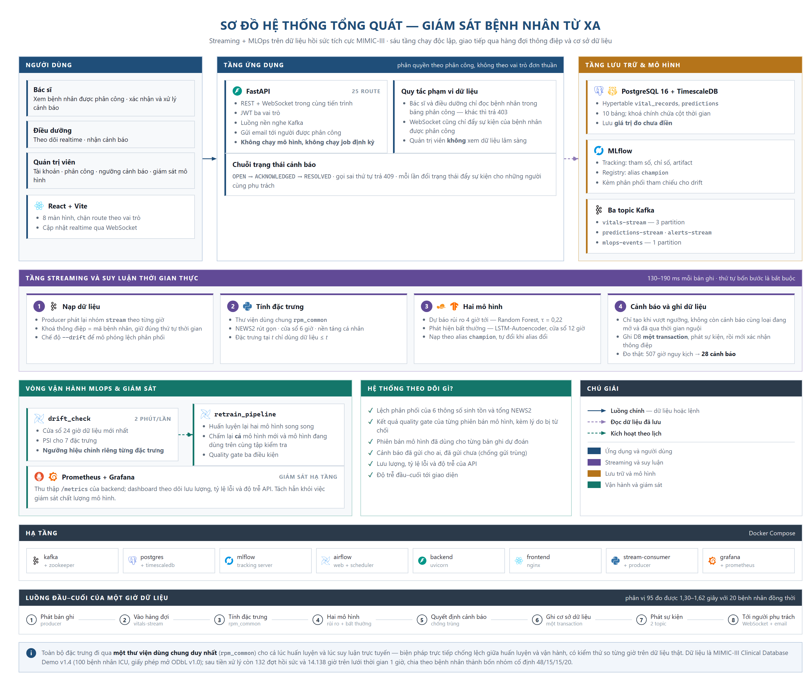

<div align="center">

# Hệ thống giám sát bệnh nhân từ xa bằng Streaming + MLOps

**Remote Patient Monitoring System using Streaming + MLOps**

Phát hiện sớm bệnh nhân ICU chuyển nặng: dữ liệu sinh hiệu chảy liên tục qua Kafka, mỗi giờ được
dự báo rủi ro 4 giờ tới và chấm điểm bất thường, cảnh báo đẩy realtime tới đúng người phụ trách —
kèm vòng lặp MLOps tự phát hiện drift, huấn luyện lại và chỉ thay model khi vượt quality gate.

[](LICENSE)
[](https://www.python.org/)
[](https://fastapi.tiangolo.com/)
[](https://react.dev/)
[](https://kafka.apache.org/)
[](https://www.timescale.com/)
[](https://mlflow.org/)
[](https://airflow.apache.org/)
[](https://docs.docker.com/compose/)
[](#kiểm-thử)

</div>

> [!WARNING]
> **Đây là đồ án học tập, không phải thiết bị y tế.** Hệ thống chạy trên dữ liệu ICU đã ẩn danh
> (MIMIC-III Demo) được *phát lại* để mô phỏng thời gian thực. Không dùng cho chẩn đoán, điều trị
> hay bất kỳ quyết định lâm sàng nào trên người bệnh thật.

---

## Mục lục

- [Bài toán](#bài-toán) · [Tính năng chính](#tính-năng-chính) · [Kiến trúc](#kiến-trúc)
- [Giao diện](#giao-diện) · [Bắt đầu nhanh](#bắt-đầu-nhanh) · [Kết quả](#kết-quả)
- [Cấu trúc mã nguồn](#cấu-trúc-mã-nguồn) · [Phát triển trên máy](#phát-triển-trên-máy) · [Kiểm thử](#kiểm-thử)
- [Tài liệu](#tài-liệu) · [Hạn chế đã biết](#hạn-chế-đã-biết) · [Dữ liệu & trích dẫn](#dữ-liệu--trích-dẫn) · [Giấy phép](#giấy-phép)

## Bài toán

Bệnh nhân ICU thường có dấu hiệu xấu đi vài giờ **trước** khi biến cố xảy ra, nhưng điều dưỡng phải
theo dõi nhiều giường cùng lúc và điểm cảnh báo sớm thủ công (NEWS2) chỉ phản ánh **hiện tại**.
Đồ án xây dựng một hệ thống hoàn chỉnh trả lời ba câu hỏi vận hành:

| Câu hỏi | Lời giải trong hệ thống |
|---|---|
| Bệnh nhân nào **sắp** chuyển nặng? | Mô hình **dự báo** mức NEWS2 cao nhất trong **4 giờ tới** — không phải phân loại tình trạng hiện tại, vì nhãn tức thời là hàm tất định của đặc trưng nên bị rò rỉ nhãn |
| Diễn biến nào **bất thường** so với chính bệnh nhân đó? | **LSTM-Autoencoder** trên cửa sổ 12 giờ × 6 kênh, đã z-score theo baseline riêng của từng bệnh nhân |
| Làm sao model **không mục ruỗng** theo thời gian? | Airflow phát hiện **drift** (PSI/KS, ngưỡng hiệu chỉnh theo từng đặc trưng) → tự kích hoạt retrain → **quality gate** → chỉ khi đạt mới chuyển alias `champion` trên MLflow |

## Tính năng chính

**Streaming & suy luận**

- Producer phát lại dữ liệu ICU thật theo nhịp giờ, có cờ `--drift` để mô phỏng phân phối lệch.
- Consumer dựng state từng bệnh nhân → sinh đặc trưng → chạy 2 model champion → quyết định cảnh báo → ghi **một transaction** DB → publish Kafka → commit offset (**at-least-once**; giết cứng giữa chừng không mất và không trùng bản ghi).
- Chống "bão cảnh báo": không mở cảnh báo mới khi còn cảnh báo `OPEN` cùng loại **và** đang trong cooldown 4 giờ dữ liệu → 507 giờ CRITICAL chỉ sinh 28 cảnh báo.

**Ứng dụng**

- FastAPI: 25 route theo 13 use case, JWT 3 vai trò (Admin / Bác sĩ / Điều dưỡng), phân quyền theo **phân công bệnh nhân** (trả `403` nếu ngoài danh sách phụ trách).
- Realtime: Kafka listener → WebSocket chỉ đẩy tới người được phân công; email cảnh báo không gửi trùng nhờ bảng `notification_logs`.
- React dashboard: 8 màn hình, chặn route theo vai trò, WebSocket tự nối lại, cập nhật tại chỗ không cần tải lại trang.

**MLOps**

- MLflow tracking + registry, alias `champion` / `challenger` (không dùng stage `Production` đã lỗi thời).
- Quality gate: ngưỡng tuyệt đối **+ phải thắng baseline persistence + không kém champion hiện tại** trên cùng tập test.
- Consumer tự phát hiện champion đổi và nạp lại model mà không cần khởi động lại.
- Prometheus + Grafana giám sát backend; Admin nhận thông báo drift/retrain qua WebSocket và email.

**Kỷ luật ML**

- **Một nguồn code đặc trưng duy nhất** (`packages/common`) dùng chung cho lúc train và lúc chạy thật, kèm test so từng giờ trên dữ liệu thật để chặn train/serving skew.
- Chia nhóm theo **bệnh nhân** (`subject_id`), cố định trong file, không bao giờ để một bệnh nhân nằm ở hai nhóm.
- Không rò rỉ tương lai: mọi đặc trưng tại `t` chỉ dùng dữ liệu `≤ t`; chỉ forward-fill có giới hạn, không nội suy. Có unit test kiểm tính nhân quả.

## Kiến trúc

<div align="center">
  
</div>

```
MIMIC-III Demo ──► preprocess (rpm_common, lưới 1 giờ) ──► producer ──► Kafka: vitals-stream
                                                                            │
                    ┌───────────────────────────────────────────────────────┘
                    ▼
            stream consumer ── đặc trưng (rpm_common) ──┬── dự báo rủi ro 4 giờ ─┐
                                                        └── LSTM-AE anomaly     ─┤
                                                                                 ▼
                                             quyết định cảnh báo (chống trùng) ──► 1 transaction
                                                                                 │
              PostgreSQL + TimescaleDB ◄─────────────────────────────────────────┤
              Kafka: predictions-stream / alerts-stream ◄────────────────────────┘
                    │
                    ▼
              FastAPI (REST + WebSocket + JWT, email) ──► React dashboard (realtime)

MLflow (tracking + registry, alias champion) ◄── training pipeline
Airflow: drift_check (PSI/KS, 2 phút/lần) ──► retrain_pipeline ──► quality gate ──► đổi alias champion
Airflow ──► Kafka: mlops-events ──► FastAPI ──► WebSocket + email cho Admin
```

| Thành phần | Công nghệ |
|---|---|
| Streaming | Apache Kafka 7.6 (Confluent), client `confluent-kafka` 2.15 |
| Cơ sở dữ liệu | PostgreSQL 16 + TimescaleDB 2.30 (hypertable `vital_records`, `predictions`), SQLAlchemy 2.0, Alembic |
| Học máy | scikit-learn 1.3 (Random Forest, Logistic Regression), XGBoost 3.0, TensorFlow 2.21 / Keras 3.13 (LSTM-AE), SHAP, SciPy |
| MLOps | MLflow 3.11, Apache Airflow 2.9 (LocalExecutor) |
| Backend | FastAPI 0.135, Uvicorn, Pydantic 2.12, PyJWT + bcrypt, WebSocket |
| Frontend | React 19, TypeScript 7, Vite 8, Tailwind CSS 4, Base UI + CVA, React Router 7 |
| Giám sát | Prometheus 2.54, Grafana 11 |
| Triển khai | Docker Compose |

## Giao diện

Dark theme, góc vuông, màu ngữ nghĩa lâm sàng (xanh / vàng / đỏ theo mức rủi ro).
Ảnh chụp từ hệ thống đang chạy thật với 20 bệnh nhân.

| Danh sách bệnh nhân | Chi tiết bệnh nhân |
|---|---|
|  |  |
| Thẻ bệnh nhân kèm dải mức rủi ro 12 giờ, cập nhật realtime | Biểu đồ 6 kênh sinh hiệu, thành phần NEWS2, diễn biến điểm bất thường |

| Trung tâm cảnh báo | Giám sát mô hình (Admin) |
|---|---|
|  |  |
| Chuyển trạng thái `OPEN → ACKNOWLEDGED → RESOLVED`, đẩy ngay tới các phiên khác | Version, chỉ số, lý do quality gate chấp nhận hoặc từ chối, báo cáo drift |

<details>
<summary>Xem thêm 5 màn hình khác</summary>

| Màn hình | Ảnh |
|---|---|
| Đăng nhập | [`images/1_login.png`](images/1_login.png) |
| Danh sách bệnh nhân theo phân công của một bác sĩ | [`images/5_patients_bs_an.png`](images/5_patients_bs_an.png) |
| Quản lý người dùng (Admin) | [`images/6_admin_user.png`](images/6_admin_user.png) |
| Phân công bệnh nhân (Admin) | [`images/7__admin_asignments.png`](images/7__admin_asignments.png) |
| Ngưỡng cảnh báo (Admin) | [`images/8_admin_thresholds.png`](images/8_admin_thresholds.png) |

</details>

## Bắt đầu nhanh

**Yêu cầu**: Docker Desktop (cấp cho Docker ≥ 8 GB RAM) và Git. Không cần cài Python/Node để chạy demo.

```bash
git clone https://github.com/MinhNguyen1007/Remote-patient-monitoring-system-using-Streaming-MLOps.git
cd Remote-patient-monitoring-system-using-Streaming-MLOps
cp .env.example .env            # rồi thay mọi giá trị "changeme" bằng mật khẩu thật

docker compose up -d postgres zookeeper kafka mlflow prometheus grafana   # hạ tầng nền
docker compose up -d airflow-webserver airflow-scheduler                  # DAG drift_check + retrain_pipeline
docker compose --profile app up -d                                        # backend, frontend, stream-consumer
```

Tạo tài khoản demo rồi bắt đầu phát lại dữ liệu:

```bash
docker compose exec backend python -m app.seed --demo     # bs.an, bs.binh, dd.cuong — mật khẩu demo12345
docker compose --profile app run --rm stream-producer     # thêm --drift để mô phỏng drift → retrain
```

Mở http://localhost:3000 và đăng nhập; cảnh báo sẽ hiện dần theo nhịp phát lại.

| Giao diện | Địa chỉ | Đăng nhập |
|---|---|---|
| Dashboard | http://localhost:3000 | `bs.an@rpm.local` / `demo12345` |
| API (Swagger) | http://localhost:8000/docs | JWT từ `POST /auth/login` |
| MLflow | http://localhost:5000 | — |
| Airflow | http://localhost:8080 | theo `AIRFLOW_WWW_*` trong `.env` |
| Grafana | http://localhost:3001 | `admin` / `GRAFANA_ADMIN_PASSWORD` |
| Prometheus | http://localhost:9090 | — |

> [!NOTE]
> **Model và dữ liệu không nằm trong repo.** Lần chạy đầu, MLflow registry còn trống nên consumer
> chưa có champion để nạp. Muốn huấn luyện lại từ đầu: tải MIMIC-III Demo theo hướng dẫn ở
> [`ml/README.md`](ml/README.md) rồi chạy `rpm_ml.data.preprocess` → `rpm_ml.training.train_risk` →
> `rpm_ml.training.train_anomaly` (xem [Phát triển trên máy](#phát-triển-trên-máy)).
> Lần build image Airflow đầu tiên mất khoảng 10 phút.

Dừng hệ thống: `docker compose --profile app down` (thêm `-v` nếu muốn xoá luôn dữ liệu trong volume).

## Kết quả

Mọi số liệu dưới đây đo trên **tập test chia theo bệnh nhân** (15 bệnh nhân chưa từng xuất hiện lúc
huấn luyện); chi tiết đầy đủ ở [`ml/reports/evaluation.md`](ml/reports/evaluation.md).

**Dự báo rủi ro 4 giờ — `risk_classifier` (Random Forest, τ = 0,22)**

| Mô hình | Macro F1 | Recall CRITICAL | Precision CRITICAL | AUROC |
|---|---|---|---|---|
| **Random Forest (champion)** | **0,623** | **0,790** | 0,391 | 0,836 |
| Baseline persistence | 0,547 | 0,308 | — | — |

Chọn mô hình bằng GroupKFold trên tập train (Macro F1): Random Forest 0,622 › Logistic Regression
0,618 › XGBoost 0,608 › persistence 0,565. Đặc trưng quan trọng nhất theo SHAP cho lớp CRITICAL:
`news2_max_6h`, `news2_score`, `respiratory_rate_mean_6h`, `heart_rate`. Kiểm chứng nhãn proxy: tỷ lệ
giờ CRITICAL là **19,1 %** ở đợt ICU tử vong tại viện so với **3,6 %** ở đợt sống sót (AUROC mức đợt 0,718).

**Phát hiện bất thường — `anomaly_detector` (LSTM-AE, τ = 0,99)**

| Đánh giá | AUROC | Precision | Recall | Tỷ lệ gắn cờ nhầm |
|---|---|---|---|---|
| Bất thường tiêm tổng hợp (spike / level shift / drift) | **0,864** | 0,727 | 0,167 | 0,7 % |

Trên dữ liệu thật (không tiêm), tỷ lệ gắn cờ tăng đúng theo mức nặng: NORMAL 0,6 % → WARNING 17,4 %
→ CRITICAL 34,8 % (AUROC CRITICAL so với NORMAL 0,837).

**Hệ thống end-to-end** — 20 bệnh nhân phát đồng thời, đo bằng bộ test E2E trên hệ thống thật:

| Chỉ số | Giá trị | Ngưỡng thiết kế |
|---|---|---|
| Độ trễ đầu–cuối (producer → WebSocket của client), p95 | **1,30 – 1,62 s** qua 3 lần chạy | < 2 s |
| Thời gian xử lý mỗi message | 130 – 190 ms (đặc trưng ~45 ms, RF ~12 ms, LSTM-AE ~64 ms) | — |
| Cảnh báo sinh ra trên số giờ dự báo CRITICAL | 28 / 507 | chống bão cảnh báo |
| Giết cứng consumer giữa chừng rồi bật lại | đủ bản ghi, **0 giờ trùng** | at-least-once + idempotent |

Bảng chi tiết được sinh tự động ở [`tests/e2e/reports/latency.md`](tests/e2e/reports/latency.md).

## Cấu trúc mã nguồn

```
services/                 Các service chạy thật — mỗi service có Dockerfile, requirements, test riêng
  backend/                FastAPI: REST + WebSocket + JWT, email, gọi Airflow      (app/, alembic/, tests/)
  frontend/               React dashboard realtime                                (src/pages, src/components)
  streaming/              Kafka producer phát lại + stream consumer suy luận       (src/rpm_streaming/)
ml/                       Dữ liệu, huấn luyện, đánh giá, drift, retrain            (src/rpm_ml/)
packages/common/          rpm_common — làm sạch, lưới giờ, NEWS2, đặc trưng:
                          NGUỒN DUY NHẤT dùng chung cho train và serving
infra/                    Dockerfile (MLflow, Airflow), DAG Airflow, Prometheus/Grafana,
                          init Postgres, smoke_test.py
tests/e2e/                Test tích hợp & phi chức năng trên hệ thống thật (độ trễ, chịu lỗi)
docs/design/              10 tài liệu thiết kế: chức năng, use case, activity, sequence, class,
                          DFD, ERD, giao diện, giải thuật, test
docs/report/              Báo cáo đồ án + bài báo (Markdown) và script bảo trì hình/bảng/trích dẫn
docker-compose.yml        Toàn bộ hệ thống; service ứng dụng nằm trong profile "app"
```

Bên trong hai package Python chính, mã chia theo chức năng:

```
ml/src/rpm_ml/            data/  models/  training/  evaluation/  drift/  pipelines/  storage/  paths.py
services/streaming/src/rpm_streaming/
                          producer/  consumer/  kafka/  storage/  config.py
```

Mỗi thư mục lớn có một `CLAUDE.md` ghi quy ước và lệnh riêng của module đó.

## Phát triển trên máy

```bash
python -m venv .venv
.venv/Scripts/python -m pip install -e packages/common -e ml -e services/streaming -r ml/requirements.txt
```

Script chạy dưới dạng module. Trên host, các service dùng cổng đã publish ra ngoài
(`KAFKA_BOOTSTRAP_SERVERS=localhost:29092`, `MLFLOW_TRACKING_URI=http://localhost:5000`,
`POSTGRES_HOST=localhost`):

```bash
.venv/Scripts/python -m rpm_ml.data.preprocess          # MIMIC-III → ml/data/processed/
.venv/Scripts/python -m rpm_ml.training.train_risk      # mô hình dự báo rủi ro
.venv/Scripts/python -m rpm_ml.training.train_anomaly   # LSTM-Autoencoder
.venv/Scripts/python -m rpm_ml.evaluation.report        # bảng + hình cho báo cáo → ml/reports/

cd services/backend && ../../.venv/Scripts/python -m alembic upgrade head   # schema DB
cd services/backend && ../../.venv/Scripts/python -m uvicorn app.main:app --reload --port 8000
cd services/frontend && npm install && npm run dev                          # http://localhost:5173
```

Lệnh đầy đủ, kèm biến môi trường cho từng lệnh, ở mục "Lệnh hay dùng" trong [`CLAUDE.md`](CLAUDE.md).

## Kiểm thử

254 test, tất cả chạy trên phụ thuộc thật — không mock Kafka, không mock database, không mock MLflow.

| Bộ test | Số test | Phạm vi |
|---|---|---|
| `packages/common` | 99 | Làm sạch, lưới giờ, NEWS2, đặc trưng và **tính nhân quả** (đặc trưng tại `t` không phụ thuộc dữ liệu sau `t`) |
| `ml` | 61 | Tiền xử lý, chia nhóm, hai mô hình, metric, quality gate, drift |
| `services/streaming` | 27 | Producer, consumer, **đồng nhất train/serving từng giờ trên dữ liệu thật** |
| `services/backend` | 34 | 25 route, phân quyền theo phân công, chuyển trạng thái cảnh báo; chạy trên TimescaleDB thật |
| `services/frontend` | 23 | Component, cập nhật realtime, chặn route theo vai trò |
| `tests/e2e` | 10 | Độ trễ đầu–cuối, chịu lỗi (giết consumer / tắt backend giữa chừng), nạp lại model |

```bash
cd packages/common     && ../../.venv/Scripts/python -m pytest -q
cd ml                  && ../.venv/Scripts/python -m pytest -q
cd services/streaming  && ../../.venv/Scripts/python -m pytest -q
cd services/backend    && ../../.venv/Scripts/python -m pytest -q   # cần postgres đang chạy
cd services/frontend   && npm run test
cd tests/e2e           && ../../.venv/Scripts/python -m pytest -q   # ~6 phút, XOÁ dữ liệu phát lại trong rpm_db
.venv/Scripts/python infra/smoke_test.py                            # smoke test hạ tầng
```

Bộ E2E tự khởi động stream consumer và backend dưới dạng tiến trình con nên có thể giết rồi bật lại
để kiểm tra khả năng chịu lỗi — xem [`tests/e2e/README.md`](tests/e2e/README.md).

## Tài liệu

| Nội dung | Đường dẫn |
|---|---|
| Thiết kế đầy đủ (chức năng, use case, activity, sequence, class, DFD, ERD, giao diện, giải thuật, test) | [`docs/design/`](docs/design/) |
| Dataset: nguồn, giấy phép, mapping itemid, cách tải lại | [`ml/README.md`](ml/README.md) |
| Từ điển dữ liệu: ý nghĩa 26 file CSV của MIMIC-III Demo và từng cột | [`ml/data_dictionary.md`](ml/data_dictionary.md) |
| Kết quả mô hình đầy đủ (bảng theo lớp, ma trận nhầm lẫn, SHAP) | [`ml/reports/evaluation.md`](ml/reports/evaluation.md) |
| Báo cáo đồ án và bài báo | [`docs/report/bao_cao_do_an.md`](docs/report/bao_cao_do_an.md), [`docs/report/bai_bao.md`](docs/report/bai_bao.md) |
| Nguồn số liệu cho báo cáo và danh sách hạn chế | [`docs/report/ghi_chu_bao_cao.md`](docs/report/ghi_chu_bao_cao.md) |
| Quy ước từng module | `CLAUDE.md` ở gốc và trong `ml/`, `services/*/` |

## Hạn chế đã biết

Công khai vì đây là đồ án học tập và những điều này ảnh hưởng trực tiếp đến cách đọc kết quả:

- **Dữ liệu rất nhỏ**: MIMIC-III **Demo** chỉ có 100 bệnh nhân (98 có sinh hiệu), tập test 15 bệnh nhân — khoảng tin cậy của mọi chỉ số đều rộng.
- **Nhãn là proxy**: mức NEWS2 tương lai, không phải biến cố lâm sàng thật (chuyển ICU, ngừng tim). Đã kiểm chứng gián tiếp bằng tương quan với tử vong tại viện, nhưng vẫn là proxy.
- **NEWS2 rút gọn còn 5 thông số**: thiếu mức ý thức (AVPU) và oxy bổ sung vì dữ liệu Demo không đủ.
- **Tập test đã dùng 2 lần** cho cả hai mô hình, và ngưỡng quality gate được hiệu chỉnh **sau khi xem kết quả test lần đầu** (Recall CRITICAL 0,80 → 0,75 cho mô hình rủi ro; P/R → AUROC cho mô hình bất thường). Lý do ghi ở `docs/design/02_10_thiet_ke_test.md` mục 2.10.3.
- **Recall của mô hình bất thường thấp** (0,167 tại τ = 0,99): đổi lại tỷ lệ gắn cờ nhầm chỉ 0,7 %, phù hợp bối cảnh chống mệt mỏi cảnh báo, nhưng vẫn là hạn chế thật.
- **Streaming là phát lại**, không phải thiết bị đo thật: không có mất gói, nhiễu cảm biến hay lệch đồng hồ như môi trường thực tế.
- Danh sách đầy đủ 16 hạn chế: [`docs/report/ghi_chu_bao_cao.md`](docs/report/ghi_chu_bao_cao.md) mục 3.5.

## Dữ liệu & trích dẫn

Hệ thống dùng **MIMIC-III Clinical Database Demo v1.4** (PhysioNet) — 100 bệnh nhân đã ẩn danh, giấy
phép Open Data Commons ODbL v1.0. Dữ liệu **không nằm trong repo**; xem [`ml/README.md`](ml/README.md)
để tải về `ml/data/raw/`. Nếu dùng lại đồ án này, hãy trích dẫn nguồn dữ liệu gốc:

> Johnson, A. E. W., Pollard, T. J., Shen, L., Lehman, L. H., Feng, M., Ghassemi, M., Moody, B.,
> Szolovits, P., Celi, L. A., & Mark, R. G. (2016). MIMIC-III, a freely accessible critical care
> database. *Scientific Data*, 3, 160035.
>
> Goldberger, A. L., Amaral, L. A. N., Glass, L., Hausdorff, J. M., Ivanov, P. Ch., Mark, R. G.,
> Mietus, J. E., Moody, G. B., Peng, C.-K., & Stanley, H. E. (2000). PhysioBank, PhysioToolkit, and
> PhysioNet: components of a new research resource for complex physiologic signals.
> *Circulation*, 101(23), e215–e220.

Thang điểm cảnh báo sớm dựa trên **NEWS2** (Royal College of Physicians, 2017), bản rút gọn 5 thông số.
Logo công nghệ trong hình lấy từ [Simple Icons](https://simpleicons.org) (CC0).

## Giấy phép

Mã nguồn phát hành theo [giấy phép MIT](LICENSE). Dữ liệu MIMIC-III, thang điểm NEWS2 và logo công nghệ
có giấy phép riêng, không thuộc phạm vi MIT — xem [`NOTICE`](NOTICE).
