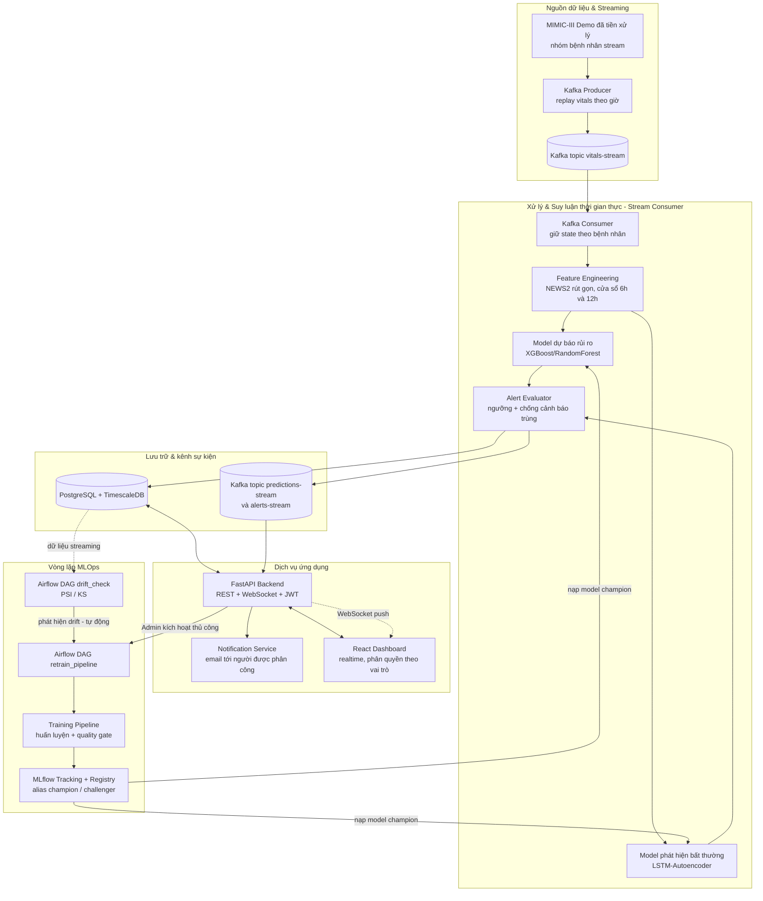

# 2.1. Sơ đồ chức năng tổng quát

Sơ đồ dưới đây chia hệ thống thành 5 nhóm chức năng lớn:
- **Nguồn dữ liệu & Streaming**
- **Xử lý & Suy luận thời gian thực**
- **Lưu trữ & kênh sự kiện**
- **Dịch vụ ứng dụng (Backend/Frontend)**
- **Vòng lặp MLOps**

**Giải thích luồng chính**:
1. **Replay.** Dữ liệu vitals đã tiền xử lý của nhóm bệnh nhân `stream` được phát lại theo từng giờ qua Kafka như một nguồn streaming thật.
2. **Suy luận.** Consumer giữ state theo từng bệnh nhân, tính đặc trưng bằng cùng thư viện đã dùng khi huấn luyện, rồi chạy 2 mô hình:
   - dự báo rủi ro trong 4 giờ tới;
   - phát hiện bất thường so với baseline của chính bệnh nhân.
3. **Lưu và phát sự kiện.** Kết quả được lưu vào DB và publish lên topic `predictions-stream`. Cảnh báo chỉ được tạo khi vượt ngưỡng và không trùng cảnh báo đang mở; khi đó nó được lưu vào DB và publish lên `alerts-stream`.
4. **Thông báo.** Backend consume 2 topic này để đẩy WebSocket lên dashboard và gửi email. Người nhận là bác sĩ/điều dưỡng được phân công cho bệnh nhân.
5. **Vòng lặp MLOps.**
   - DAG `drift_check` định kỳ so sánh phân phối dữ liệu streaming với phân phối huấn luyện của model champion.
   - Khi lệch đáng kể, nó tự động kích hoạt DAG `retrain_pipeline`. Admin cũng có thể kích hoạt thủ công.
   - Model mới chỉ nhận alias `champion` khi qua quality gate. Consumer phát hiện alias đổi và nạp model mới.
