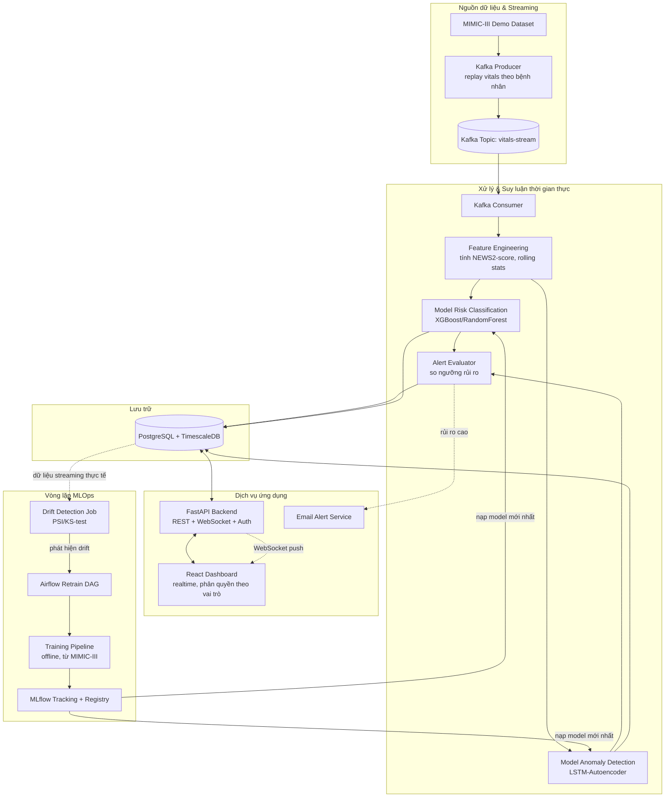

# 2.1. Sơ đồ chức năng tổng quát

Sơ đồ dưới đây chia hệ thống thành 5 nhóm chức năng lớn: **Nguồn dữ liệu & Streaming**, **Xử lý & Suy luận thời gian thực**, **Lưu trữ**, **Dịch vụ ứng dụng (Backend/Frontend)**, và **Vòng lặp MLOps**.

**Giải thích luồng chính**: dữ liệu vitals được phát lại (replay) qua Kafka như một nguồn streaming thật → consumer tính feature và chạy song song 2 mô hình (phân loại rủi ro + phát hiện bất thường) → kết quả được lưu vào DB và đánh giá ngưỡng cảnh báo → nếu vượt ngưỡng, đẩy cảnh báo realtime lên dashboard qua WebSocket và gửi email → toàn bộ dữ liệu thực tế được dùng để giám sát drift, khi phát hiện lệch sẽ kích hoạt Airflow chạy lại pipeline huấn luyện, đăng ký phiên bản model mới vào MLflow Registry để hệ thống suy luận nạp lại.
