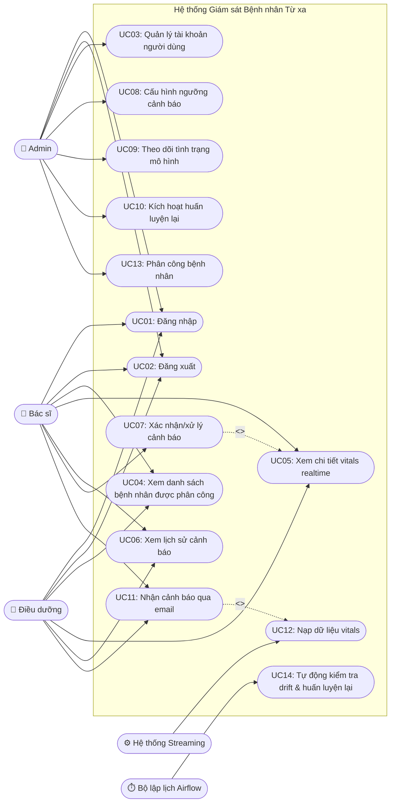

# 2.2. Biểu đồ Use Case

## Danh sách actor

| Actor | Mô tả |
|---|---|
| Admin | Quản trị hệ thống, người dùng, phân công bệnh nhân, giám sát mô hình |
| Bác sĩ | Theo dõi bệnh nhân được phân công, xác nhận và xử lý cảnh báo |
| Điều dưỡng | Theo dõi realtime bệnh nhân được phân công, nhận cảnh báo |
| Hệ thống Streaming (secondary actor) | Nguồn dữ liệu vitals tự động đẩy vào hệ thống (Kafka), không phải người dùng trực tiếp |
| Bộ lập lịch Airflow (secondary actor) | Kích hoạt định kỳ việc kiểm tra drift và huấn luyện lại tự động |

## Danh sách Use Case

| Mã | Use case | Actor chính |
|---|---|---|
| UC01 | Đăng nhập | Admin, Bác sĩ, Điều dưỡng |
| UC02 | Đăng xuất | Admin, Bác sĩ, Điều dưỡng |
| UC03 | Quản lý tài khoản người dùng | Admin |
| UC04 | Xem danh sách bệnh nhân được phân công & mức rủi ro | Bác sĩ, Điều dưỡng |
| UC05 | Xem chi tiết vitals realtime của bệnh nhân | Bác sĩ, Điều dưỡng |
| UC06 | Xem lịch sử cảnh báo | Bác sĩ, Điều dưỡng |
| UC07 | Xác nhận/xử lý cảnh báo | Bác sĩ |
| UC08 | Cấu hình ngưỡng cảnh báo | Admin |
| UC09 | Theo dõi tình trạng mô hình & drift report | Admin |
| UC10 | Kích hoạt huấn luyện lại mô hình (thủ công) | Admin |
| UC11 | Nhận cảnh báo qua email | Bác sĩ, Điều dưỡng |
| UC12 | Nạp dữ liệu vitals vào hệ thống (streaming) | Hệ thống Streaming |
| UC13 | Phân công bệnh nhân cho bác sĩ/điều dưỡng | Admin |
| UC14 | Tự động kiểm tra drift & huấn luyện lại | Bộ lập lịch Airflow |

## Biểu đồ

**Ghi chú quan hệ:**
- **Đăng nhập (UC01) là tiền điều kiện** của mọi use case UC02–UC11 và UC13. Nó được ghi ở phần tiền điều kiện của từng use case, không vẽ bằng `<<include>>` — đăng nhập không phải một bước con của từng chức năng, và vẽ lặp lại cho mọi use case sẽ làm rối biểu đồ.
- `UC07 <<include>> UC05`: xử lý cảnh báo bắt buộc phải xem chi tiết vitals trước khi xác nhận.
- `UC11 <<extend>> UC12`:
  - Gửi email cảnh báo là nhánh mở rộng, chỉ phát sinh khi dữ liệu nạp vào (UC12) vượt ngưỡng rủi ro và không trùng cảnh báo đang mở.
  - Không xảy ra ở mọi lần nạp dữ liệu.
  - Người nhận là bác sĩ và điều dưỡng được phân công (UC13).
- **Phạm vi dữ liệu**: Bác sĩ và Điều dưỡng chỉ xem được bệnh nhân được phân công cho mình (UC04–UC07, UC11). Admin không theo dõi bệnh nhân, chỉ quản lý phân công (UC13).
- `UC14` chạy tự động theo lịch; `UC10` là đường kích hoạt thủ công của cùng quy trình huấn luyện lại. Cả hai đều phải qua quality gate trước khi thay model đang chạy (mục 2.9.5).
