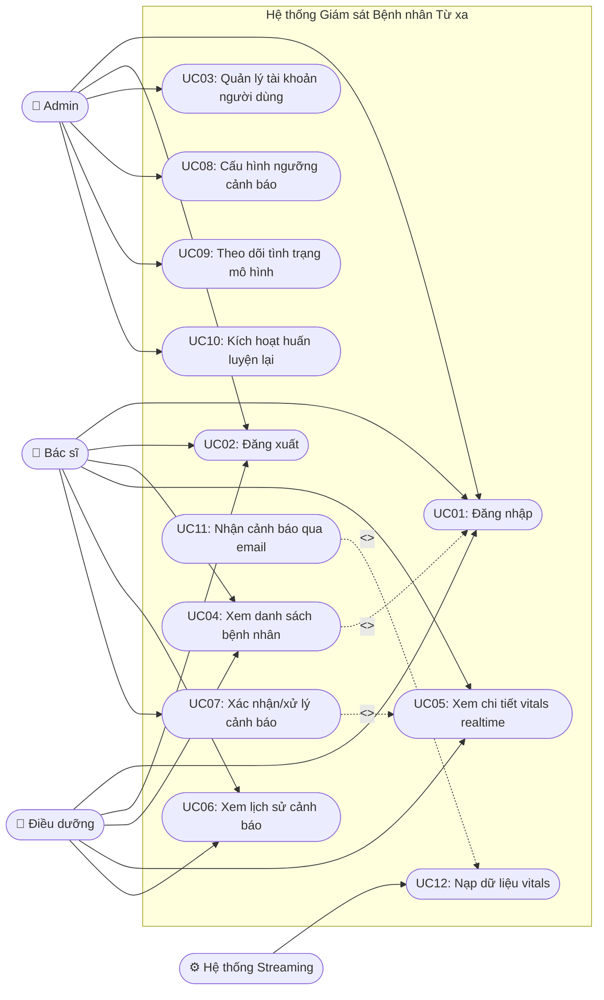

# 2.2. Biểu đồ Use Case

## Danh sách actor

| Actor | Mô tả |
|---|---|
| Admin | Quản trị hệ thống, người dùng, giám sát mô hình |
| Bác sĩ | Theo dõi bệnh nhân được phân công, xử lý cảnh báo |
| Điều dưỡng | Theo dõi realtime, nhận cảnh báo |
| Hệ thống Streaming (secondary actor) | Nguồn dữ liệu vitals tự động đẩy vào hệ thống (Kafka), không phải người dùng trực tiếp |

## Danh sách Use Case

| Mã | Use case | Actor chính |
|---|---|---|
| UC01 | Đăng nhập | Admin, Bác sĩ, Điều dưỡng |
| UC02 | Đăng xuất | Admin, Bác sĩ, Điều dưỡng |
| UC03 | Quản lý tài khoản người dùng | Admin |
| UC04 | Xem danh sách bệnh nhân & mức rủi ro | Bác sĩ, Điều dưỡng |
| UC05 | Xem chi tiết vitals realtime của bệnh nhân | Bác sĩ, Điều dưỡng |
| UC06 | Xem lịch sử cảnh báo | Bác sĩ, Điều dưỡng |
| UC07 | Xác nhận/xử lý cảnh báo | Bác sĩ |
| UC08 | Cấu hình ngưỡng cảnh báo | Admin |
| UC09 | Theo dõi tình trạng mô hình & drift report | Admin |
| UC10 | Kích hoạt huấn luyện lại mô hình (thủ công) | Admin |
| UC11 | Nhận cảnh báo qua email | Bác sĩ, Điều dưỡng |
| UC12 | Nạp dữ liệu vitals vào hệ thống (streaming) | Hệ thống Streaming |

## Biểu đồ

**Ghi chú quan hệ:**
- `UC07 <<include>> UC05`: xử lý cảnh báo bắt buộc phải xem chi tiết vitals trước khi xác nhận.
- `UC04 <<include>> UC01`: mọi chức năng xem dữ liệu đều yêu cầu đã đăng nhập (áp dụng ẩn cho UC05, UC06 tương tự, không vẽ lặp lại để tránh rối biểu đồ).
- `UC11 <<extend>> UC12`: việc gửi email cảnh báo là nhánh mở rộng phát sinh khi dữ liệu nạp vào (UC12) vượt ngưỡng rủi ro, không xảy ra ở mọi lần nạp dữ liệu.
