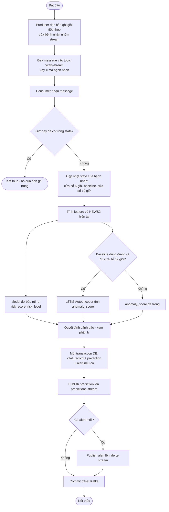
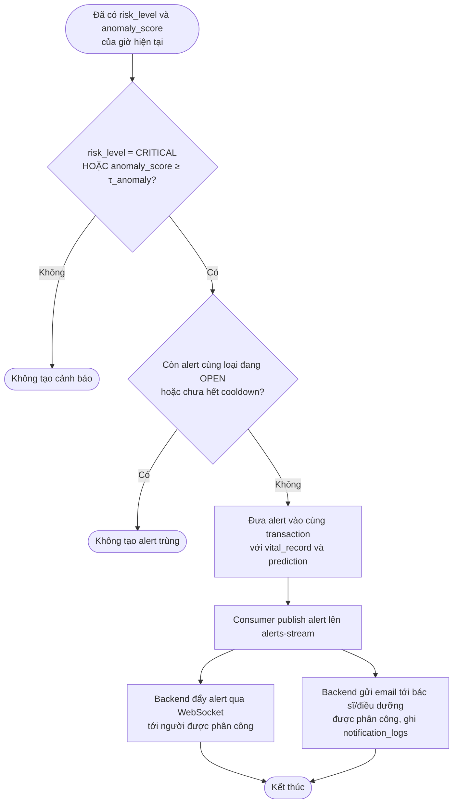
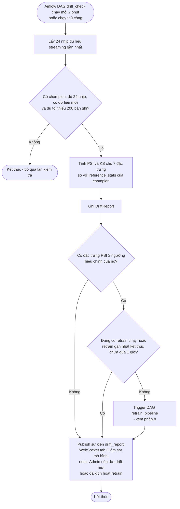
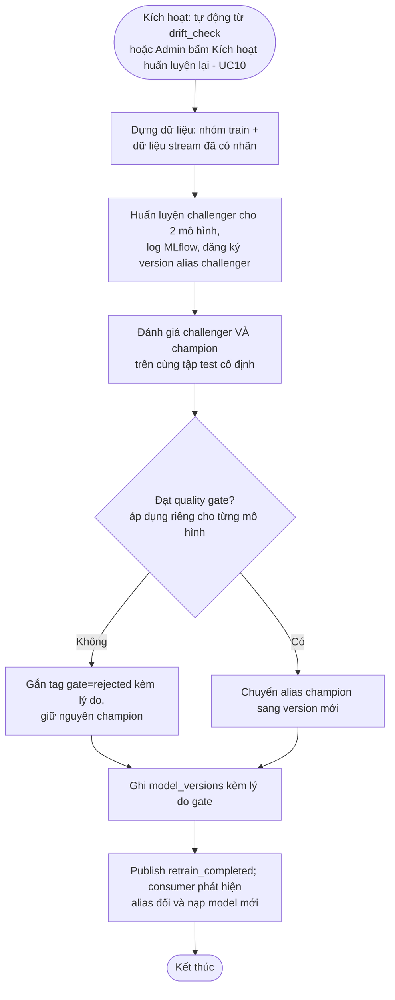

# 2.3. Biểu đồ hoạt động (Activity Diagram)

Hai luồng dài (2.3.1 và 2.3.3) được tách thành hai phần a/b. Lý do: mỗi luồng vẽ liền một mạch cho tỉ lệ khung hình khoảng 0,35 — cao gấp ba lần khung một trang A4 dọc, không đưa được vào bản in mà vẫn đọc được chữ (xem `docs/report/README.md`). Điểm tách trùng với ranh giới nghiệp vụ thật, nên hai phần đọc độc lập được.

## 2.3.1. Luồng xử lý dữ liệu streaming → cảnh báo (UC12, UC11)

### a) Từ message tới bản ghi đã lưu và sự kiện đã phát

### b) Quyết định cảnh báo và thông báo người được phân công

Ghi chú:
- Prediction **luôn** được lưu và đẩy lên dashboard. Cảnh báo chỉ được tạo khi vượt ngưỡng **và** không trùng với cảnh báo đang mở.
- **Thứ tự ghi DB rồi mới commit offset là bắt buộc**: commit offset trước khi ghi DB sẽ làm mất bản ghi nếu consumer chết đúng giữa hai bước. Với thứ tự trên, sự cố chỉ dẫn tới việc xử lý lại message, và bản ghi trùng bị chặn ở nhánh `C1`.
- Quyết định cảnh báo nằm **trước** khi ghi DB, và alert được ghi trong **cùng một transaction** với vital_record + prediction — không phải hai lần ghi riêng. (Sơ đồ trước 2026-09-12 vẽ sai chỗ này: nó tách thành hai lần ghi và đặt bước quyết định sau khi publish prediction. Đã sửa cho khớp `services/streaming/src/rpm_streaming/consumer/main.py`.)
- Ngưỡng `τ_critical`, `τ_anomaly` và thời gian cooldown được mô tả ở mục 2.9.6.
- Mức WARNING chỉ đổi màu badge, không tạo cảnh báo.

## 2.3.2. Luồng đăng nhập (UC01)

## 2.3.3. Luồng phát hiện drift → huấn luyện lại (UC09, UC10)

### a) DAG `drift_check`: phát hiện drift và quyết định kích hoạt

### b) DAG `retrain_pipeline`: huấn luyện lại và quality gate

Ghi chú:
- Retrain được kích hoạt **tự động** khi có drift. Quality gate (mục 2.9.5) là chốt chặn không cho model kém hơn lên thay. Admin vẫn có thể kích hoạt thủ công (UC10) bất kỳ lúc nào.
- Quyết định drift dùng ngưỡng PSI **hiệu chỉnh theo từng đặc trưng** (luôn ≥ 0,25), không dùng một ngưỡng 0,25 chung — lý do ở mục 2.9.4.
- Thông báo Admin đứng sau bước chống vòng lặp để nội dung email nói rõ đã kích hoạt retrain hay chưa (và vì sao không).
- Ở bước đánh giá, **cả challenger lẫn champion đều được chấm lại** trên tập test cố định ngay tại thời điểm đó, không lấy metric đã log từ lần trước (có thể đo trên dữ liệu khác).
- Quality gate gồm 3 điều kiện:
  - Đạt ngưỡng tuyệt đối ở 2.10.3.
  - Mô hình rủi ro phải thắng baseline persistence.
  - Không kém champion trên cùng tập test.
