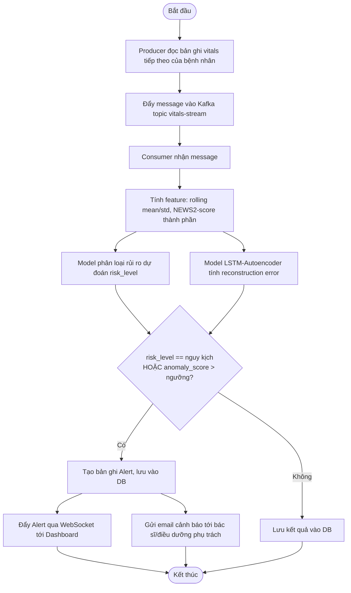
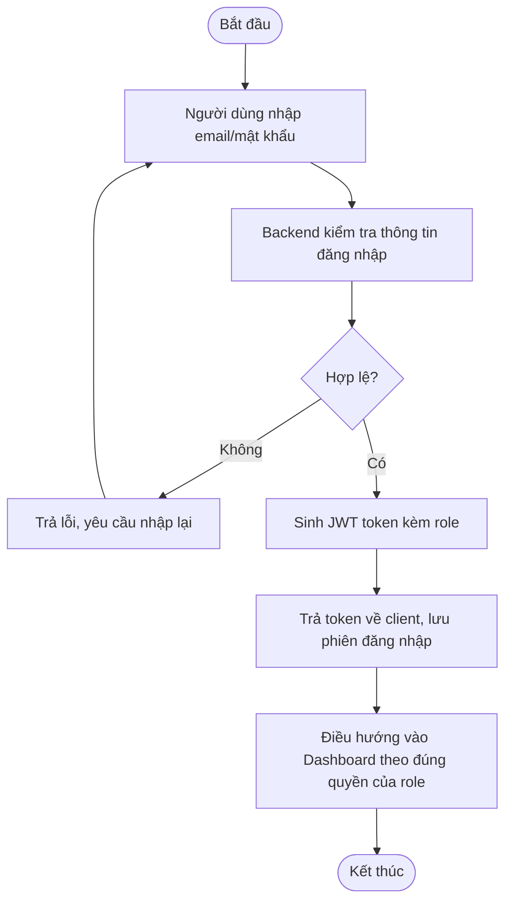
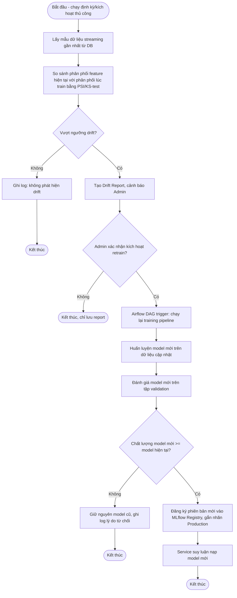

# 2.3. Biểu đồ hoạt động (Activity Diagram)

## 2.3.1. Luồng xử lý dữ liệu streaming → cảnh báo (UC12, UC11)

## 2.3.2. Luồng đăng nhập (UC01)

## 2.3.3. Luồng phát hiện drift → huấn luyện lại (UC09, UC10)

