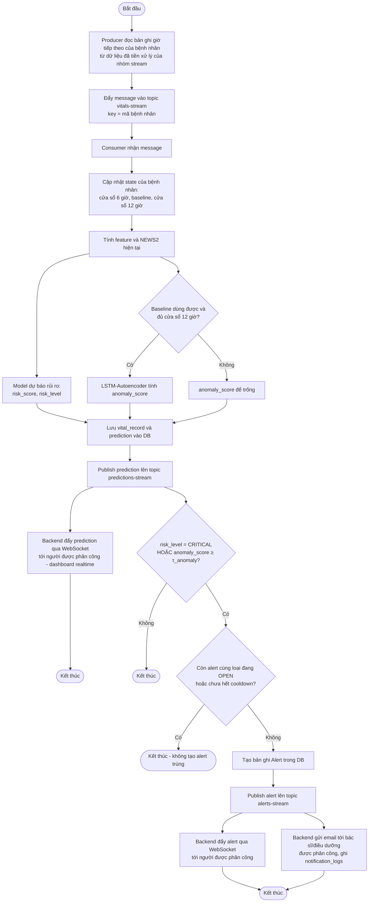
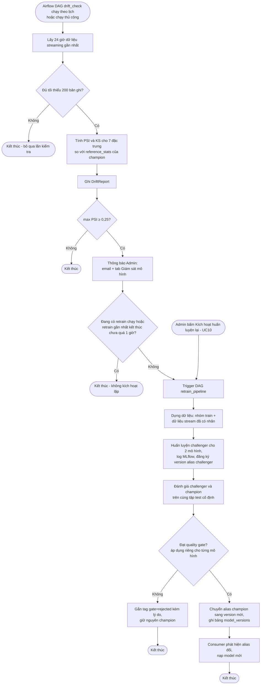

# 2.3. Biểu đồ hoạt động (Activity Diagram)

## 2.3.1. Luồng xử lý dữ liệu streaming → cảnh báo (UC12, UC11)

Ghi chú:
- Prediction **luôn** được lưu và đẩy lên dashboard. Cảnh báo chỉ được tạo khi vượt ngưỡng **và** không trùng với cảnh báo đang mở.
- Ngưỡng `τ_critical`, `τ_anomaly` và thời gian cooldown được mô tả ở mục 2.9.6.
- Mức WARNING chỉ đổi màu badge, không tạo cảnh báo.

## 2.3.2. Luồng đăng nhập (UC01)

## 2.3.3. Luồng phát hiện drift → huấn luyện lại (UC09, UC10)

Ghi chú:
- Retrain được kích hoạt **tự động** khi có drift. Quality gate (mục 2.9.5) là chốt chặn không cho model kém hơn lên thay. Admin vẫn có thể kích hoạt thủ công (UC10) bất kỳ lúc nào.
- Quality gate gồm 3 điều kiện:
  - Đạt ngưỡng tuyệt đối ở 2.10.3.
  - Mô hình rủi ro phải thắng baseline persistence.
  - Không kém champion trên cùng tập test.
