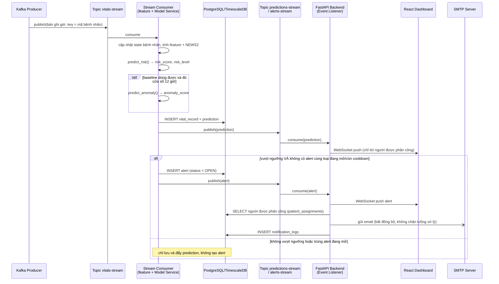
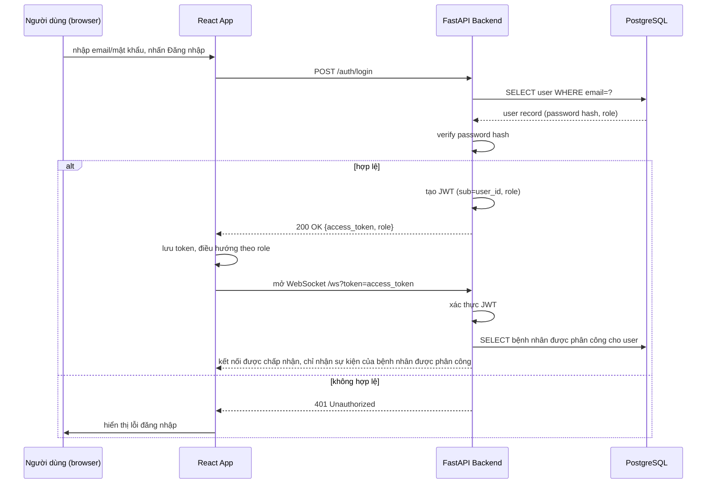
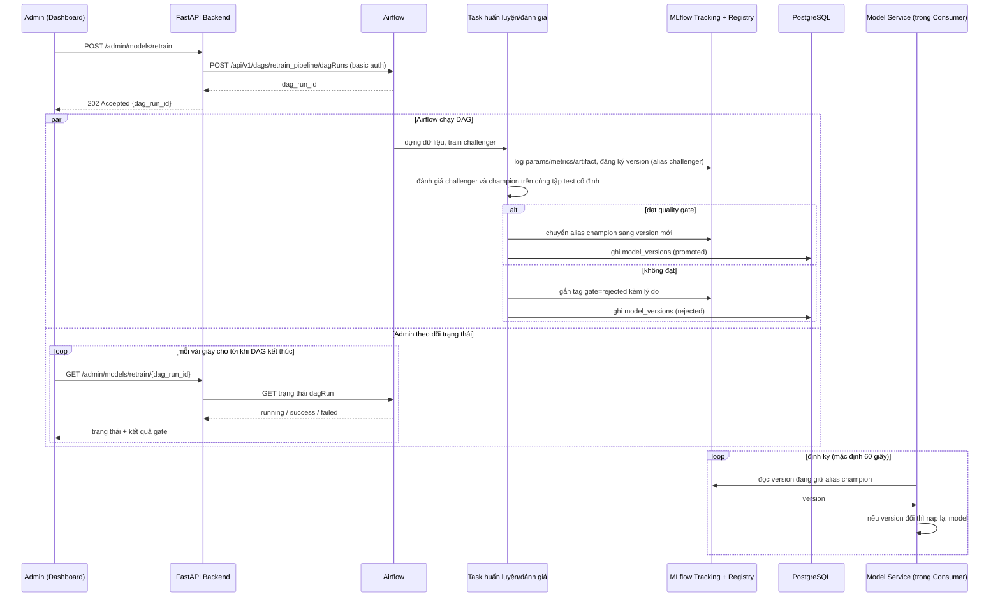

# 2.4. Biểu đồ trình tự (Sequence Diagram)

## 2.4.1. Dự đoán realtime & phát cảnh báo

Ghi chú hiện thực:
- **Model Service** là module chạy bên trong consumer, không phải service riêng.
  - Khi khởi động, nó nạp `models:/risk_classifier@champion` và `models:/anomaly_detector@champion` từ MLflow.
  - Sau đó định kỳ kiểm tra alias để nạp lại khi có model mới (mục 2.4.3).
- **Consumer giữ state theo từng bệnh nhân**: toàn bộ giá trị đo theo giờ của đợt ICU đang phát lại (tối đa vài trăm giờ). Mỗi giờ mới, đặc trưng được tính lại bằng đúng hàm của `rpm_common` như lúc huấn luyện, rồi lấy giờ mới nhất.
  - Khi khởi động lại, state được dựng lại từ **toàn bộ** `vital_records` của bệnh nhân trong DB, không chỉ 24 bản ghi gần nhất. Lý do: baseline cá nhân tính trên 24 giờ đầu của đợt (mục 2.9.1f), nên thiếu các giờ đầu thì z-score sai.
  - Offset Kafka chỉ được commit sau khi đã ghi DB (at-least-once). Bản ghi giờ đã có trong DB được bỏ qua khi nhận lại, nên không có bản ghi hay cảnh báo trùng.
  - Kiểm thử thật (2026-09-11): kill cứng consumer giữa lúc phát lại rồi bật lại → đủ 229/229 bản ghi, 0 bản ghi trùng, 0 cảnh báo OPEN trùng.
- **Consumer không gọi trực tiếp backend**. Nó publish kết quả lên Kafka và backend tự consume. Hai tiến trình tách rời nhau: backend dừng thì consumer vẫn chạy, chỉ trễ phần đẩy thông báo.
- **Backend là nơi duy nhất gửi email và đẩy WebSocket.**
  - Event Listener của backend dùng consumer group riêng, commit offset sau khi xử lý: backend tắt rồi bật lại sẽ đọc tiếp từ offset cũ. Lần chạy đầu tiên (chưa có offset) bắt đầu từ sự kiện mới nhất, để không gửi email cho cảnh báo cũ.
  - Email gửi trong thread riêng, không chặn luồng đẩy WebSocket. Nếu `notification_logs` đã có `SENT` cho cặp (cảnh báo, người nhận) thì không gửi lại.
  - Khi bác sĩ xác nhận/xử lý cảnh báo (UC07), backend đẩy sự kiện `alert_update` tới mọi người cùng phụ trách bệnh nhân.
- Topic `vitals-stream` dùng key = mã bệnh nhân, nên các bản ghi của cùng 1 bệnh nhân luôn nằm cùng partition và đúng thứ tự.

## 2.4.2. Đăng nhập hệ thống và mở kết nối realtime

Ghi chú hiện thực:
- Trình duyệt không đặt được header `Authorization` cho WebSocket, nên token đi qua query string. Backend che `token=` trong log truy cập để token không lộ ra log.
- Token sai, hết hạn hoặc tài khoản đã bị khóa → server đóng kết nối với mã 1008 (policy violation).

## 2.4.3. Kích hoạt huấn luyện lại mô hình (thủ công bởi Admin — UC10)

Ghi chú:
- Huấn luyện có thể mất nhiều phút, nên backend trả `202 Accepted` ngay và giao diện theo dõi trạng thái, thay vì giữ request chờ.
- Luồng retrain **tự động** do drift dùng đúng DAG `retrain_pipeline` này, chỉ khác là được DAG `drift_check` kích hoạt (xem 2.3.3).
