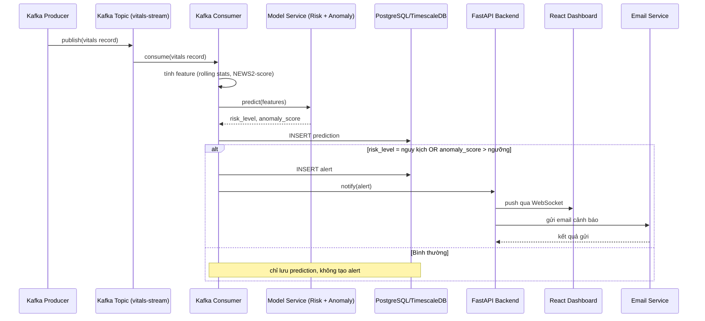
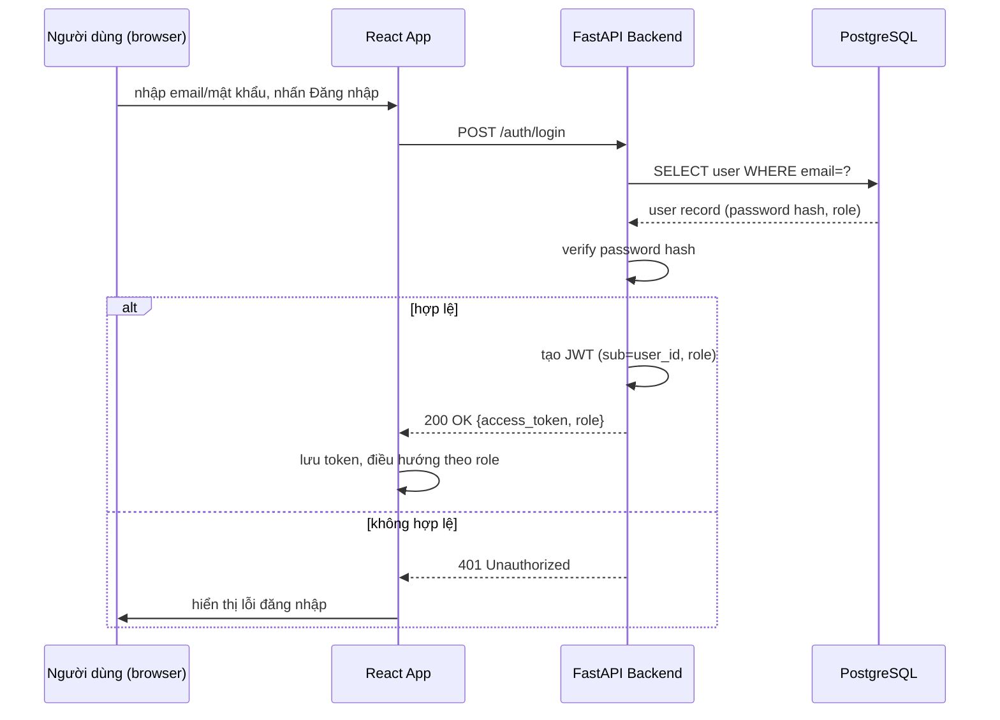
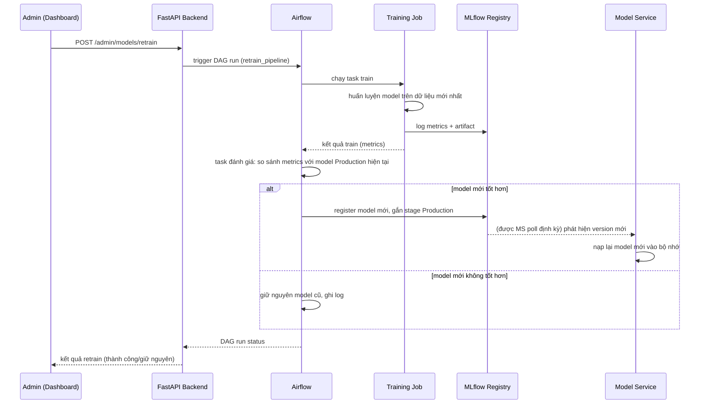

# 2.4. Biểu đồ trình tự (Sequence Diagram)

## 2.4.1. Dự đoán realtime & phát cảnh báo

```mermaid
sequenceDiagram
    participant P as Kafka Producer
    participant K as Kafka Topic (vitals-stream)
    participant C as Kafka Consumer
    participant M as Model Service (Risk + Anomaly)
    participant DB as PostgreSQL/TimescaleDB
    participant BE as FastAPI Backend
    participant FE as React Dashboard
    participant Mail as Email Service

    P->>K: publish(vitals record)
    K->>C: consume(vitals record)
    C->>C: tính feature (rolling stats, NEWS2-score)
    C->>M: predict(features)
    M-->>C: risk_level, anomaly_score
    C->>DB: INSERT prediction
    alt risk_level = nguy kịch OR anomaly_score > ngưỡng
        C->>DB: INSERT alert
        C->>BE: notify(alert)
        BE->>FE: push qua WebSocket
        BE->>Mail: gửi email cảnh báo
        Mail-->>BE: kết quả gửi
    else Bình thường
        Note over C,DB: chỉ lưu prediction, không tạo alert
    end
```

## 2.4.2. Đăng nhập hệ thống

```mermaid
sequenceDiagram
    participant U as Người dùng (browser)
    participant FE as React App
    participant BE as FastAPI Backend
    participant DB as PostgreSQL

    U->>FE: nhập email/mật khẩu, nhấn Đăng nhập
    FE->>BE: POST /auth/login
    BE->>DB: SELECT user WHERE email=?
    DB-->>BE: user record (password hash, role)
    BE->>BE: verify password hash
    alt hợp lệ
        BE->>BE: tạo JWT (sub=user_id, role)
        BE-->>FE: 200 OK {access_token, role}
        FE->>FE: lưu token, điều hướng theo role
    else không hợp lệ
        BE-->>FE: 401 Unauthorized
        FE->>U: hiển thị lỗi đăng nhập
    end
```

## 2.4.3. Kích hoạt huấn luyện lại mô hình (thủ công bởi Admin)

```mermaid
sequenceDiagram
    participant A as Admin (Dashboard)
    participant BE as FastAPI Backend
    participant AF as Airflow
    participant TR as Training Job
    participant MLF as MLflow Registry
    participant MS as Model Service

    A->>BE: POST /admin/models/retrain
    BE->>AF: trigger DAG run (retrain_pipeline)
    AF->>TR: chạy task train
    TR->>TR: huấn luyện model trên dữ liệu mới nhất
    TR->>MLF: log metrics + artifact
    TR-->>AF: kết quả train (metrics)
    AF->>AF: task đánh giá: so sánh metrics với model Production hiện tại
    alt model mới tốt hơn
        AF->>MLF: register model mới, gắn stage Production
        MLF-->>MS: (được MS poll định kỳ) phát hiện version mới
        MS->>MS: nạp lại model mới vào bộ nhớ
    else model mới không tốt hơn
        AF->>AF: giữ nguyên model cũ, ghi log
    end
    AF-->>BE: DAG run status
    BE-->>A: kết quả retrain (thành công/giữ nguyên)
```
