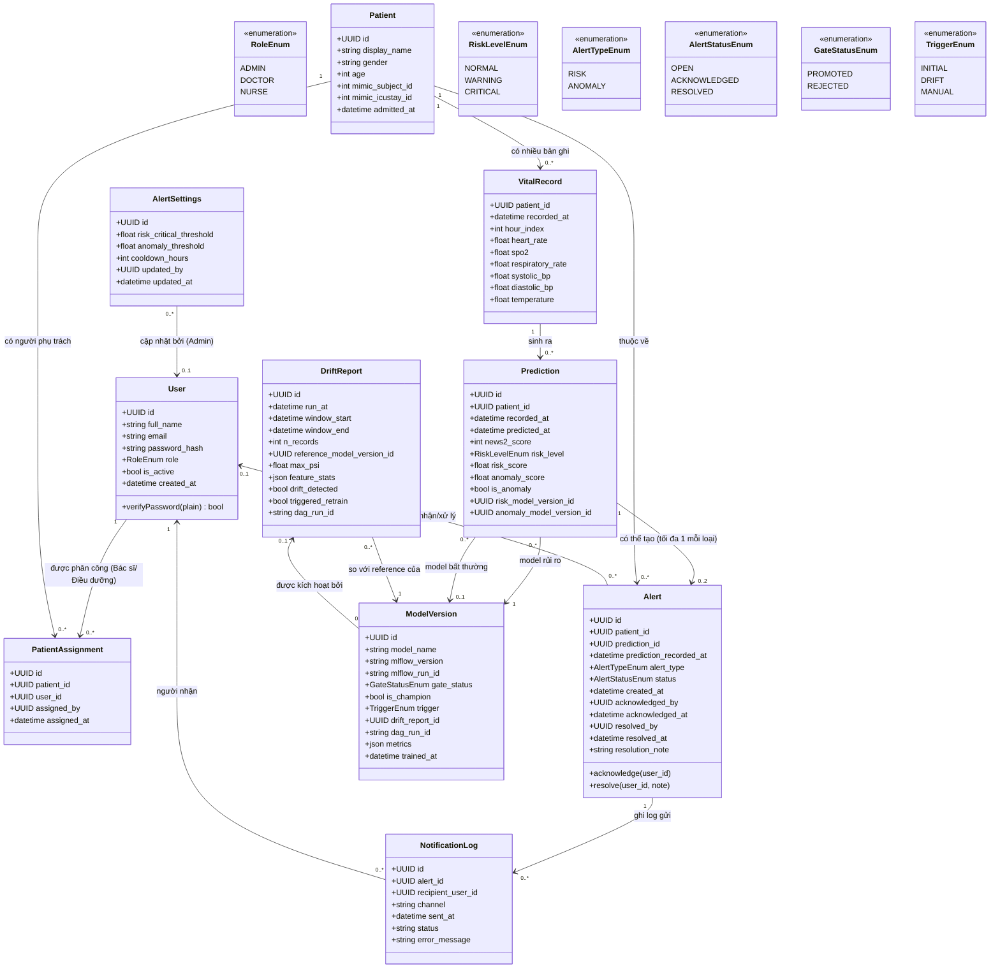

# 2.5. Biểu đồ Lớp (Class Diagram)

**Ghi chú thiết kế:**
- `Patient` là bệnh nhân **đang được giám sát**. Mỗi `Patient` ứng với 1 bệnh nhân MIMIC thuộc nhóm `stream` (`mimic_subject_id`) và đúng 1 đợt ICU được phát lại (`mimic_icustay_id`), xem mục 2.9.1(g).
  - MIMIC đã phi định danh (không có tên, ngày sinh bị dịch chuyển), nên chỉ lưu `display_name` giả lập (vd `BN-10006`) và `age` tính sẵn.
- `PatientAssignment` là quan hệ nhiều–nhiều giữa bệnh nhân và người dùng có role `DOCTOR` hoặc `NURSE`, do Admin quản lý (UC13). Nó quyết định 3 việc:
  - (1) ai được xem bệnh nhân,
  - (2) ai nhận sự kiện WebSocket,
  - (3) ai nhận email cảnh báo.
- `Prediction` tách khỏi `VitalRecord`, để một bản ghi vitals có thể được **tái dự đoán** khi có model mới mà không sửa dữ liệu gốc.
  - Vì vậy quan hệ là `1 — 0..*`. Luồng chính tạo đúng 1 prediction cho mỗi bản ghi.
  - Mỗi prediction ghi rõ **version của cả 2 model** đã dùng. `anomaly_model_version_id` để trống khi chưa đủ cửa sổ 12 giờ.
- `news2_score` là điểm NEWS2 rút gọn **hiện tại** (tính bằng luật), hiển thị cạnh `risk_level`. `risk_level` là mức rủi ro **dự báo trong h giờ tới** của mô hình học máy (mục 2.9.2).
- `Alert` tách khỏi `Prediction` vì không phải prediction nào cũng sinh cảnh báo. Một prediction có thể sinh tối đa 2 cảnh báo (1 `RISK` và 1 `ANOMALY`) khi cả hai điều kiện cùng xảy ra.
  - Trạng thái: `OPEN → ACKNOWLEDGED` (Bác sĩ đã nhận) → `RESOLVED` (Bác sĩ đã xử lý xong).
- `AlertSettings` lưu các ngưỡng Admin cấu hình (UC08). `risk_critical_threshold` để trống nghĩa là dùng ngưỡng khuyến nghị gắn kèm model champion.
- `ModelVersion` là bản sao metadata của MLflow Model Registry (không lưu trọng số model trong DB nghiệp vụ). Mọi challenger đều được ghi lại kể cả khi bị từ chối (`gate_status = REJECTED`). Mỗi `model_name` có đúng 1 version `is_champion = true`.
- `DriftReport` là **1 lần chạy** kiểm tra drift. PSI/KS chi tiết của từng đặc trưng nằm trong `feature_stats`. Nó tham chiếu version champion có phân phối được dùng làm mốc so sánh. Các version được huấn luyện do lần drift này kích hoạt trỏ ngược lại qua `drift_report_id`.
