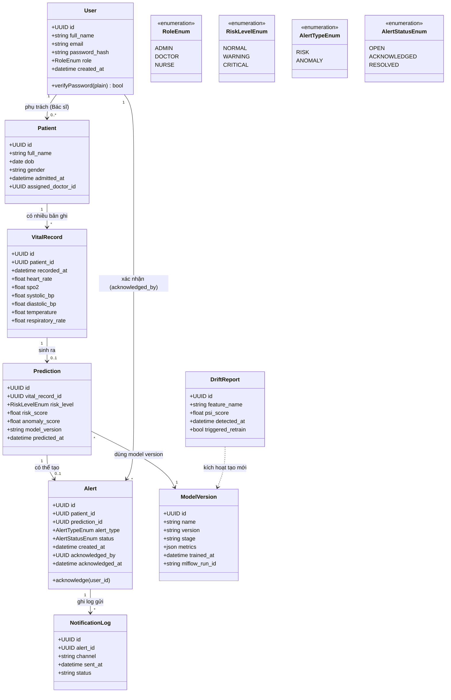

# 2.5. Biểu đồ Lớp (Class Diagram)

**Ghi chú thiết kế:**
- `Prediction` tách khỏi `VitalRecord` để một bản ghi vitals có thể được tái dự đoán khi có model mới mà không cần sửa dữ liệu gốc.
- `Alert` tách khỏi `Prediction` vì không phải mọi prediction đều sinh alert (chỉ khi vượt ngưỡng); quan hệ 0..1 phản ánh đúng điều này (khớp với activity diagram 2.3.1).
- `ModelVersion` ánh xạ trực tiếp tới MLflow Model Registry (không lưu trọng số model trong DB nghiệp vụ, chỉ lưu metadata tham chiếu) — tách biệt hạ tầng lưu trữ model khỏi DB nghiệp vụ.
