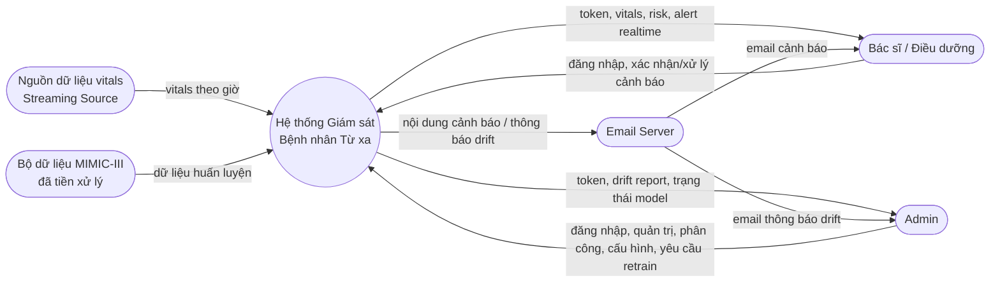
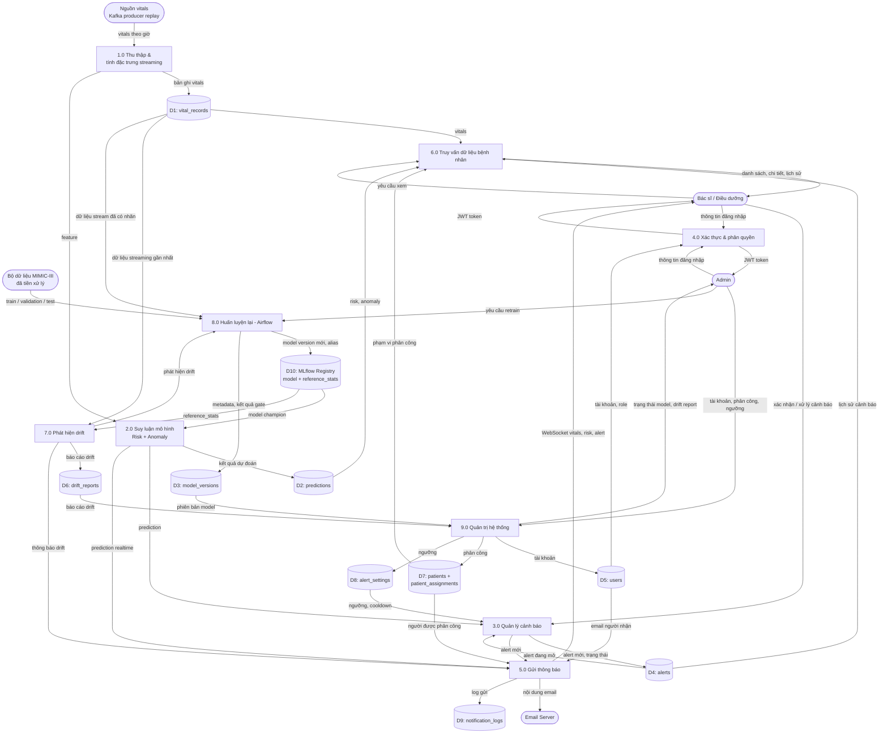

# 2.6. Biểu đồ luồng dữ liệu (DFD) & Database Diagram

## 2.6.1. DFD mức ngữ cảnh (Context Diagram - Level 0)

## 2.6.2. DFD mức 1 (Level 1)

**Kiểm tra cân bằng với mức 0**: mọi luồng vào/ra của hệ thống ở mức 0 đều có tiến trình tương ứng ở mức 1:

| Luồng ở mức 0 | Tiến trình ở mức 1 |
|---|---|
| vitals | 1.0 |
| dữ liệu huấn luyện | 8.0 |
| đăng nhập | 4.0 |
| xác nhận/xử lý cảnh báo | 3.0 |
| vitals/risk/alert realtime | 5.0, 6.0 |
| quản trị/phân công/cấu hình | 9.0 |
| yêu cầu retrain | 8.0 |
| drift report/trạng thái model | 9.0 |
| email | 5.0 |

Mọi kho dữ liệu đều có ít nhất một luồng ghi và một luồng đọc; riêng D9 là log kiểm toán, chỉ ghi.

## 2.6.3. Bảng dữ liệu vật lý (tổng quan)

Chi tiết cardinality/quan hệ trình bày ở mục 2.7 (ERD). Bảng dưới đây liệt kê nhanh các bảng chính tương ứng với data store trong DFD:

| Data store | Bảng | Vai trò |
|---|---|---|
| D1 | `vital_records` | Bản ghi vitals theo giờ của từng bệnh nhân — TimescaleDB hypertable theo `recorded_at` |
| D2 | `predictions` | Kết quả suy luận (NEWS2 hiện tại, risk_level, risk_score, anomaly_score, version 2 model) — TimescaleDB hypertable theo `recorded_at` |
| D3 | `model_versions` | Metadata tham chiếu tới MLflow Model Registry, kết quả quality gate (không lưu trọng số) |
| D4 | `alerts` | Cảnh báo phát sinh khi vượt ngưỡng, có trạng thái xử lý |
| D5 | `users` | Tài khoản, vai trò |
| D6 | `drift_reports` | Kết quả mỗi lần chạy kiểm tra drift |
| D7 | `patients`, `patient_assignments` | Bệnh nhân đang giám sát và phân công bác sĩ/điều dưỡng |
| D8 | `alert_settings` | Ngưỡng cảnh báo và cooldown do Admin cấu hình |
| D9 | `notification_logs` | Log gửi email cảnh báo/thông báo |
| D10 | MLflow Registry (ngoài `rpm_db`) | Model artifact, alias `champion`/`challenger`, `reference_stats.json` |

TimescaleDB được áp dụng cho `vital_records` và `predictions` (dữ liệu time-series). Các bảng nghiệp vụ còn lại dùng bảng PostgreSQL thông thường. MLflow dùng database riêng `mlflow_db` và volume artifact riêng.
