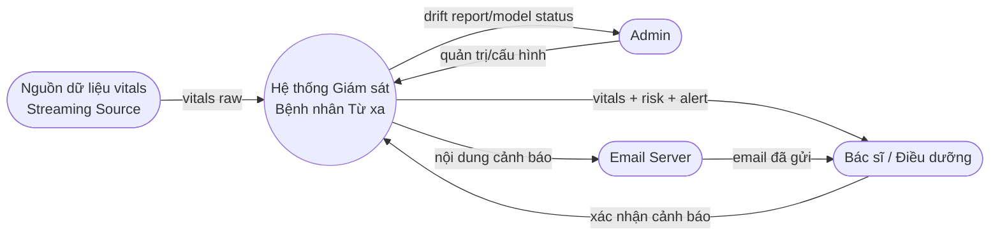
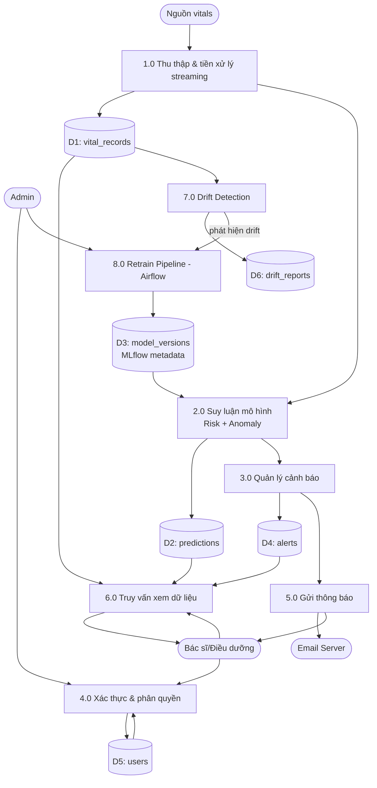

# 2.6. Biểu đồ luồng dữ liệu (DFD) & Database Diagram

## 2.6.1. DFD mức ngữ cảnh (Context Diagram - Level 0)

## 2.6.2. DFD mức 1 (Level 1)

## 2.6.3. Bảng dữ liệu vật lý (tổng quan)

Chi tiết cardinality/quan hệ trình bày ở mục 2.7 (ERD). Bảng dưới đây liệt kê nhanh các bảng chính tương ứng với data store trong DFD:

| Data store | Bảng | Vai trò |
|---|---|---|
| D1 | `vital_records` | Lưu bản ghi vitals thô theo bệnh nhân, dùng TimescaleDB hypertable theo `recorded_at` |
| D2 | `predictions` | Kết quả suy luận (risk_level, risk_score, anomaly_score) gắn với `vital_records` |
| D3 | `model_versions` | Metadata tham chiếu tới MLflow Model Registry (không lưu trọng số) |
| D4 | `alerts` | Cảnh báo phát sinh khi vượt ngưỡng, có trạng thái xử lý |
| D5 | `users` | Tài khoản, vai trò |
| D6 | `drift_reports` | Kết quả phát hiện drift theo từng lần chạy job |

TimescaleDB được áp dụng cho `vital_records` và `predictions` (dữ liệu time-series tần suất cao), trong khi `users`, `alerts`, `model_versions`, `drift_reports` dùng bảng PostgreSQL thông thường.
