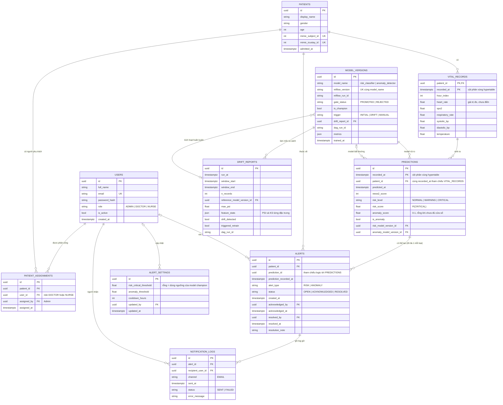

# 2.7. Biểu đồ mối quan hệ giữa các dữ liệu (ERD)

**Diễn giải cardinality và ràng buộc quan trọng:**
- `PATIENTS (1) — (0..*) PATIENT_ASSIGNMENTS (0..*) — (1) USERS`: quan hệ nhiều–nhiều giữa bệnh nhân và bác sĩ/điều dưỡng. Ràng buộc duy nhất `(patient_id, user_id)`. Role của `user_id` phải là `DOCTOR` hoặc `NURSE`, kiểm tra ở tầng ứng dụng.
- `PATIENTS (1) — (0..*) VITAL_RECORDS`: dữ liệu time-series. Khóa chính là cặp tự nhiên `(patient_id, recorded_at)`, mỗi bệnh nhân có tối đa 1 bản ghi mỗi giờ dữ liệu.
  - 6 cột vitals lưu **giá trị đo như producer gửi, chưa forward-fill**. Giờ không đo thì để trống. Consumer cần giá trị gốc để dựng lại đặc trưng giống hệt lúc huấn luyện khi khởi động lại. Giá trị đã điền được tính lại khi cần và có trong message `predictions-stream` (`vitals_filled`).
- `VITAL_RECORDS (1) — (0..*) PREDICTIONS`:
  - Luồng chính tạo đúng 1 prediction cho mỗi bản ghi.
  - Tái dự đoán bằng model mới sẽ thêm dòng mới, không sửa dòng cũ.
  - Liên kết qua cặp `(patient_id, recorded_at)`.
- `PREDICTIONS (1) — (0..2) ALERTS`: tối đa 1 cảnh báo `RISK` và 1 cảnh báo `ANOMALY` cho mỗi prediction.
- `USERS (0..1) — (0..*) ALERTS`: `acknowledged_by`/`resolved_by` để trống khi cảnh báo chưa được xử lý.
- `MODEL_VERSIONS (1) — (0..*) PREDICTIONS` (model rủi ro, bắt buộc) và `(0..1) — (0..*)` (model bất thường, để trống khi chưa đủ cửa sổ 12 giờ).
- `MODEL_VERSIONS`: ràng buộc duy nhất `(model_name, mlflow_version)`.
  - Consumer tự đồng bộ version champion từ MLflow vào bảng này khi nạp model (`gate_status = PROMOTED`, `is_champion = true`, bỏ cờ champion ở version cũ).
  - DAG `retrain_pipeline` (Giai đoạn G) ghi thêm các challenger, kể cả version bị từ chối.
- `MODEL_VERSIONS (1) — (0..*) DRIFT_REPORTS`: mỗi lần kiểm tra drift so với phân phối huấn luyện của đúng 1 version champion.
- `DRIFT_REPORTS (0..1) — (0..*) MODEL_VERSIONS`: các challenger được huấn luyện do một lần drift kích hoạt trỏ ngược về báo cáo đó. Retrain thủ công hoặc lần huấn luyện đầu tiên thì để trống.

**Lưu ý hiện thực với TimescaleDB:**
- `vital_records` và `predictions` là hypertable, phân vùng theo `recorded_at`. TimescaleDB bắt buộc mọi khóa chính/unique của hypertable phải chứa cột phân vùng, nên khóa chính là `(patient_id, recorded_at)` và `(id, recorded_at)`, không phải `id` đơn lẻ.
- Khóa ngoại **từ** hypertable **tới** bảng thường (`patients`, `model_versions`) được ràng buộc ở DB như bình thường. Khóa ngoại **trỏ vào** hypertable (`predictions → vital_records`, `alerts → predictions`) bị giới hạn tùy phiên bản TimescaleDB, nên được giữ là **tham chiếu logic**. Tính toàn vẹn đảm bảo ở tầng ứng dụng: consumer ghi `vital_record`, `prediction` và `alert` trong cùng một transaction.
- Các bảng còn lại dùng bảng PostgreSQL thông thường.
