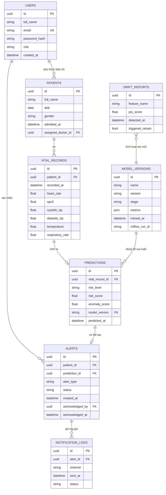

# 2.7. Biểu đồ mối quan hệ giữa các dữ liệu (ERD)

**Diễn giải cardinality quan trọng:**
- `PATIENTS (1) -- (0..*) VITAL_RECORDS`: một bệnh nhân có nhiều bản ghi vitals theo thời gian (time-series).
- `VITAL_RECORDS (1) -- (0..1) PREDICTIONS`: mỗi bản ghi vitals được suy luận tối đa 1 lần tại thời điểm phát sinh (không loại trừ việc tái suy luận tạo bản ghi Prediction mới khi có model mới — khi đó là 1..* nhưng ở luồng chính hệ thống chỉ giữ 0..1 hiện hành).
- `PREDICTIONS (1) -- (0..1) ALERTS`: chỉ những prediction vượt ngưỡng mới sinh alert.
- `USERS (1) -- (0..*) PATIENTS`: một bác sĩ phụ trách nhiều bệnh nhân (quan hệ `assigned_doctor_id`).
- `MODEL_VERSIONS (1) -- (0..*) PREDICTIONS`: một phiên bản model có thể được dùng cho nhiều prediction; khi model mới được đăng ký (do `DRIFT_REPORTS` kích hoạt retrain), các prediction tiếp theo sẽ tham chiếu `model_version` mới.
