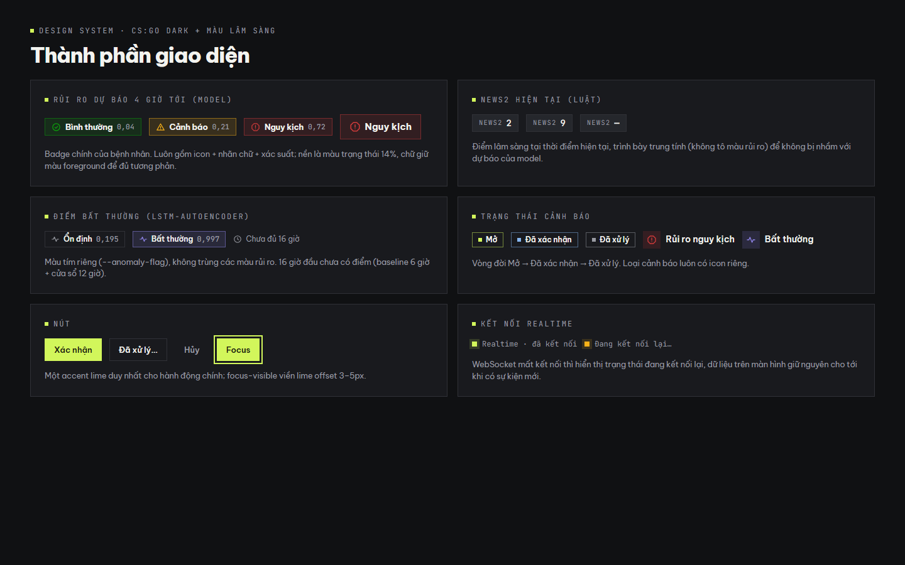
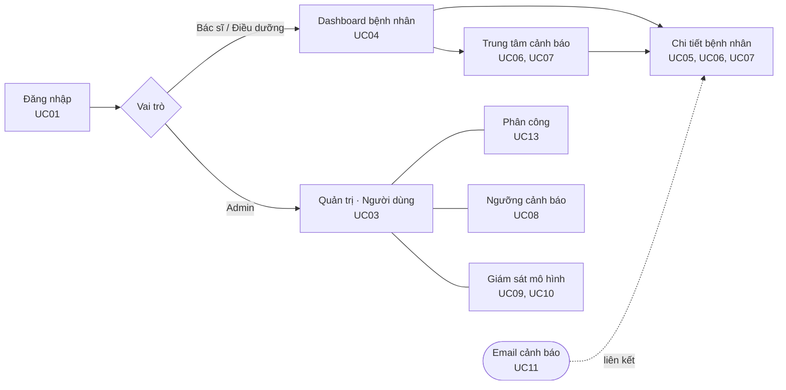
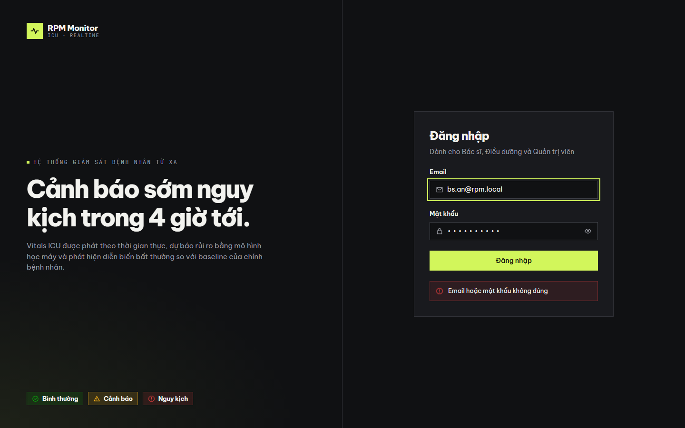
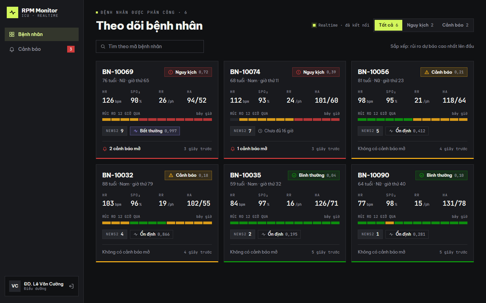
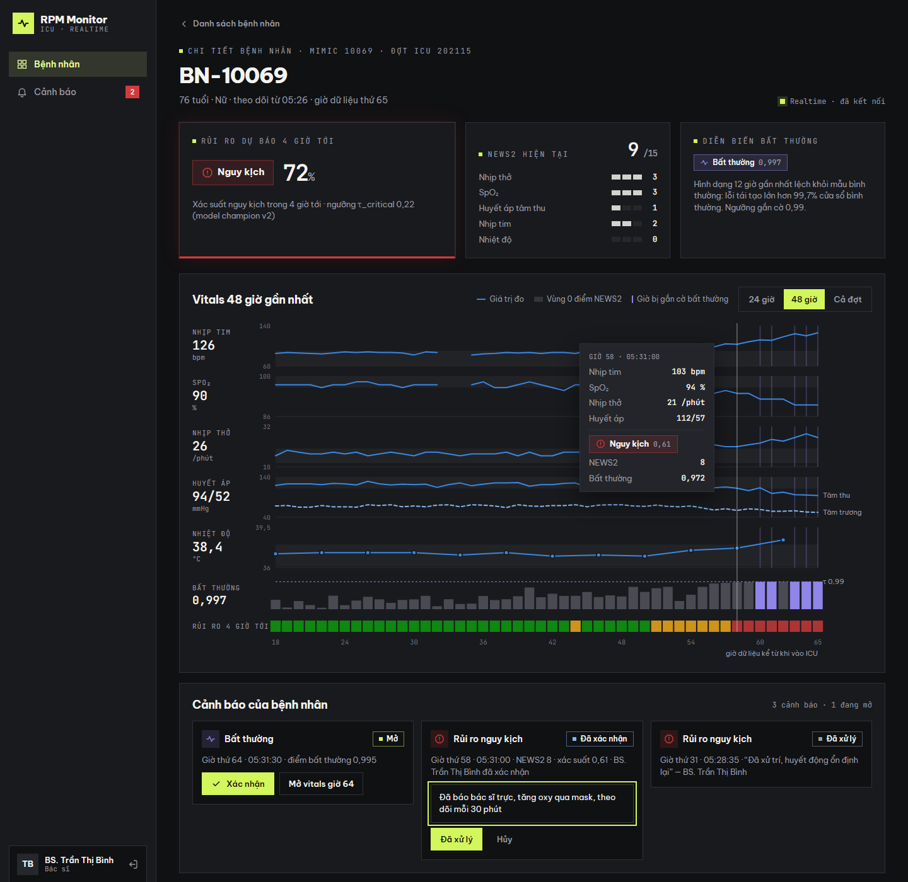
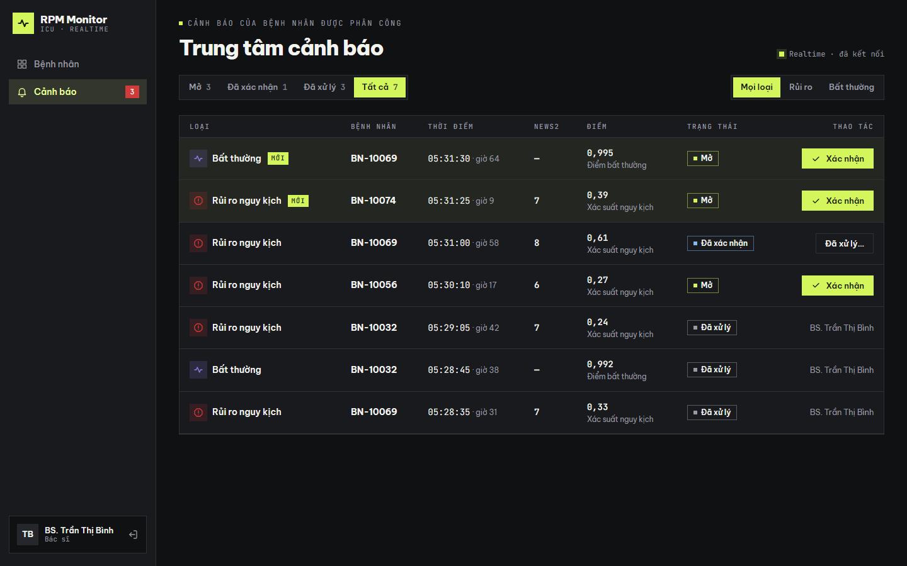
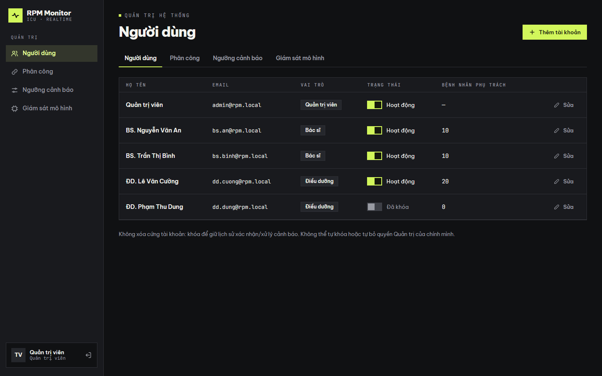
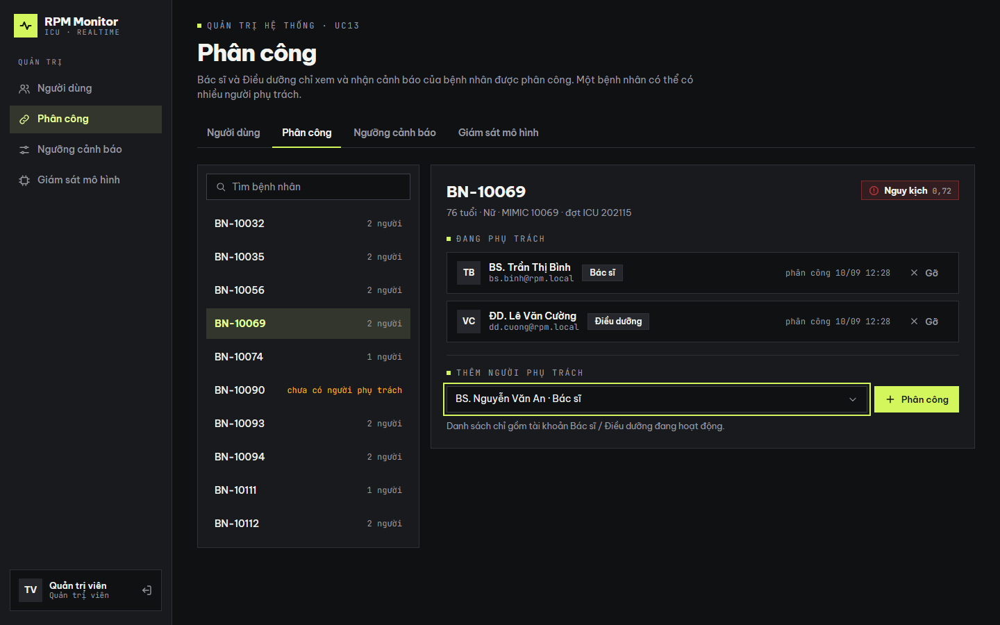
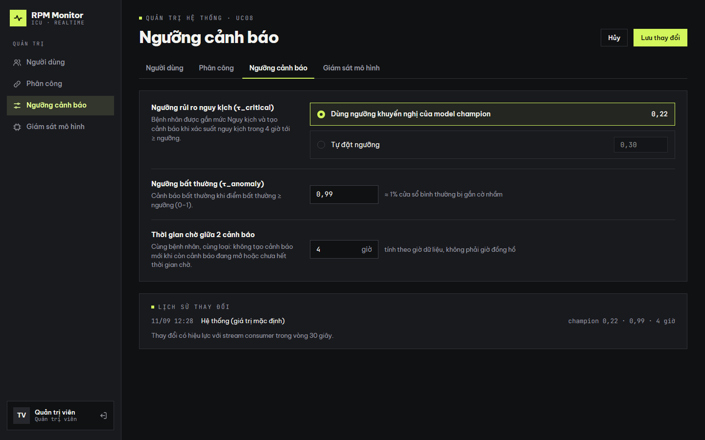
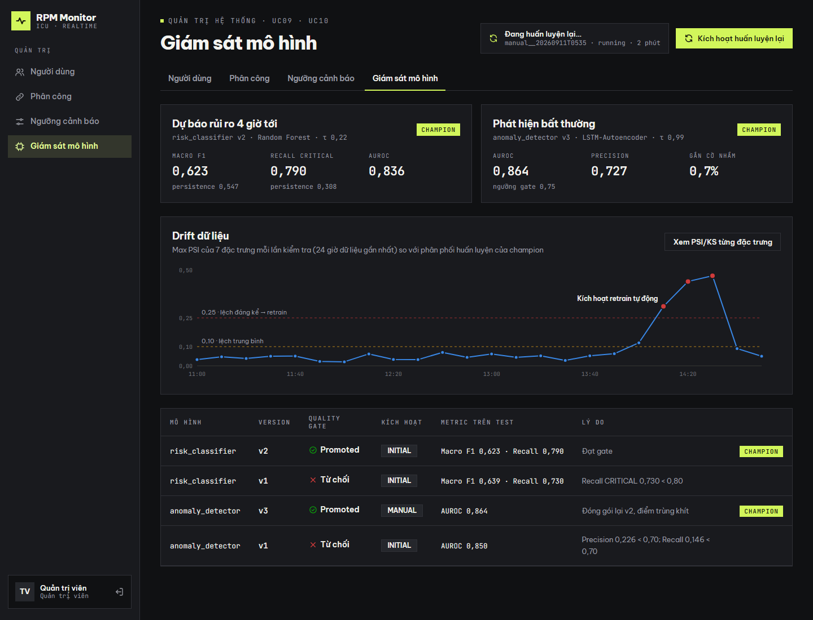

# 2.8. Thiết kế giao diện

Mục này trình bày thiết kế giao diện người dùng của hệ thống: định hướng thẩm mỹ, hệ thống thiết kế (design system), kiến trúc điều hướng theo vai trò và thiết kế chi tiết từng màn hình kèm mockup. Mọi màn hình ánh xạ trực tiếp tới use case ở mục 2.2 và API backend (`backend/CLAUDE.md`).

Mockup độ trung thực cao được dựng bằng Claude Design canvas: https://claude.ai/code/artifact/06619c98-443f-4157-be37-cef16741dc5d. Mã nguồn artboard nằm ở `docs/design/mockups/`, ảnh dùng trong tài liệu ở `docs/design/mockups/png/`. Số liệu trên mockup là **số liệu mẫu**, cùng định dạng với response của API.

## 2.8.1. Định hướng thiết kế

**Người dùng và bối cảnh sử dụng.** Bác sĩ và điều dưỡng theo dõi đồng thời nhiều bệnh nhân ICU trên màn hình máy tính, thường trong ca trực kéo dài và ở phòng có ánh sáng thấp. Giao diện cần:

1. Cho biết **ai cần chú ý trước** chỉ trong một lần nhìn.
2. Tách rõ **dự báo của mô hình** với **điểm lâm sàng hiện tại**.
3. Cho phép xem diễn biến vitals trước khi xác nhận cảnh báo.
4. Không gây mỏi mắt hoặc "bão cảnh báo" bằng hiệu ứng nhấp nháy.

**Phong cách.** Giao diện dùng design system dark-theme lấy cảm hứng từ giao diện mở hộp CS:GO (`csgo-case-opening-design`): nền gần đen, đúng một màu nhấn neon, chữ tiêu đề đậm, nhãn dữ liệu dạng mono. Đây là lựa chọn thẩm mỹ có chủ đích để dashboard có bản sắc riêng. Bên trên design system đó, hệ thống bổ sung một lớp màu ngữ nghĩa lâm sàng.

Các tùy biến so với design system gốc:

| Thành phần của design system gốc | Tùy biến trong RPM | Lý do |
|---|---|---|
| Cơ chế "mở case", vòng quay ngẫu nhiên | Bỏ hoàn toàn | Không có khoảnh khắc ngẫu nhiên trong nghiệp vụ y tế |
| Thang "rarity" (độ hiếm) | Thay bằng 3 mức rủi ro lâm sàng + màu bất thường | Giữ cơ chế gán màu qua biến CSS, đổi ý nghĩa |
| Bo góc `--radius: .4rem` | **Góc vuông** `--radius: 0` | Theo yêu cầu của người dùng: hình khối vuông cho cảm giác chắc chắn, nghiêm túc. Design system cho phép đổi một biến gốc để cả thang bo góc về 0 |
| Motion bằng `requestAnimationFrame` | Chỉ dùng cho thay đổi có ý nghĩa thật: badge đổi mức, cảnh báo mới vào, trạng thái cảnh báo đổi | Tránh chuyển động trang trí trong môi trường lâm sàng |

## 2.8.2. Hệ thống thiết kế (Design System)

*Hình 2.8.1 — Bảng thành phần dùng chung: badge rủi ro, NEWS2, điểm bất thường, trạng thái cảnh báo, nút, trạng thái kết nối.*

### a) Màu sắc

Toàn bộ màu khai báo thành biến CSS; component chỉ tham chiếu biến, không dùng mã màu trực tiếp.

| Nhóm | Token | Giá trị | Dùng cho |
|---|---|---|---|
| Nền | `--background` | `#101113` | Nền trang. Gần đen nhưng không phải đen tuyệt đối, để đỡ chói |
| | `--card` | `#191a1e` | Thẻ, sidebar, bảng |
| | `--popover` | `#24252a` | Tooltip, menu |
| Chữ | `--foreground` | `#f3f3ef` | Chữ chính |
| | `--muted-foreground` | `#999ba3` | Chữ phụ, nhãn, mô tả |
| Viền | `--border` / `--input` | `#303137` / `#3d3f46` | Viền thẻ, ô nhập |
| Nhấn | `--primary` | `#d2f65b` (lime) | **Chỉ** hành động chính, mục điều hướng đang chọn, viền focus, chỉ báo "live" |
| Rủi ro | `--risk-normal` | `#0ca30c` | Bình thường |
| | `--risk-warning` | `#fab219` | Cảnh báo — cần theo dõi sát |
| | `--risk-critical` | `#d03b3b` | Nguy kịch |
| Bất thường | `--anomaly-flag` | `#9085e9` (tím) | Điểm/cờ bất thường của LSTM-Autoencoder; tách khỏi 3 màu rủi ro |
| Biểu đồ | series | `#3987e5` / `#86b6ef` | Đường vitals / huyết áp tâm trương |

Quy tắc dùng màu:

- **Không truyền đạt thông tin chỉ bằng màu.** Mọi mức rủi ro luôn gồm icon riêng và nhãn chữ (`Bình thường` / `Cảnh báo` / `Nguy kịch`): vòng tròn dấu tích, tam giác, bát giác. Nhờ vậy người mù màu đỏ–xanh vẫn phân biệt được.
- Badge dùng nền màu trạng thái ở độ phủ 14% và viền 45%. Chữ giữ màu `--foreground` để đạt tương phản đọc. Màu trạng thái chỉ nằm ở icon và nền.
- Màu rủi ro lấy từ bảng màu trạng thái của hướng dẫn trực quan hóa dữ liệu (`dataviz`). Các màu này tách biệt với accent lime, nên nút hành động không bị nhầm với trạng thái bệnh nhân.

### b) Typography

| Vai trò | Font | Cỡ / độ đậm | Ghi chú |
|---|---|---|---|
| Tiêu đề trang | Be Vietnam Pro | 34px / 800, letter-spacing −1.2px | Đậm, khoảng chữ âm theo design system |
| Tiêu đề khối | Be Vietnam Pro | 18px / 700 | |
| Nội dung | Be Vietnam Pro | 14px / 400–600 | Hỗ trợ đầy đủ dấu tiếng Việt |
| Nhãn dữ liệu, số liệu | JetBrains Mono | 11–22px, số tabular | Eyebrow viết hoa giãn chữ 2px; mọi con số (vitals, xác suất, thời gian) dùng mono để thẳng cột |

Số thập phân dùng dấu phẩy theo chuẩn tiếng Việt (`0,72`). Cách này nhất quán với báo cáo.

### c) Hình khối, khoảng cách, icon

- **Góc vuông** cho mọi thẻ, nút, ô nhập, badge, tooltip và ô biểu đồ. Ngoại lệ duy nhất là nút radio giữ hình tròn, vì hình tròn là quy ước nhận biết lựa chọn đơn, phân biệt với checkbox.
- Viền 1px `--border` cho mọi khối. Thẻ bệnh nhân có thêm **viền dưới 3px theo màu rủi ro**: đây là motif "tier" của design system gốc, được dùng lại để thể hiện mức rủi ro.
- Khoảng cách theo bội số 4px. Thẻ cách nhau 16px, lề nội dung trang 28–36px.
- Icon vẽ bằng SVG nét 1,8px trên lưới 24px, cùng một phong cách. Không dùng emoji.

### d) Chuyển động và khả năng tiếp cận

- Cảnh báo mới: nền lime nhạt + tag `MỚI` trong vài giây rồi mờ dần. Đây là **một** chuyển động duy nhất, không nhấp nháy liên tục.
- Badge đổi mức rủi ro: chuyển màu mượt khi nhận prediction mới qua WebSocket.
- Tôn trọng `prefers-reduced-motion`: tắt mọi chuyển động khi người dùng bật tùy chọn giảm chuyển động.
- `focus-visible`: viền lime 2px, cách phần tử 3px, cho điều hướng bằng bàn phím.
- Vùng bấm tối thiểu 32–44px. Mọi biểu đồ có `role="img"` và `aria-label` mô tả nội dung.

## 2.8.3. Kiến trúc thông tin và điều hướng

| Vai trò | Mục trên sidebar | Route | API chính |
|---|---|---|---|
| Bác sĩ, Điều dưỡng | Bệnh nhân | `/patients`, `/patients/:id` | `GET /patients`, `/patients/{id}`, `/timeline`, `/alerts` |
| | Cảnh báo (badge số cảnh báo mở) | `/alerts` | `GET /alerts`, `/alerts/open-count`; Bác sĩ: `POST /alerts/{id}/acknowledge`, `/resolve` |
| Admin | Quản trị: 4 tab | `/admin/users`, `/admin/assignments`, `/admin/thresholds`, `/admin/models` | `/users`, `/admin/*` |
| Mọi vai trò | Khối tài khoản cuối sidebar + đăng xuất | — | `GET /auth/me`; đăng xuất = xóa token phía client (UC02) |

Nguyên tắc:
- Route được chặn theo vai trò đúng bảng phân quyền ở mục 2.2. Admin **không** có mục Bệnh nhân vì không theo dõi bệnh nhân; Admin chỉ quản lý phân công.
- Bác sĩ và Điều dưỡng chỉ thấy bệnh nhân được phân công. Việc lọc do backend thực hiện, frontend không tự lọc thay.
- Trạng thái kết nối WebSocket luôn hiển thị ở góc phải tiêu đề trang (`Realtime · đã kết nối` / `Đang kết nối lại…`).

## 2.8.4. Thiết kế chi tiết các màn hình

### a) Đăng nhập (UC01)

*Hình 2.8.2 — Màn hình đăng nhập.*

- **Bố cục**: chia đôi màn hình.
  - Nửa trái giới thiệu hệ thống bằng một câu nêu giá trị cốt lõi ("Cảnh báo sớm nguy kịch trong 4 giờ tới") và 3 badge rủi ro.
  - Nửa phải là form email/mật khẩu.
- **Tương tác**: ô đang nhập có viền focus lime; có nút hiện/ẩn mật khẩu.
- **Báo lỗi**: hiển thị **ngay dưới nút Đăng nhập**, không dùng toast ở góc màn hình. Người dùng thấy lỗi ở đúng chỗ đang thao tác, và trình đọc màn hình đọc được theo thứ tự form.
- **Nội dung lỗi**: cùng một thông báo cho sai email, sai mật khẩu và tài khoản bị khóa ("Email hoặc mật khẩu không đúng"), để không lộ tài khoản nào tồn tại. Cách này khớp với API `POST /auth/login` trả 401.

### b) Dashboard bệnh nhân (UC04) — Bác sĩ, Điều dưỡng

*Hình 2.8.3 — Dashboard bệnh nhân của điều dưỡng: 6 bệnh nhân được phân công, sắp theo rủi ro dự báo.*

- **Mục tiêu**: trả lời câu hỏi "bệnh nhân nào cần chú ý trước" trong một lần nhìn.
- **Bố cục**: lưới thẻ 3 cột, mỗi thẻ một bệnh nhân. Danh sách **sắp theo rủi ro dự báo cao nhất lên đầu**, cùng mức thì xác suất nguy kịch cao hơn đứng trước (đúng thứ tự API trả về).
- **Nội dung thẻ**, theo thứ tự đọc:
  1. Mã bệnh nhân, tuổi, giới, giờ dữ liệu hiện tại.
  2. **Badge rủi ro dự báo 4 giờ tới** kèm xác suất — thông tin quan trọng nhất, đặt góc phải trên.
  3. 4 vitals mới nhất: HR, SpO₂, RR, huyết áp, chữ mono cỡ lớn.
  4. **Dải rủi ro 12 giờ qua**: 12 ô màu, cho thấy bệnh nhân đang xấu đi hay ổn định lại mà không cần mở chi tiết.
  5. **NEWS2 hiện tại** (màu trung tính) và **trạng thái bất thường**. Bệnh nhân vào ICU chưa đủ 16 giờ hiển thị "Chưa đủ 16 giờ" thay vì để trống khó hiểu.
  6. Số cảnh báo đang mở và thời gian cập nhật.
- **Viền dưới 3px** theo màu rủi ro giúp quét nhanh cả lưới thẻ.
- **Bộ lọc** Tất cả / Nguy kịch / Cảnh báo kèm số lượng; ô tìm theo mã bệnh nhân.
- **Realtime**: mỗi prediction mới qua WebSocket cập nhật đúng thẻ tương ứng. Badge đổi mức có chuyển màu và thẻ được sắp lại vị trí.

### c) Chi tiết bệnh nhân (UC05, UC06, UC07)

*Hình 2.8.4 — Chi tiết bệnh nhân BN-10069 (góc nhìn Bác sĩ), đang ở trạng thái hover tại giờ 58.*

- **Hàng tóm tắt**: 3 thẻ ứng với 3 nguồn thông tin khác nhau, **không gộp làm một**.

| Thẻ | Nguồn | Nội dung |
|---|---|---|
| Rủi ro dự báo 4 giờ tới | Mô hình Random Forest (champion) | Badge lớn + xác suất nguy kịch (72%) + ngưỡng τ_critical và version model đang dùng |
| NEWS2 hiện tại | Luật lâm sàng | Tổng điểm /15 và **điểm từng thông số**, để biết thông số nào kéo điểm lên |
| Diễn biến bất thường | LSTM-Autoencoder | Trạng thái + điểm 0–1 + một câu giải thích ý nghĩa điểm |

- **Biểu đồ vitals 48 giờ** (chọn 24 giờ / 48 giờ / cả đợt):
  - **5 dải xếp chồng** dùng chung trục thời gian: nhịp tim, SpO₂, nhịp thở, huyết áp (tâm thu nét liền, tâm trương nét đứt, có nhãn trực tiếp), nhiệt độ. Mỗi chỉ số một đơn vị, nên tách dải thay vì dùng 2 trục y (một trục y cho mỗi biểu đồ).
  - **Vùng xám** = khoảng 0 điểm NEWS2 của từng thông số, để thấy ngay giá trị nào ra khỏi vùng an toàn.
  - Giờ không có số đo được **để trống**, không nội suy, đúng với dữ liệu mô hình nhìn thấy. Nhiệt độ đo 4 giờ/lần nên vẽ thành điểm.
  - **Vạch tím** đánh dấu giờ bị gắn cờ bất thường, xuyên qua mọi dải.
  - **Làn Bất thường**: cột điểm 0–1 mỗi giờ, đường ngưỡng 0,99; cột vượt ngưỡng tô tím.
  - **Dải Rủi ro 4 giờ tới**: mỗi ô là mức rủi ro dự báo tại giờ đó, cho thấy thời điểm bệnh nhân chuyển từ Bình thường sang Cảnh báo rồi Nguy kịch.
  - **Hover**: crosshair dọc qua mọi dải và tooltip tổng hợp mọi chỉ số, mức rủi ro, NEWS2, điểm bất thường tại giờ đó.
- **Cảnh báo của bệnh nhân**: đặt **dưới biểu đồ**, theo đúng quan hệ `UC07 <<include>> UC05` (xem vitals trước khi xác nhận). Mỗi cảnh báo hiển thị loại, trạng thái, giờ dữ liệu và chi tiết. Thao tác chỉ dành cho Bác sĩ:
  - `Mở` → nút **Xác nhận**, kèm nút mở vitals đúng giờ phát sinh cảnh báo;
  - `Đã xác nhận` → ô **ghi chú xử lý** (bắt buộc) + nút **Đã xử lý**;
  - `Đã xử lý` → hiển thị ghi chú và người xử lý.

### d) Trung tâm cảnh báo (UC06, UC07)

*Hình 2.8.5 — Trung tâm cảnh báo (góc nhìn Bác sĩ).*

- **Bố cục**: bảng cảnh báo của mọi bệnh nhân được phân công, mới nhất lên đầu. Các cột: Loại, Bệnh nhân, Thời điểm (kèm giờ dữ liệu), NEWS2, Điểm (xác suất nguy kịch hoặc điểm bất thường, có nhãn), Trạng thái, Thao tác.
- **Bộ lọc**: theo trạng thái (Mở / Đã xác nhận / Đã xử lý / Tất cả, kèm số lượng) và theo loại (Rủi ro / Bất thường).
- **Cảnh báo mới** vào qua WebSocket: hàng có nền lime nhạt và tag `MỚI` trong vài giây. Badge số cảnh báo mở trên sidebar cập nhật cùng lúc.
- **Phân quyền thao tác**: Bác sĩ có nút Xác nhận / Đã xử lý trên từng hàng. Điều dưỡng xem cùng danh sách nhưng không có cột Thao tác. Khi một bác sĩ đổi trạng thái, những người cùng phụ trách thấy trạng thái mới ngay (sự kiện `alert_update`).
- **Email cảnh báo (UC11)** không có màn hình riêng; email chứa đường dẫn mở thẳng trang chi tiết bệnh nhân.

### e) Quản trị · Người dùng (UC03) — Admin

*Hình 2.8.6 — Tab Người dùng.*

- Sidebar của Admin chỉ có nhóm **Quản trị** với 4 mục; mỗi trang quản trị có thêm thanh tab để chuyển nhanh.
- Bảng tài khoản: họ tên, email (mono), vai trò, trạng thái (công tắc Hoạt động / Đã khóa), số bệnh nhân phụ trách, nút Sửa. Nút **Thêm tài khoản** là hành động chính (lime).
- Không xóa cứng tài khoản: khóa tài khoản để giữ lịch sử người xác nhận/xử lý cảnh báo. Admin không thể tự khóa hoặc tự bỏ quyền Quản trị của mình (API trả 409).

### f) Quản trị · Phân công (UC13) — Admin

*Hình 2.8.7 — Tab Phân công: chọn bệnh nhân bên trái, quản lý người phụ trách bên phải.*

- Bố cục master–detail:
  - cột trái: danh sách bệnh nhân kèm số người phụ trách. Bệnh nhân **chưa có người phụ trách** được làm nổi bật bằng màu cảnh báo, vì cảnh báo của họ sẽ không gửi tới ai;
  - cột phải: bệnh nhân đang chọn, mức rủi ro hiện tại, danh sách người đang phụ trách (nút Gỡ) và ô thêm người phụ trách.
- Ô chọn chỉ liệt kê tài khoản Bác sĩ / Điều dưỡng đang hoạt động, đúng ràng buộc API (gán cho Admin → 422, gán trùng → 409).

### g) Quản trị · Ngưỡng cảnh báo (UC08) — Admin

*Hình 2.8.8 — Tab Ngưỡng cảnh báo.*

- Form 2 cột: cột trái là tên và giải thích ngắn của từng ngưỡng; cột phải là ô điều khiển.
- **τ_critical**: hai lựa chọn loại trừ nhau.
  - Mặc định: **dùng ngưỡng khuyến nghị của model champion**, hiển thị giá trị hiện hành 0,22.
  - Hoặc tự đặt ngưỡng. Cách này tránh việc Admin phải nhớ và nhập lại ngưỡng mỗi khi champion đổi.
- **τ_anomaly** kèm diễn giải "≈ 1% cửa sổ bình thường bị gắn cờ nhầm".
- **Thời gian chờ** ghi rõ đơn vị là giờ dữ liệu, không phải giờ đồng hồ (mục 2.9.6).
- **Lịch sử thay đổi**: mỗi lần lưu tạo một bản ghi mới, kèm người sửa và thời điểm. Thay đổi có hiệu lực với stream consumer trong vòng 30 giây.

### h) Quản trị · Giám sát mô hình (UC09, UC10) — Admin

*Hình 2.8.9 — Tab Giám sát mô hình.*

- **Hai thẻ champion** (dự báo rủi ro, phát hiện bất thường): version, họ mô hình, ngưỡng, và metric chính trên tập test. Mô hình rủi ro luôn kèm **baseline persistence**: model chỉ có giá trị khi thắng baseline này.
- **Biểu đồ drift**:
  - đường max PSI của mỗi lần kiểm tra, với 2 đường ngưỡng có nhãn (0,10 lệch trung bình; 0,25 lệch đáng kể);
  - điểm vượt 0,25 tô đỏ, có chú thích "Kích hoạt retrain tự động";
  - nút mở chi tiết PSI/KS từng đặc trưng.
  - Số liệu drift trên mockup chỉ để minh họa, vì DAG `drift_check` thuộc Giai đoạn G.
- **Bảng version**: mọi version kể cả bị từ chối, kèm kết quả quality gate, nguồn kích hoạt (INITIAL/DRIFT/MANUAL), metric và **lý do** từ chối. Ví dụ đúng lịch sử thật: v1 bị từ chối vì Recall CRITICAL 0,730 < 0,80.
- **Kích hoạt huấn luyện lại** (UC10):
  - bấm nút → nhận `dag_run_id` → khối trạng thái cạnh nút cập nhật định kỳ (queued / running / success / failed) cho tới khi có kết quả promote hay từ chối;
  - giao diện không giữ một request chờ lâu.

## 2.8.5. Nguyên tắc trực quan hóa dữ liệu

Mọi biểu đồ tuân theo hướng dẫn `dataviz`:

| Nguyên tắc | Áp dụng |
|---|---|
| Một trục y cho mỗi biểu đồ | Vitals khác đơn vị → 5 dải xếp chồng dùng chung trục thời gian |
| Màu theo vai trò, không tùy tiện | Đường dữ liệu dùng một màu xanh; màu trạng thái chỉ cho mức rủi ro; tím chỉ cho bất thường |
| Nhận diện không chỉ bằng màu | Huyết áp tâm thu/tâm trương phân biệt bằng nét liền/đứt + nhãn trực tiếp; mức rủi ro luôn kèm icon + chữ |
| Nét mảnh, lưới mờ | Đường 2px, lưới và trục màu tối nhạt, không lấn dữ liệu |
| Có lớp tương tác | Crosshair + tooltip trên biểu đồ đường; tooltip trên từng điểm/ô |
| Trung thực với dữ liệu | Giờ không đo để trống, không nội suy; ngưỡng vẽ thành đường có nhãn thay vì chỉ ghi trong chú thích |

## 2.8.6. Ghi chú hiện thực

- Mockup là tài liệu tham chiếu bắt buộc khi lập trình frontend (Giai đoạn F): lấy đúng token màu, font, kích thước và cấu tạo component từ `docs/design/mockups/build_mockups.py`.
- Sửa mockup: chỉnh `build_mockups.py`, chạy `python docs/design/mockups/build_mockups.py --png` để sinh lại artboard và ảnh trong `png/`, rồi cập nhật canvas.
- Ảnh trong mục này có kích thước 1440px chiều ngang, dùng trực tiếp được cho báo cáo Word (mục 6).
