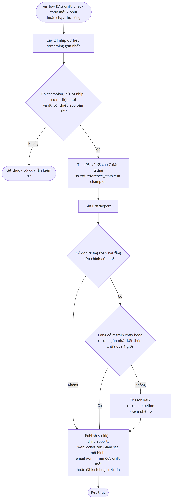

> **HỆ THỐNG GIÁM SÁT BỆNH NHÂN TỪ XA BẰNG STREAMING VÀ MLOPS**
>
> NGUYỄN TẤN MINH^1^

*^1^Khoa Công nghệ thông tin, Đại học Công nghiệp Thành phố Hồ Chí Minh*

> minhnguyen10072004@gmail.com
>
> Corresponding email: minhnguyen10072004@gmail.com

**Tóm tắt:** Bệnh nhân trong khoa hồi sức tích cực có thể chuyển nặng trong vài giờ, nhưng việc phát hiện dấu hiệu xấu đi phụ thuộc vào quan sát định kỳ của nhân viên y tế, nên khoảng thời gian giữa hai lần đánh giá chính là khoảng thời gian rủi ro. Các thang điểm cảnh báo sớm như NEWS2 chuẩn hoá việc đánh giá nhưng chỉ là luật tính trên trạng thái hiện tại, không trả lời được câu hỏi bệnh nhân nào sẽ chuyển nặng trong vài giờ tới. Nghiên cứu này xây dựng một hệ thống giám sát bệnh nhân từ xa hoạt động theo thời gian thực, kết hợp kiến trúc xử lý luồng dữ liệu với quy trình MLOps vận hành liên tục. Hệ thống giải hai bài toán bổ sung nhau: dự báo mức rủi ro cao nhất trong 4 giờ tới theo thang NEWS2 rút gọn, và phát hiện diễn biến bất thường so với chính nền tảng của từng bệnh nhân bằng LSTM-Autoencoder trên cửa sổ 12 giờ. Điểm khác biệt về phương pháp là bài toán được đặt ở dạng **dự báo** thay vì phân loại tức thời — phân loại tức thời bị rò rỉ nhãn vì nhãn là hàm tất định của đặc trưng — và mô hình bắt buộc phải thắng baseline persistence, tức thắng phương án giả định trạng thái 4 giờ sau vẫn như hiện tại. Dữ liệu là MIMIC-III Clinical Database Demo v1.4, sau tiền xử lý thu được 132 đợt hồi sức và 14.138 giờ trên lưới thời gian 1 giờ, chia theo bệnh nhân thành bốn nhóm cố định. Trên tập kiểm tra, mô hình dự báo rủi ro đạt Macro F1 0,623 và Recall lớp nguy kịch 0,790 so với 0,547 và 0,308 của baseline persistence; mô hình bất thường đạt AUROC 0,864 với tỷ lệ gắn cờ nhầm 0,7%. Hệ thống được kiểm chứng chạy thật: độ trễ đầu–cuối từ lúc phát dữ liệu tới lúc giao diện nhận được dự đoán có phân vị 95 trong khoảng 1,30–1,62 giây với 20 bệnh nhân đồng thời, và không mất bản ghi hay tạo cảnh báo trùng khi các thành phần bị dừng đột ngột. Vòng vận hành MLOps tự phát hiện drift phân phối và kích hoạt huấn luyện lại, trong đó cửa kiểm định chất lượng đã từ chối cả bốn phiên bản mô hình sinh ra vì không vượt được phiên bản đang dùng — hành vi đúng như thiết kế. Nghiên cứu cũng chỉ ra rằng ngưỡng PSI 0,25 thường được trích dẫn để kết luận drift không dùng được ở quy mô cửa sổ khoảng 20 bệnh nhân, vì nó gắn cờ 93% số cửa sổ không hề có drift.

**Từ khoá:** giám sát bệnh nhân từ xa, xử lý luồng dữ liệu, MLOps, cảnh báo sớm, NEWS2, phát hiện bất thường, LSTM-Autoencoder, data drift, MIMIC-III

# **1. GIỚI THIỆU**

Trong khoa hồi sức tích cực, tình trạng bệnh nhân có thể xấu đi trong vài giờ. Các dấu hiệu sinh tồn được ghi nhận liên tục hoặc gần liên tục, và phần lớn biến cố nặng đều để lại dấu hiệu trong dữ liệu sinh hiệu nhiều giờ trước khi được phát hiện. Tuy nhiên việc nhận ra những dấu hiệu đó phụ thuộc vào quan sát định kỳ của nhân viên y tế; khi một điều dưỡng phụ trách nhiều bệnh nhân, khoảng thời gian giữa hai lần đánh giá chính là khoảng thời gian rủi ro.

Các thang điểm cảnh báo sớm được thiết kế để chuẩn hoá việc đánh giá này. Thang NEWS2 [4] cho điểm từng thông số sinh tồn theo mức độ lệch khỏi khoảng bình thường và dùng tổng điểm để xác định mức theo dõi cần thiết. Thang điểm này minh bạch, tính được tại giường bệnh và đã được kiểm chứng trên quy mô lớn — nhưng nó là **hàm của trạng thái hiện tại**. Hai bệnh nhân cùng điểm, một người đang xấu đi nhanh và một người đang hồi phục, được đối xử như nhau.

Hướng dùng học máy để thay thế thang điểm cố định đã được nghiên cứu rộng. Tổng quan hệ thống của Muralitharan và cộng sự [5] kết luận rằng các hệ thống cảnh báo sớm dựa trên học máy có thể đạt độ chính xác cao hơn thang điểm tổng hợp theo trọng số cố định, đồng thời nêu ba vấn đề còn tồn tại: thiếu chuẩn hoá chỉ số đầu ra, hạn chế về khả năng diễn giải, và hiệu quả lâm sàng thực tế chưa được chứng minh đầy đủ.

Nghiên cứu này nhận thấy thêm ba khoảng trống mang tính hệ thống. Thứ nhất, phần lớn công trình dừng ở mô hình ngoại tuyến: mô hình được huấn luyện, đánh giá trên tập giữ lại, rồi báo cáo chỉ số, mà không được đặt vào một hệ thống thực sự chạy. Thứ hai, các chỉ tiêu phi chức năng gần như không được báo cáo — một hệ thống cảnh báo sớm mà kết quả tới người trực sau năm phút thì không còn là cảnh báo sớm, nhưng độ trễ đầu–cuối rất ít khi xuất hiện trong công bố. Thứ ba, vòng vận hành MLOps thường được mô tả ở dạng sơ đồ mà không được kiểm chứng bằng thực nghiệm.

Các đóng góp của chúng tôi trong nghiên cứu này bao gồm những nội dung như sau:

- Chúng tôi đặt bài toán rủi ro ở dạng **dự báo bốn giờ** thay vì phân loại tức thời, và chỉ rõ lý do bắt buộc phải làm vậy: vì NEWS2 là hàm tất định của các thông số sinh tồn, lấy nhãn tại thời điểm hiện tại sẽ khiến mô hình chỉ học lại bảng tính điểm. Chúng tôi đồng thời đặt ràng buộc mô hình phải thắng baseline persistence, và chỉ ra rằng ở tầm một giờ thì baseline này **không thể** bị đánh bại — một kết quả âm có giá trị cho việc chọn tầm dự báo.
- Chúng tôi thiết kế một nguồn tính đặc trưng duy nhất dùng chung cho huấn luyện và suy luận trực tuyến, và kiểm chứng bằng phép so từng giờ trên dữ liệu thật rằng đặc trưng tính trực tuyến trùng khít đặc trưng lúc huấn luyện.
- Chúng tôi bổ sung bước **căn giữa cửa sổ theo từng kênh** cho LSTM-Autoencoder, giúp ngưỡng gắn cờ ổn định giữa các bệnh nhân: tỷ lệ gắn cờ nhầm giảm từ khoảng 0–24% xuống 0–6% giữa các phần của kiểm định chéo, và độ chính xác tại cùng ngưỡng tăng từ 0,19 lên 0,50.
- Chúng tôi chỉ ra rằng ngưỡng PSI 0,25 thường được trích dẫn **không dùng được** ở quy mô cửa sổ khoảng 20 bệnh nhân (gắn cờ 93% cửa sổ không drift), và đề xuất quy trình hiệu chỉnh ngưỡng riêng cho từng đặc trưng dựa trên phân bố PSI trong điều kiện không drift.
- Chúng tôi hiện thực và chạy thật vòng vận hành khép kín từ phát hiện drift tới huấn luyện lại, kiểm định chất lượng và thay mô hình đang dùng, đồng thời báo cáo cả những kết quả không thuận lợi.
- Chúng tôi đo và công bố các chỉ tiêu phi chức năng — độ trễ đầu–cuối và khả năng chịu lỗi — thay vì chỉ báo cáo chỉ số mô hình.

Ngoài phần giới thiệu, các phần còn lại của bài báo bao gồm những nội dung như sau: Phần 2 trình bày các nghiên cứu có liên quan. Mô hình tổng quát và các đặc trưng của mô hình đề xuất được trình bày chi tiết trong Phần 3. Phần 4 trình bày thực nghiệm và so sánh kết quả. Phần 5 trình bày kết luận và hướng phát triển trong tương lai.

# **2. CÁC NGHIÊN CỨU CÓ LIÊN QUAN**

**Thang điểm cảnh báo sớm dựa trên luật.** NEWS2 [4] là chuẩn được khuyến nghị áp dụng toàn hệ thống y tế công của Anh, cho điểm bảy thông số sinh tồn cùng quy tắc "một thông số đạt 3 điểm". Ưu điểm là minh bạch hoàn toàn và không cần dữ liệu huấn luyện. Hạn chế là nó không dùng diễn biến theo thời gian, trọng số do hội đồng chuyên gia đặt cố định nên không tận dụng được tương tác giữa các thông số, và bản chất nó mô tả mức độ nặng hiện tại chứ không dự báo.

**Dự báo suy giảm lâm sàng bằng học máy.** Bộ dữ liệu MIMIC-III [1] là nền tảng của phần lớn công trình trong hướng này; bản trích xuất công khai thu nhỏ [2] trên PhysioNet [3] là dữ liệu dùng trong nghiên cứu này. Tổng quan [5] cho thấy các mô hình học máy có thể vượt thang điểm tổng hợp nhờ khai thác được xu hướng và quan hệ giữa các thông số. Điểm thiếu trong nhiều công trình là **thiếu mốc so sánh đủ mạnh**: một mô hình dự báo tầm ngắn mà không so với phương án "trạng thái giữ nguyên" thì con số nó đạt được không diễn giải được. Thực nghiệm của chúng tôi (mục 4.2.2) cho thấy đây là nguy cơ thật.

**Phát hiện bất thường trên chuỗi thời gian.** Malhotra và cộng sự [6] đề xuất kiến trúc mã hoá–giải mã dựa trên LSTM [9] cho dữ liệu nhiều cảm biến, dùng sai số tái tạo làm điểm bất thường. Hướng này phù hợp với bài toán y tế vì không cần nhãn bất thường và so sánh bệnh nhân với chính họ. Hai khó khăn thực tế được ghi nhận rõ: việc chọn ngưỡng, và tính ổn định của ngưỡng khi chuyển sang đối tượng mới. Cả hai đều tái xuất hiện trong nghiên cứu này và dẫn tới hai giải pháp cụ thể ở mục 3.2.3.

**Phát hiện drift và thực hành MLOps.** Gama và cộng sự [7] tổng quan các phương pháp phát hiện và thích ứng với thay đổi phân phối dữ liệu theo thời gian. Sculley và cộng sự [8] chỉ ra phần mã học máy chỉ là một phần nhỏ của một hệ thống học máy thực tế, và nêu hai vấn đề mà nghiên cứu này phải xử lý trực tiếp: lệch giữa huấn luyện và vận hành, và vòng phản hồi ẩn. Chỉ số PSI, xuất phát từ thực hành mô hình rủi ro tín dụng, được dùng rộng rãi để đo mức lệch phân phối kèm thang ngưỡng 0,1 và 0,25. Một phát hiện thực nghiệm của chúng tôi là thang ngưỡng này không áp dụng được ở quy mô cửa sổ nhỏ với quan sát tương quan mạnh.

# **3. MÔ HÌNH VÀ CÁC ĐẶC TRƯNG**

## **3.1. Mô hình tổng quát**

{width="15cm"}

**Hình 1.** Kiến trúc tổng quát của hệ thống giám sát bệnh nhân từ xa

Hệ thống gồm sáu tầng, mỗi tầng là một tiến trình độc lập giao tiếp qua hàng đợi thông điệp hoặc cơ sở dữ liệu, không gọi trực tiếp lẫn nhau: tầng nguồn dữ liệu và tiền xử lý, tầng truyền luồng, tầng xử lý thời gian thực, tầng lưu trữ, tầng ứng dụng và tầng vận hành MLOps.

Hai quyết định kiến trúc xuyên suốt quyết định tính đúng đắn của mọi thứ còn lại.

**Một nguồn tính đặc trưng duy nhất.** Mọi phép tính đặc trưng — gộp mã chỉ số, làm sạch, dựng lưới giờ, điền giá trị, NEWS2, đặc trưng cửa sổ, nền tảng cá nhân, điểm z, cắt cửa sổ — nằm trong một thư viện dùng chung được cả quy trình huấn luyện và thành phần xử lý luồng nhập vào. Không tồn tại bản sao thứ hai của bất kỳ công thức nào. Đây là biện pháp trực tiếp chống lại loại lỗi mà Sculley và cộng sự [8] gọi là lệch giữa huấn luyện và vận hành — loại lỗi đặc biệt nguy hiểm vì nó không gây ngoại lệ, chỉ làm chất lượng dự đoán âm thầm giảm.

**Thay mô hình bằng cách đổi nhãn, không triển khai lại.** Thành phần xử lý luồng nạp mô hình theo nhãn trỏ tới phiên bản đang dùng trong sổ đăng ký mô hình và kiểm tra lại nhãn này theo chu kỳ. Khi cửa kiểm định cho phép một phiên bản mới, thành phần xử lý tự phát hiện và nạp trong vòng một chu kỳ, không cần dừng tiến trình. Mỗi bản ghi dự đoán lưu lại mã phiên bản mô hình đã dùng nên luôn truy vết được.

Một chi tiết của tầng xử lý cần nêu vì nó quyết định tính không mất dữ liệu: với mỗi thông điệp, trình tự là cập nhật trạng thái → tính đặc trưng → chạy hai mô hình → quyết định cảnh báo → **ghi cơ sở dữ liệu trong một giao dịch** → phát sự kiện → **xác nhận đã tiêu thụ thông điệp**. Thứ tự hai bước cuối không được đảo: nếu xác nhận trước khi ghi, một sự cố đúng giữa hai bước sẽ làm mất bản ghi vĩnh viễn; với thứ tự như trên, sự cố chỉ dẫn tới việc xử lý lại, và bản ghi trùng bị phát hiện rồi bỏ qua.

## **3.2. Đặc trưng của mô hình đề xuất**

### **3.2.1. Tiền xử lý và kỹ thuật đặc trưng**

Dữ liệu trong MIMIC là giá trị do điều dưỡng ghi nhận, không phải tín hiệu monitor liên tục: khoảng cách đo trung vị là 60 phút với nhịp tim, SpO₂, nhịp thở, huyết áp và 240 phút với nhiệt độ. Vì vậy mỗi đợt hồi sức được đưa về lưới một giờ, nhiều lần đo trong cùng giờ lấy trung vị. **Mọi cửa sổ thời gian trong toàn hệ thống được tính bằng số giờ dữ liệu**, nên kết quả không phụ thuộc tốc độ phát lại.

Giá trị thiếu chỉ được điền theo chiều thời gian, tối đa hai giờ với bốn thông số đo dày và sáu giờ với nhiệt độ; sau khi điền, 92,9% số giờ có đủ năm thông số cần cho NEWS2. **Không dùng nội suy**, và đây là quyết định có tính nguyên tắc: nội suy dùng giá trị ở thời điểm tương lai, thứ mà dòng dữ liệu thời gian thực không thể có, nên vừa là rò rỉ thông tin vừa gây lệch giữa huấn luyện và vận hành.

Điểm NEWS2 được tính trên năm thông số đo được liên tục (thang 0–15 thay vì 0–20 vì thiếu thông tin về thở oxy bổ sung và mức ý thức), kèm **quy tắc "một thông số đạt 3 điểm"**. Quy tắc này không phải chi tiết nhỏ: nếu bỏ nó, 13,9% số giờ sẽ bị gán mức bình thường trong khi bệnh nhân có một thông số ở mức nguy hiểm.

Đặc trưng cửa sổ sáu giờ gồm trung bình, độ lệch chuẩn và độ dốc tuyến tính của từng thông số, được tính **trên giá trị đo thật chứ không trên giá trị đã điền** — nếu tính trên giá trị đã điền, độ lệch chuẩn và độ dốc sẽ bị làm phẳng giả tạo vì chuỗi giá trị điền là một hằng số. Bổ sung thêm chênh lệch so với giờ trước và NEWS2 cao nhất trong sáu giờ.

Nền tảng cá nhân của từng bệnh nhân (phục vụ mô hình bất thường) là trung bình và độ lệch chuẩn từng thông số, tính lũy tiến trên tối đa 24 giờ đầu và dùng được từ giờ thứ sáu; độ lệch chuẩn có sàn tối thiểu để điểm z không bùng nổ.

Mọi đặc trưng tại giờ *t* chỉ dùng dữ liệu tại *t* hoặc trước đó. Tính chất này được kiểm chứng bằng kiểm thử tự động: thay đổi dữ liệu ở các giờ **sau** *t* không được làm đổi bất kỳ đặc trưng nào tại *t*.

### **3.2.2. Mô hình dự báo rủi ro bốn giờ**

Nhãn của giờ *t* là `y_t = max(mức rủi ro tại t+1, …, mức rủi ro tại t+4)`, chỉ gán cho những giờ có đủ bốn giờ phía sau trong cùng một đợt hồi sức. Bốn phương án được so sánh trên cùng quy trình kiểm định chéo GroupKFold năm phần theo bệnh nhân: baseline persistence, hồi quy logistic đa lớp, rừng ngẫu nhiên [10] và XGBoost [11]. Mất cân bằng lớp được xử lý bằng trọng số mẫu chứ không sinh mẫu giả — sinh mẫu giả trên dữ liệu sinh lý sẽ tạo ra những trạng thái không tồn tại.

Ngưỡng quyết định mức nguy kịch không lấy mặc định 0,5 mà được chọn để Recall lớp nguy kịch đạt mục tiêu 0,80. Điểm cần nhấn mạnh là **ngưỡng được chọn ở đâu**: lần thực hiện đầu chọn trên riêng tập validation (15 bệnh nhân) và cho Recall chỉ 0,730 trên tập kiểm tra. Phương án cuối chọn ngưỡng trên **dự đoán out-of-fold** của kiểm định chéo trên toàn tập phát triển (63 bệnh nhân), nơi mỗi bệnh nhân được dự đoán bởi một mô hình không thấy bệnh nhân đó khi huấn luyện.

{width="15cm"}

**Hình 2.** Tuần tự xử lý một bản ghi sinh hiệu: đặc trưng, hai mô hình, quyết định cảnh báo và phát sự kiện

### **3.2.3. Mô hình phát hiện bất thường**

Kiến trúc là bộ tự mã hoá dùng LSTM [9]: bộ mã hoá hai lớp LSTM (64 rồi 32 nơ-ron) nén chuỗi thành vector ẩn, bộ giải mã nhân bản vector rồi dùng hai lớp LSTM (32 rồi 64) và một lớp Dense phân phối theo thời gian để tái tạo chuỗi sáu kênh. Đầu vào là cửa sổ 12 giờ × 6 kênh điểm z so với nền tảng cá nhân. Do nền tảng cần sáu giờ và cửa sổ cần 12 giờ liên tiếp, **điểm bất thường sớm nhất chỉ xuất hiện ở giờ thứ 17** của đợt hồi sức. Mô hình chỉ huấn luyện trên những cửa sổ mà cả 12 giờ đều ở mức bình thường.

**Căn giữa cửa sổ theo từng kênh** là quyết định kỹ thuật quan trọng nhất của mô hình này: mỗi kênh được trừ đi trung bình của chính nó trong cửa sổ trước khi vào bộ tự mã hoá, để mô hình học **hình dạng** diễn biến 12 giờ chứ không học mức lệch tuyệt đối — phần mức lệch tuyệt đối đã được NEWS2 và mô hình dự báo rủi ro xử lý. Lý do được xác định bằng thực nghiệm **chỉ trên tập phát triển**: khi không căn giữa, sai số tái tạo của cửa sổ bình thường có đuôi rất dày (phân vị 99 gấp tám lần trung vị) do một vài bệnh nhân lệch xa nền tảng dù vẫn ở mức bình thường, nên ngưỡng phân vị 99 không dùng lại được cho bệnh nhân mới — tỷ lệ gắn cờ nhầm dao động 0–24% giữa các phần kiểm định chéo. Sau khi căn giữa, con số này về 0–6% và độ chính xác tại cùng ngưỡng tăng từ 0,19 lên 0,50.

Sai số tái tạo thô không có ý nghĩa trực tiếp nên được chuyển thành điểm trong khoảng [0, 1] qua hàm phân phối tích lũy thực nghiệm của sai số trên cửa sổ bình thường của tập validation: điểm 0,99 nghĩa là sai số lớn hơn 99% cửa sổ bình thường.

Vì bộ dữ liệu không có nhãn bất thường theo thời điểm, việc đánh giá dùng **tiêm bất thường tổng hợp** vào cửa sổ bình thường của tập kiểm tra: 10% số cửa sổ, hạt giống cố định, ba loại chia đều — đột biến nhọn (±4σ ở một kênh), dịch mức (+3σ từ giữa cửa sổ) và trôi dần (tăng tuyến tính tới +3σ). Giá trị σ của mỗi kênh lấy từ nhóm huấn luyện cố định nên tập kiểm tra đã tiêm không đổi giữa các lần huấn luyện lại.

### **3.2.4. Cơ chế cảnh báo và phân phối sự kiện**

Có hai loại cảnh báo: loại rủi ro khi mức dự báo là nguy kịch, và loại bất thường khi điểm bất thường vượt ngưỡng. Mức trung gian chỉ đổi màu nhãn trên giao diện — nếu nó cũng sinh cảnh báo thì với 31,8% số giờ ở mức này, hệ thống sẽ bị người dùng bỏ qua.

**Chống bão cảnh báo** là yêu cầu bắt buộc để hệ thống dùng được trên thực tế. Với mỗi cặp (bệnh nhân, loại cảnh báo), cảnh báo mới chỉ được tạo khi không còn cảnh báo cùng loại đang mở **và** đã qua một khoảng nguội tính bằng giờ dữ liệu. Con số minh chứng cho sự cần thiết: dữ liệu thật có 874 giờ ở mức nguy kịch; nếu mỗi giờ sinh một cảnh báo, một bác sĩ sẽ nhận hàng trăm email lặp cho cùng một đợt.

Cảnh báo chỉ được đẩy tới bác sĩ và điều dưỡng **được phân công** cho bệnh nhân đó, ở cả kênh thời gian thực và email. Một bảng log ghi từng cặp (cảnh báo, người nhận) đã gửi nên máy chủ khởi động lại và đọc lại sự kiện cũ cũng không gửi trùng.

### **3.2.5. Vòng vận hành MLOps: drift, huấn luyện lại và kiểm định chất lượng**

{width="9cm"}

**Hình 3.** Luồng kiểm tra drift: phát hiện drift và quyết định kích hoạt huấn luyện lại

Hệ thống theo dõi sáu thông số sinh tồn và tổng NEWS2, so phân phối của cửa sổ 24 giờ gần nhất với phân phối trên tập huấn luyện của mô hình đang dùng, bằng chỉ số PSI với 10 khoảng chia theo thập phân vị. Thống kê Kolmogorov–Smirnov được tính để kiểm chứng chéo nhưng p-value không dùng để ra quyết định: với số mẫu lớn, chênh lệch nhỏ đến mức không có ý nghĩa thực tế vẫn "có ý nghĩa thống kê".

**Ngưỡng quyết định là ngưỡng hiệu chỉnh riêng cho từng đặc trưng, không dùng ngưỡng 0,25 chung.** Thang ngưỡng thông dụng giả định mẫu lớn và quan sát độc lập, trong khi một cửa sổ ở đây chỉ gồm khoảng 20 bệnh nhân × 24 giờ và các giờ của cùng bệnh nhân tương quan mạnh, nên chỉ riêng sự khác biệt giữa các bệnh nhân đã đẩy PSI lên cao. Đo trên các cửa sổ **không** drift nhưng cùng hình dạng với lúc vận hành, quy tắc "PSI lớn nhất ≥ 0,25" gắn cờ **93%** số cửa sổ.

Quy trình hiệu chỉnh, **chỉ dùng dữ liệu phát triển**: (1) kiểm định chéo GroupKFold năm phần theo bệnh nhân, mỗi phần dựng phân phối tham chiếu từ bốn phần còn lại; (2) lấy ngẫu nhiên tối đa 20 đợt hồi sức của phần giữ lại, lặp 150 lần, với cửa sổ đúng hình dạng lúc vận hành, để thu phân bố PSI trong điều kiện không drift; (3) ngưỡng của mỗi đặc trưng là giá trị lớn hơn giữa 0,25 và một phân vị *q* của phân bố đó, với cùng *q* cho mọi đặc trưng, chọn bằng tìm kiếm nhị phân sao cho tỷ lệ cửa sổ không drift bị gắn cờ xấp xỉ 5% mỗi lần kiểm tra.

**Cửa kiểm định chất lượng.** Mô hình rủi ro chỉ được thay thế mô hình đang dùng khi đạt đồng thời: vượt ngưỡng tuyệt đối; Macro F1 cao hơn baseline persistence trên cùng tập kiểm tra; và Macro F1 **cùng** Recall lớp nguy kịch đều không kém mô hình đang dùng. Điều kiện thứ ba chặn việc đánh đổi khả năng phát hiện ca nguy kịch để lấy độ chính xác tổng thể. Mô hình bất thường được kiểm định độc lập bằng AUROC. Ở mỗi lần huấn luyện lại, **cả mô hình mới và mô hình đang dùng đều được chấm lại trên cùng tập kiểm tra ngay tại thời điểm đó**, không lấy chỉ số đã lưu từ lần trước — so sánh hai con số đo trong điều kiện khác nhau là một lỗi phương pháp dễ mắc.

# **4. THỰC NGHIỆM**

## **4.1 Tập dữ liệu**

Dữ liệu là MIMIC-III Clinical Database Demo v1.4 [2] — bản trích xuất công khai thu nhỏ còn 100 bệnh nhân từ MIMIC-III [1], lưu trữ trên PhysioNet [3] dưới giấy phép Open Data Commons ODbL v1.0. Dữ liệu thật, đã phi định danh, thu thập từ khoa hồi sức tích cực của một bệnh viện Hoa Kỳ giai đoạn 2001–2012; gồm 129 lượt nhập viện, 136 đợt hồi sức và 758.355 dòng giá trị đo.

Sau tiền xử lý: 132 đợt hồi sức có dữ liệu sinh hiệu, 14.138 giờ trên lưới một giờ. 98 bệnh nhân có dữ liệu dùng được, chia theo bệnh nhân (hạt giống cố định, phân tầng theo tử vong tại viện) thành bốn nhóm: 48 bệnh nhân huấn luyện (6.286 giờ), 15 validation (2.251 giờ), 15 kiểm tra (3.476 giờ) và 20 phát lại (1.834 giờ). Danh sách từng nhóm được lưu cố định và dùng chung cho mọi lần huấn luyện lại — điều kiện để so sánh được mô hình mới với mô hình đang dùng.

Đơn vị chia là bệnh nhân chứ không phải đợt hồi sức vì 19 bệnh nhân nằm hồi sức nhiều hơn một lần. Hệ quả: số giờ mỗi nhóm không tỷ lệ với số bệnh nhân (độ dài đợt chênh từ 12 tới 365 giờ), nhóm huấn luyện chỉ chiếm 44,5% số giờ. Đây là cái giá để không bệnh nhân nào xuất hiện ở hai nhóm.

Phân bố nhãn ở mức tức thời: bình thường 61,6%, trung gian 31,8%, nguy kịch 6,7%; với nhãn dự báo bốn giờ, lớp nguy kịch tăng lên 14,5%. Một con số cho thấy bài toán dự báo không tầm thường: trong 874 giờ ở mức nguy kịch, **434 giờ là khởi phát mới** (giờ liền trước chưa nguy kịch).

**Thiên lệch chọn mẫu cần nêu rõ:** PhysioNet chọn 100 bệnh nhân này từ nhóm bệnh nhân về sau đã tử vong; 31% lượt nhập viện có tử vong tại viện. Nhóm này nặng hơn quần thể hồi sức chung.

## **4.2 Phương pháp và kết quả đánh giá**

### **4.2.1 Phương pháp đánh giá**

Vì dữ liệu mất cân bằng mạnh, **Accuracy là chỉ số gây nhầm lẫn** — một mô hình luôn dự báo mức bình thường đã đạt hơn 60%. Chỉ số dùng để đánh giá là **Macro F1** (trung bình không trọng số trên ba lớp, nên lớp nguy kịch ít mẫu vẫn có trọng lượng bằng hai lớp kia) và **Recall lớp nguy kịch** (ưu tiên lâm sàng: bỏ sót ca nguy kịch nặng hơn báo động giả), kèm AUROC, AUPRC và ma trận nhầm lẫn. Mọi kết quả đều báo cáo cùng baseline persistence trên cùng tập dữ liệu. Với mô hình bất thường, chỉ số kiểm định là AUROC vì nó không phụ thuộc ngưỡng.

**Hạn chế về phương pháp cần công khai:** hai ngưỡng của cửa kiểm định đã được hiệu chỉnh **sau khi xem kết quả trên tập kiểm tra**. Ngưỡng Recall lớp nguy kịch hạ từ 0,80 xuống 0,75 sau khi một phiên bản thiếu đúng ba giờ nguy kịch (249 trên 315, cần 252); tiêu chí của mô hình bất thường đổi từ Precision/Recall ≥ 0,7 sang AUROC sau khi kết quả lần đầu không đạt, dựa trên chẩn đoán **chỉ chạy trên tập phát triển** cho thấy tiêu chí đó không đạt được với bộ dữ liệu này. Hệ quả: **tập kiểm tra đã được dùng hai lần**, và các chỉ số dưới đây là ước lượng lạc quan hơn thực tế. Cách làm đúng về phương pháp là tách thêm một tập giữ lại thứ hai, nhưng với 98 bệnh nhân thì tập đó quá nhỏ để có ý nghĩa.

### **4.2.2 Kết quả đánh giá**

**Bảng 1.** Kết quả mô hình dự báo rủi ro (rừng ngẫu nhiên, τ = 0,22) và baseline persistence

| Tập dữ liệu | Macro F1 | Recall nguy kịch | Precision nguy kịch |
|---|---|---|---|
| Out-of-fold (63 bệnh nhân) | 0,591 | 0,807 | 0,395 |
| Validation | 0,623 | 0,849 | 0,498 |
| **Kiểm tra** | **0,623** | **0,790** | 0,391 |
| Baseline persistence (kiểm tra) | 0,547 | 0,308 | — |

Chọn mô hình bằng kiểm định chéo cho Macro F1: rừng ngẫu nhiên 0,622 (được chọn), hồi quy logistic 0,618, XGBoost 0,608, baseline persistence 0,565. Trên tập kiểm tra, mô hình đạt thêm AUROC 0,836, AUPRC lớp nguy kịch 0,615 và Accuracy 0,647.

Chênh lệch có ý nghĩa lâm sàng nằm ở Recall lớp nguy kịch: **0,790 so với 0,308**, tức mô hình phát hiện được hơn hai lần rưỡi số giờ nguy kịch so với baseline. Đổi lại, Precision chỉ 0,391 — khoảng sáu trong mười lần báo nguy kịch là báo động giả. Đây là đánh đổi có chủ ý, và cơ chế chống bão cảnh báo là thứ giữ cho tỷ lệ này không thành gánh nặng thực tế.

**Tầm dự báo quyết định việc mô hình có giá trị hay không.** Một thực nghiệm bổ sung với tầm một giờ cho kết quả ngược: mô hình đạt Macro F1 0,578 trong khi baseline persistence đạt 0,621 — **mô hình thua baseline**, vì sinh hiệu tự tương quan rất mạnh trong khoảng một giờ. Kết quả âm này biện minh cho việc chọn tầm bốn giờ, và cho thấy nếu không bắt buộc so với baseline thì một mô hình ở tầm một giờ vẫn có thể được báo cáo là "đạt Macro F1 0,578" và trông như một thành công.

**Nhãn proxy có liên hệ với kết cục thật.** Tỷ lệ giờ ở mức nguy kịch trung bình mỗi đợt hồi sức là 19,1% ở nhóm tử vong tại viện so với 3,6% ở nhóm sống sót; AUROC ở mức đợt đạt 0,718.

{width="11cm"}

**Hình 4.** Ma trận nhầm lẫn của mô hình dự báo rủi ro trên tập kiểm tra

{width="13cm"}

**Hình 5.** Mức đóng góp đặc trưng (SHAP [12]) cho lớp nguy kịch

Bốn đặc trưng đóng góp lớn nhất, theo thứ tự: NEWS2 cao nhất trong sáu giờ qua, NEWS2 hiện tại, nhịp thở trung bình sáu giờ, nhịp tim. Đáng chú ý là đặc trưng quan trọng nhất là một đặc trưng **lịch sử**, không phải trạng thái hiện tại — đây là lời giải thích cơ học cho việc mô hình thắng được baseline persistence. Nhịp thở nổi lên như thông số có giá trị dự báo cao nhất, phù hợp với y văn về cảnh báo sớm.

**Bảng 2.** Kết quả mô hình phát hiện bất thường trên tập kiểm tra (10% cửa sổ bị tiêm bất thường)

| Chỉ số | Giá trị |
|---|---|
| AUROC | 0,864 |
| Precision tại τ = 0,99 | 0,727 |
| Recall tại τ = 0,99 | 0,167 |
| Tỷ lệ gắn cờ nhầm | 0,7% |
| Recall theo loại: đột biến / dịch mức / trôi dần | 0,25 / 0,19 / 0,06 |

{width="13cm"}

**Hình 6.** Phân bố điểm bất thường trên cửa sổ bình thường và cửa sổ bị tiêm bất thường

AUROC cao nhưng Recall thấp không mâu thuẫn: AUROC đo năng lực xếp hạng, còn Recall 0,167 là kết quả *tại một ngưỡng rất cao* nơi mô hình chỉ gắn cờ trường hợp rõ rệt nhất, đổi lấy Precision 0,727 và tỷ lệ gắn cờ nhầm chỉ 0,7%. Loại trôi dần gần như không phát hiện được (Recall 0,06) — một kênh tăng tuyến tính trong 12 giờ có hình dạng gần như không phân biệt được với xu hướng sinh lý bình thường, và chính bước căn giữa cửa sổ cũng làm mô hình bớt nhạy với dạng lệch chậm này. Đây là hệ quả trực tiếp của một quyết định thiết kế, không phải lỗi hiện thực.

**Bằng chứng bổ sung trên dữ liệu thật, không tiêm:** tỷ lệ gắn cờ là 0,6% với cửa sổ toàn bình thường, 17,4% với cửa sổ có mức trung gian và 34,8% với cửa sổ có mức nguy kịch; AUROC phân biệt cửa sổ nguy kịch với bình thường đạt 0,837. Đây là bằng chứng độc lập với phần tiêm tổng hợp.

**Bảng 3.** Kết quả chạy hệ thống và chỉ tiêu phi chức năng

| Chỉ tiêu | Kết quả |
|---|---|
| Bản ghi ghi vào cơ sở dữ liệu (20 bệnh nhân, 1.834 giờ) | 1.834 / 1.834 |
| Số giờ được dự báo nguy kịch | 507 |
| Số cảnh báo sinh ra | 28 (19 rủi ro, 9 bất thường) |
| Cảnh báo mở trùng lặp | 0 |
| Thời gian xử lý mỗi bản ghi | 130–190 ms |
| Độ trễ đầu–cuối, 20 bệnh nhân đồng thời (p50 / **p95** / max) | 0,71 / **1,30** / 1,63 giây |
| Độ trễ đầu–cuối, toàn bộ mẫu (p50 / p95 / max) | 0,74 / 1,52 / 2,33 giây |

**Nén cảnh báo 18 lần:** 507 giờ nguy kịch chỉ sinh 19 cảnh báo loại rủi ro. Không có cơ chế chống trùng, bác sĩ sẽ nhận 507 email cho 20 bệnh nhân trong một lần phát lại.

**Độ trễ đạt ngưỡng thiết kế 2 giây**, với ba lần chạy độc lập cho phân vị 95 là 1,30 / 1,48 / 1,62 giây. Phần lớn độ trễ không phải chi phí tính toán mà là thời gian chờ trong hàng đợi của một nhịp: thành phần xử lý luồng xử lý tuần tự khoảng 70 ms mỗi bản ghi, nên bản ghi cuối trong nhịp 20 bệnh nhân phải chờ khoảng 1,4 giây. Ngoại suy từ quan hệ gần tuyến tính này, khoảng 28 bệnh nhân mỗi nhịp là chạm ngưỡng 2 giây với một thành phần xử lý duy nhất; cách mở rộng (tăng số phân vùng, chạy nhiều thành phần cùng nhóm) có trong thiết kế nhưng chưa được đo thử.

**Chịu lỗi.** Kết thúc cưỡng bức thành phần xử lý luồng giữa dòng dữ liệu rồi bật lại: trạng thái được dựng lại từ cơ sở dữ liệu, số bản ghi đầy đủ, không giờ trùng, và mỗi bệnh nhân vẫn chỉ có đúng một cảnh báo. Tắt máy chủ ứng dụng giữa lúc dữ liệu đang chảy: thành phần xử lý vẫn ghi cơ sở dữ liệu và tạo cảnh báo; sau khi bật lại, máy chủ đọc tiếp từ vị trí đã xác nhận, xử lý cảnh báo bị bỏ lại và gửi tới đúng người được phân công — không cảnh báo nào bị mất.

**Kết quả vòng vận hành MLOps.** Ngưỡng drift sau hiệu chỉnh trải từ 0,53 (huyết áp tâm trương) tới 1,78 (nhịp tim), riêng SpO₂ là 0,745 — tất cả đều cao hơn nhiều ngưỡng 0,25 thông dụng, và khoảng cách này chính là thước đo mức độ không phù hợp của ngưỡng chung. Với dữ liệu sạch, hai lần kiểm tra cho PSI lớn nhất 0,235 và 0,340, kết luận **không drift** — trong khi quy tắc 0,25 sẽ kết luận drift sai ở lần thứ hai. Với drift tiêm (nhịp tim +15, SpO₂ −3 trên một nửa bệnh nhân), hệ thống phát hiện lệch ở SpO₂ và tự kích hoạt huấn luyện lại, nhưng **không** phát hiện được lệch ở nhịp tim vì ngưỡng của thông số này rất cao.

{width="15cm"}

**Hình 7.** Giao diện giám sát mô hình: kết luận kiểm định chất lượng của từng phiên bản và biểu đồ drift

**Bảng 4.** Kết quả kiểm định chất lượng của bốn phiên bản mô hình sinh ra từ việc huấn luyện lại

| Phiên bản | Nguồn kích hoạt | Chỉ số trên tập kiểm tra | Kết luận |
|---|---|---|---|
| Rủi ro v3 | Tự động do drift | Macro F1 0,612, Recall 0,803 | **Từ chối** — Macro F1 thấp hơn 0,623 |
| Bất thường v4 | Tự động do drift | AUROC 0,86418 | Chấp nhận — chỉ hơn 0,86415 ở chữ số thứ tư |
| Rủi ro v4 | Thủ công | Macro F1 0,631, Recall 0,759 | **Từ chối** — Recall thấp hơn 0,790 |
| Bất thường v5 | Thủ công | AUROC 0,853 | **Từ chối** — thấp hơn 0,864 |

Trường hợp mô hình rủi ro v4 minh hoạ đúng ý định của điều kiện thứ ba: phiên bản này **có** Macro F1 tốt hơn (0,631 so với 0,623) nên nếu chỉ dùng một chỉ số tổng thể thì đã được chấp nhận, nhưng Recall lớp nguy kịch giảm từ 0,790 xuống 0,759 — nó đánh đổi khả năng phát hiện ca nguy kịch để lấy độ chính xác chung, và cửa kiểm định chặn lại. Trường hợp mô hình bất thường v4 lại bộc lộ điểm yếu: nó được chấp nhận chỉ vì **bằng điểm**, do ở lần chạy đó drift bị kết luận khi cửa sổ mới có 16 nhịp nên dữ liệu huấn luyện lại không có cửa sổ bình thường mới nào — mô hình mới thực chất học trên đúng dữ liệu cũ. Đây là lý do điều kiện "cửa sổ phải đủ 24 nhịp" được thêm vào sau lần chạy này.

Cần nói thẳng: thực nghiệm này **không chứng minh** rằng huấn luyện lại "sửa" được drift. Dữ liệu mới quá ít (tối đa 858 giờ so với 6.286 giờ nhóm huấn luyện) và tập kiểm tra cố định không chứa drift, nên một mô hình học được cách xử lý drift cũng không được thưởng điểm trên tập đó. Điều thực nghiệm chứng minh là cửa kiểm định hoạt động: nó không để hệ thống tự hạ cấp.

# **5. KẾT LUẬN.**

Nghiên cứu này xây dựng và kiểm chứng một hệ thống giám sát bệnh nhân từ xa hoạt động theo thời gian thực, kết hợp xử lý luồng dữ liệu với vòng vận hành MLOps khép kín. Mô hình dự báo rủi ro bốn giờ đạt Macro F1 0,623 và Recall lớp nguy kịch 0,790 trên tập kiểm tra cố định, vượt rõ baseline persistence (0,547 và 0,308); mô hình phát hiện bất thường đạt AUROC 0,864 với tỷ lệ gắn cờ nhầm 0,7%. Hệ thống đạt ngưỡng độ trễ đầu–cuối phân vị 95 dưới 2 giây với 20 bệnh nhân đồng thời, không mất bản ghi và không tạo cảnh báo trùng khi các thành phần bị dừng đột ngột.

Ba đóng góp có tính phương pháp đáng được nhấn lại. Thứ nhất, việc đặt bài toán ở dạng dự báo và bắt buộc so với baseline persistence cho phép phát hiện rằng ở tầm một giờ, mô hình học máy **không thể** thắng phương án đơn giản — một kết quả âm mà nếu không có mốc so sánh sẽ bị bỏ qua. Thứ hai, bước căn giữa cửa sổ theo từng kênh làm ngưỡng gắn cờ bất thường ổn định giữa các bệnh nhân, giảm tỷ lệ gắn cờ nhầm từ khoảng 0–24% xuống 0–6%. Thứ ba, ngưỡng PSI 0,25 thường được trích dẫn không dùng được ở quy mô cửa sổ khoảng 20 bệnh nhân với quan sát tương quan mạnh, và quy trình hiệu chỉnh ngưỡng theo từng đặc trưng là một cách xử lý khả thi.

**Hạn chế.** Hạn chế nghiêm trọng nhất là về phương pháp: tập kiểm tra đã được dùng hai lần và hai ngưỡng của cửa kiểm định được hiệu chỉnh sau khi xem kết quả kiểm tra, nên các chỉ số báo cáo là ước lượng lạc quan hơn thực tế. Tập kiểm tra chỉ 15 bệnh nhân nên khoảng tin cậy rộng. Bộ dữ liệu có thiên lệch chọn mẫu (toàn bộ bệnh nhân về sau đều đã tử vong). Nhãn rủi ro là proxy suy ra từ NEWS2 rút gọn năm thông số, không phải chẩn đoán lâm sàng, nên mô hình dự báo "điểm cảnh báo sớm sẽ cao" chứ không phải "bệnh nhân sẽ chuyển nặng". Bất thường dùng để đánh giá là bất thường tổng hợp. Dòng dữ liệu là phát lại dữ liệu lịch sử và drift là drift mô phỏng, nên hệ thống chưa đối mặt với các vấn đề của thiết bị thật: mất kết nối, dữ liệu đến muộn hoặc sai thứ tự. Độ trễ chỉ đo với một thành phần xử lý trên một máy.

**Hướng phát triển.** Chạy lại toàn bộ quy trình trên MIMIC-III/IV bản đầy đủ hoặc eICU để có tập kiểm tra đủ lớn, có bệnh nhân sống sót, và đủ dữ liệu để tách thêm một tập giữ lại thứ hai nhằm khắc phục hạn chế về phương pháp. Thay nhãn proxy bằng nhãn lâm sàng thật (biến cố chuyển nặng, can thiệp cấp cứu, dùng thuốc vận mạch) để biến bài toán từ dự báo điểm cảnh báo thành dự báo biến cố. Thay PSI gộp bằng phương pháp có tính đến tương quan trong cùng bệnh nhân, hoặc theo dõi trực tiếp chất lượng dự đoán theo thời gian thay vì chỉ theo dõi phân phối đầu vào — drift đầu vào chỉ là dấu hiệu gián tiếp, còn suy giảm chất lượng dự đoán mới là thứ đáng lo. Mở rộng thông lượng bằng nhiều thành phần xử lý song song và đo lại độ trễ. Cuối cùng, tìm cách phát hiện dạng bất thường trôi dần — dạng hiện gần như không phát hiện được nhưng lại có ý nghĩa lâm sàng cao, vì suy giảm chậm là điều khó nhận ra nhất bằng mắt thường.

# **TÀI LIỆU THAM KHẢO**

\[1\] Johnson, A. E. W., Pollard, T. J., Shen, L., Lehman, L. H., Feng, M., Ghassemi, M., Moody, B., Szolovits, P., Celi, L. A., & Mark, R. G. (2016). MIMIC-III, a freely accessible critical care database. *Scientific Data*, 3, 160035.

\[2\] Johnson, A., Pollard, T., & Mark, R. (2016). *MIMIC-III Clinical Database Demo* (version 1.4). PhysioNet. https://doi.org/10.13026/C2HM2Q

\[3\] Goldberger, A. L., Amaral, L. A. N., Glass, L., Hausdorff, J. M., Ivanov, P. C., Mark, R. G., Mietus, J. E., Moody, G. B., Peng, C.-K., & Stanley, H. E. (2000). PhysioBank, PhysioToolkit, and PhysioNet: Components of a new research resource for complex physiologic signals. *Circulation*, 101(23), e215–e220.

\[4\] Royal College of Physicians. (2017). *National Early Warning Score (NEWS) 2: Standardising the assessment of acute-illness severity in the NHS. Updated report of a working party*. London: RCP.

\[5\] Muralitharan, S., Nelson, W., Di, S., McGillion, M., Devereaux, P. J., Barr, N. G., & Petch, J. (2021). Machine learning–based early warning systems for clinical deterioration: Systematic scoping review. *Journal of Medical Internet Research*, 23(2), e25187.

\[6\] Malhotra, P., Ramakrishnan, A., Anand, G., Vig, L., Agarwal, P., & Shroff, G. (2016). LSTM-based encoder-decoder for multi-sensor anomaly detection. *arXiv preprint arXiv:1607.00148*.

\[7\] Gama, J., Žliobaitė, I., Bifet, A., Pechenizkiy, M., & Bouchachia, A. (2014). A survey on concept drift adaptation. *ACM Computing Surveys*, 46(4), 44:1–44:37.

\[8\] Sculley, D., Holt, G., Golovin, D., Davydov, E., Phillips, T., Ebner, D., Chaudhary, V., Young, M., Crespo, J.-F., & Dennison, D. (2015). Hidden technical debt in machine learning systems. *Advances in Neural Information Processing Systems 28 (NIPS 2015)*, 2503–2511.

\[9\] Hochreiter, S., & Schmidhuber, J. (1997). Long short-term memory. *Neural Computation*, 9(8), 1735–1780.

\[10\] Breiman, L. (2001). Random forests. *Machine Learning*, 45(1), 5–32.

\[11\] Chen, T., & Guestrin, C. (2016). XGBoost: A scalable tree boosting system. *Proceedings of the 22nd ACM SIGKDD International Conference on Knowledge Discovery and Data Mining*, 785–794.

\[12\] Lundberg, S. M., & Lee, S.-I. (2017). A unified approach to interpreting model predictions. *Advances in Neural Information Processing Systems 30 (NIPS 2017)*, 4765–4774.
