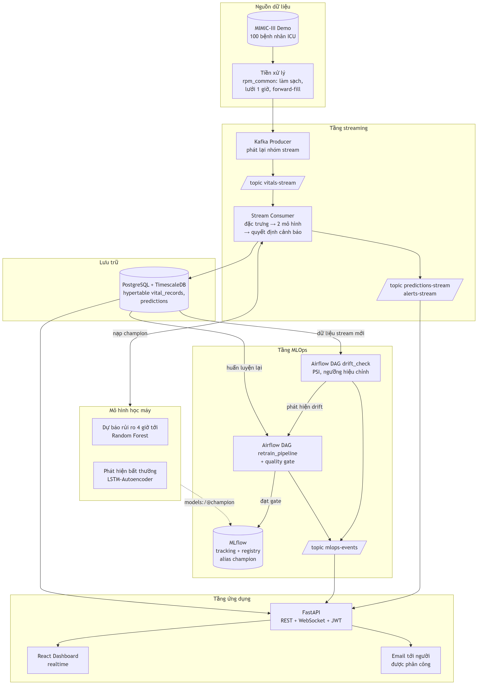
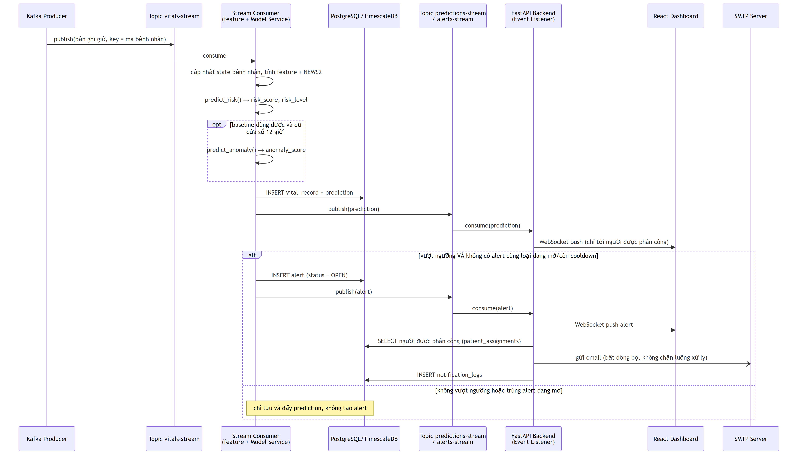
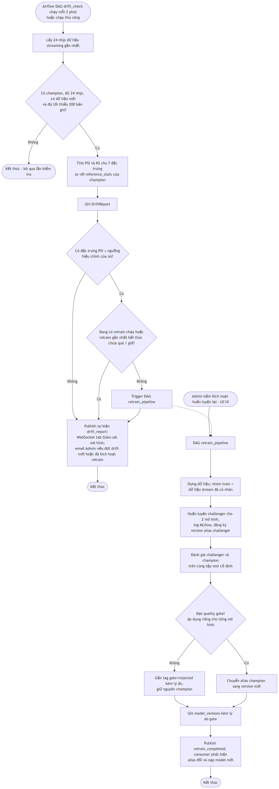
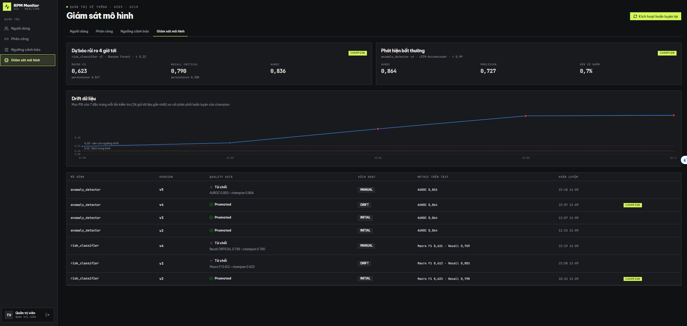

> **HỆ THỐNG GIÁM SÁT BỆNH NHÂN TỪ XA BẰNG STREAMING VÀ MLOPS**
>
> NGUYỄN TẤN MINH^1^, ⟨*các thành viên còn lại nếu làm nhóm*⟩^1^, ⟨*HỌ TÊN GIẢNG VIÊN HƯỚNG DẪN*⟩^1^

*^1^Khoa Công nghệ thông tin, Đại học Công nghiệp Thành phố Hồ Chí Minh*

> minhnguyen10072004@gmail.com, ⟨*email giảng viên*⟩
>
> Corresponding email: minhnguyen10072004@gmail.com

**Tóm tắt:** Bệnh nhân trong khoa hồi sức tích cực có thể chuyển nặng trong vài giờ, nhưng việc phát hiện dấu hiệu xấu đi phụ thuộc vào quan sát định kỳ của nhân viên y tế, nên khoảng thời gian giữa hai lần đánh giá chính là khoảng thời gian rủi ro. Các thang điểm cảnh báo sớm như NEWS2 chuẩn hoá việc đánh giá nhưng chỉ là luật tính trên trạng thái hiện tại, không trả lời được câu hỏi bệnh nhân nào sẽ chuyển nặng trong vài giờ tới. Nghiên cứu này xây dựng một hệ thống giám sát bệnh nhân từ xa hoạt động theo thời gian thực, kết hợp kiến trúc xử lý luồng dữ liệu với quy trình MLOps vận hành liên tục. Hệ thống giải hai bài toán bổ sung nhau: dự báo mức rủi ro cao nhất trong 4 giờ tới theo thang NEWS2 rút gọn, và phát hiện diễn biến bất thường so với chính baseline của từng bệnh nhân bằng LSTM-Autoencoder trên cửa sổ 12 giờ. Điểm khác biệt về phương pháp là bài toán được đặt ở dạng **dự báo** thay vì phân loại tức thời — phân loại tức thời bị rò rỉ nhãn vì nhãn là hàm tất định của đặc trưng — và mô hình bắt buộc phải thắng baseline persistence, tức thắng phương án giả định trạng thái 4 giờ sau vẫn như hiện tại. Dữ liệu là MIMIC-III Clinical Database Demo v1.4, sau tiền xử lý thu được 132 đợt hồi sức và 14.138 giờ trên lưới thời gian 1 giờ, chia theo bệnh nhân thành bốn nhóm cố định. Trên tập kiểm tra, mô hình dự báo rủi ro đạt Macro F1 0,623 và Recall lớp nguy kịch 0,790 so với 0,547 và 0,308 của baseline persistence; mô hình bất thường đạt AUROC 0,864 với tỷ lệ gắn cờ nhầm 0,7%. Hệ thống được kiểm chứng chạy thật: độ trễ đầu–cuối từ lúc phát dữ liệu tới lúc giao diện nhận được dự đoán có p95 1,30–1,62 giây với 20 bệnh nhân đồng thời, và không mất bản ghi hay tạo cảnh báo trùng khi các thành phần bị dừng đột ngột. Vòng vận hành MLOps tự phát hiện drift phân phối và kích hoạt huấn luyện lại, trong đó quality gate đã từ chối bốn phiên bản mô hình không vượt được phiên bản đang dùng — hành vi đúng như thiết kế.

**Từ khoá:** giám sát bệnh nhân từ xa, xử lý luồng dữ liệu, MLOps, cảnh báo sớm, NEWS2, phát hiện bất thường, LSTM-Autoencoder, data drift, MIMIC-III

# **1. GIỚI THIỆU**

⟨*Viết lại mục 1.1 và 1.2 của báo cáo ở giọng bài báo, ngắn hơn: bối cảnh → khoảng trống → đề xuất → đóng góp.*⟩

⟨*Kết mục 1 bằng danh sách đóng góp, theo đúng dạng của mẫu ("Các đóng góp của chúng tôi trong nghiên cứu này bao gồm..."):*⟩

- ⟨*Đặt bài toán ở dạng dự báo 4 giờ và chứng minh mô hình thắng baseline persistence, đồng thời chỉ ra ở tầm 1 giờ thì persistence không thể thắng được — làm rõ tầm dự báo nào mới có ý nghĩa.*⟩
- ⟨*Thiết kế một nguồn tính đặc trưng duy nhất dùng chung cho huấn luyện và suy luận trực tuyến, có kiểm chứng trùng khít từng giờ trên dữ liệu thật.*⟩
- ⟨*Bổ sung bước căn giữa cửa sổ theo kênh cho LSTM-Autoencoder, giúp ngưỡng gắn cờ ổn định giữa các bệnh nhân.*⟩
- ⟨*Chỉ ra ngưỡng PSI 0,25 thường được trích dẫn không dùng được ở quy mô cửa sổ khoảng 20 bệnh nhân (gắn cờ 93% cửa sổ không drift) và đề xuất ngưỡng hiệu chỉnh theo từng đặc trưng.*⟩
- ⟨*Triển khai vòng vận hành khép kín drift → huấn luyện lại → quality gate → đổi mô hình đang dùng, và báo cáo kết quả chạy thật.*⟩
- ⟨*Đo và công bố các chỉ tiêu phi chức năng (độ trễ đầu–cuối, khả năng chịu lỗi) thay vì chỉ báo cáo chỉ số mô hình.*⟩

⟨*Đoạn cuối: giới thiệu bố cục các phần còn lại — theo đúng công thức của mẫu.*⟩

# **2. CÁC NGHIÊN CỨU CÓ LIÊN QUAN**

⟨*Cần tra cứu tài liệu thật. Bốn nhóm, mỗi nhóm 3–5 công trình:*⟩

⟨*2.1 Thang điểm cảnh báo sớm — NEWS/NEWS2, MEWS; các nghiên cứu đánh giá năng lực dự báo và hạn chế của điểm cắt cố định.*⟩

⟨*2.2 Dự báo suy giảm lâm sàng bằng học máy trên dữ liệu ICU — các công trình trên MIMIC; so sánh cây quyết định tập hợp với mạng nơ-ron hồi tiếp; vấn đề rò rỉ nhãn và chia dữ liệu theo bệnh nhân.*⟩

⟨*2.3 Phát hiện bất thường trên chuỗi thời gian sinh hiệu — autoencoder, LSTM-AE, phương pháp thống kê; vấn đề chọn ngưỡng và tỷ lệ báo nhầm.*⟩

⟨*2.4 MLOps và phát hiện data drift — PSI, kiểm định KS, Champion–Challenger, model registry, quality gate.*⟩

⟨*Kết phần: khoảng trống — phần lớn công trình dừng ở mô hình offline; ít công trình đặt mô hình vào hệ thống streaming có vòng vận hành khép kín và công bố chỉ tiêu phi chức năng.*⟩

# **3. MÔ HÌNH VÀ CÁC ĐẶC TRƯNG**

## **3.1. Mô hình tổng quát**

{width="15cm"}

**Hình 1.** Kiến trúc tổng quát của hệ thống giám sát bệnh nhân từ xa

⟨*Thuyết minh sáu tầng và hai quyết định kiến trúc cốt lõi (nguồn đặc trưng duy nhất; nạp mô hình theo alias champion).*⟩

## **3.2. Đặc trưng của mô hình đề xuất**

### **3.2.1. Tiền xử lý và kỹ thuật đặc trưng**

⟨*Nguồn: `docs/design/02_9_thiet_ke_giai_thuat.md` mục 2.9.1 và 2.9.2. Nội dung: mapping itemid, làm sạch, lưới 1 giờ, forward-fill có giới hạn (không nội suy), NEWS2 rút gọn, đặc trưng cửa sổ 6 giờ, baseline cá nhân, nhãn dự báo. Kèm bảng tập đặc trưng.*⟩

### **3.2.2. Mô hình dự báo rủi ro 4 giờ**

⟨*Công thức nhãn; cách chọn τ_critical trên dự đoán out-of-fold GroupKFold; so sánh thuật toán; baseline persistence.*⟩

{width="15cm"}

**Hình 2.** Tuần tự xử lý một bản ghi sinh hiệu: đặc trưng, hai mô hình, quyết định cảnh báo và phát sự kiện

### **3.2.3. Mô hình phát hiện bất thường**

⟨*LSTM-Autoencoder trên cửa sổ 12 giờ × 6 kênh điểm z; bước căn giữa cửa sổ; chuyển lỗi tái tạo sang điểm 0–1 bằng ECDF; cách tiêm bất thường tổng hợp để đánh giá (spike, level shift, drift).*⟩

### **3.2.4. Cơ chế cảnh báo và phân phối sự kiện**

⟨*Quy tắc chống trùng và chống bão cảnh báo (không tạo thêm khi còn cảnh báo cùng loại đang mở, cooldown theo giờ dữ liệu); phân phối sự kiện chỉ tới người được phân công; thứ tự ghi cơ sở dữ liệu trước khi xác nhận tiêu thụ dữ liệu để không mất bản ghi.*⟩

### **3.2.5. Vòng vận hành MLOps: drift, huấn luyện lại và quality gate**

{width="9cm"}

**Hình 3.** Luồng phát hiện drift và huấn luyện lại mô hình

⟨*PSI và ngưỡng hiệu chỉnh theo từng đặc trưng (cách hiệu chỉnh: chạy trên các cửa sổ không drift của dữ liệu phát triển, chọn ngưỡng cho tỷ lệ báo nhầm chung khoảng 5%, có sàn 0,25); ba điều kiện của quality gate; cơ chế chống vòng lặp.*⟩

# **4. THỰC NGHIỆM**

## **4.1 Tập dữ liệu**

⟨*MIMIC-III Clinical Database Demo v1.4 (ODbL v1.0): 100 bệnh nhân, 98 bệnh nhân có sinh hiệu dùng được, 132 đợt ICU, 14.138 giờ. Bảng chia nhóm theo bệnh nhân 48/15/15/20 (seed 42, cố định). Nêu rõ thiên lệch: toàn bộ bệnh nhân trong bộ Demo đều đã tử vong về sau.*⟩

## **4.2 Phương pháp và kết quả đánh giá**

### **4.2.1 Phương pháp đánh giá**

⟨*Chỉ số: Macro F1, Recall lớp nguy kịch, AUROC; lý do chọn (dữ liệu mất cân bằng, ưu tiên không bỏ sót ca nặng). Baseline persistence. Ba điều kiện quality gate. Chỉ tiêu phi chức năng: p95 độ trễ đầu–cuối, chịu lỗi.*⟩

⟨**Bắt buộc nêu trong bài báo**: *tập kiểm tra đã dùng hai lần và ngưỡng gate được hiệu chỉnh sau khi xem kết quả kiểm tra.*⟩

### **4.2.2 Kết quả đánh giá**

⟨*Dùng lại các bảng của báo cáo (Bảng 4.5–4.11) nhưng gộp gọn: 1 bảng so sánh thuật toán + baseline, 1 bảng kết quả hai mô hình, 1 bảng kết quả hệ thống (streaming + độ trễ).*⟩

{width="11cm"}

**Hình 4.** Ma trận nhầm lẫn của mô hình dự báo rủi ro trên tập kiểm tra

{width="13cm"}

**Hình 5.** Mức đóng góp đặc trưng (SHAP) cho lớp nguy kịch

{width="13cm"}

**Hình 6.** Phân bố điểm bất thường trên cửa sổ bình thường và cửa sổ bị tiêm bất thường

{width="15cm"}

**Hình 7.** Giao diện giám sát mô hình: kết luận quality gate của từng phiên bản và biểu đồ drift

⟨*Phần bàn luận: (a) mô hình thắng persistence ở tầm 4 giờ nhưng không thắng ở tầm 1 giờ, và ý nghĩa của điều đó; (b) đánh đổi giữa recall và tỷ lệ báo nhầm của mô hình bất thường; (c) quality gate từ chối cả bốn challenger — bảo vệ hệ thống nhưng cũng cho thấy retrain trên drift mô phỏng với dữ liệu nhỏ không cải thiện được mô hình.*⟩

# **5. KẾT LUẬN.**

⟨*Tóm lại đóng góp; nêu hạn chế trung thực (tập kiểm tra dùng hai lần, ngưỡng gate hiệu chỉnh sau khi xem kết quả, dữ liệu nhỏ và thiên lệch, nhãn proxy, drift nhân tạo, độ trễ đo với một consumer); hướng phát triển.*⟩

# **TÀI LIỆU THAM KHẢO**

⟨*Định dạng `[n] Tác giả (Năm). Tên bài. Tạp chí/Hội nghị, trang.` — cần tra cứu và kiểm tra lại toàn bộ. Bắt buộc có: MIMIC-III (Johnson và cộng sự), NEWS2 (Royal College of Physicians), PSI/drift, LSTM-Autoencoder.*⟩
