**TRƯỜNG ĐẠI HỌC CÔNG NGHIỆP TP HỒ CHÍ MINH**

**KHOA CÔNG NGHỆ THÔNG TIN**

**ĐỒ ÁN CUỐI KÌ**

**HỆ THỐNG GIÁM SÁT BỆNH NHÂN TỪ XA BẰNG STREAMING VÀ MLOPS**

*Remote Patient Monitoring System using Streaming and MLOps*

*Người thực hiện:* **NGUYỄN TẤN MINH -- 22643511**

Khoá : **19**

**THÀNH PHỐ HỒ CHÍ MINH, NĂM 2026**

\newpage

# LỜI CẢM ƠN

Trước hết, em xin gửi lời cảm ơn chân thành đến Khoa Công nghệ Thông tin, Trường Đại học Công nghiệp Thành phố Hồ Chí Minh đã tạo điều kiện thuận lợi và môi trường học tập tốt cho em trong suốt quá trình học tập và rèn luyện tại trường.

Em xin bày tỏ lòng biết ơn sâu sắc đến giảng viên hướng dẫn. Những định hướng và chỉ dẫn sát sao của Thầy trong suốt quá trình thực hiện chính là kim chỉ nam giúp em vượt qua các khó khăn về kỹ thuật cũng như về phương pháp nghiên cứu, đặc biệt ở những quyết định khó như việc chuyển bài toán từ phân loại tức thời sang bài toán dự báo để tránh rò rỉ nhãn, hay việc hiệu chỉnh lại ngưỡng phát hiện drift cho đúng quy mô dữ liệu.

Em cũng xin gửi lời cảm ơn đến nhóm nghiên cứu **MIT Laboratory for Computational Physiology** và cộng đồng **PhysioNet** đã công bố bộ dữ liệu MIMIC-III Clinical Database Demo dưới giấy phép mở Open Data Commons ODbL v1.0. Nếu không có một bộ dữ liệu hồi sức tích cực thật, phi định danh và tiếp cận được, đồ án này sẽ chỉ có thể dừng ở dữ liệu mô phỏng. Em cũng cảm ơn cộng đồng phát triển các phần mềm nguồn mở mà hệ thống này được xây dựng trên đó: Apache Kafka, PostgreSQL/TimescaleDB, MLflow, Apache Airflow, scikit-learn, TensorFlow, FastAPI và React.

Xin chân thành cảm ơn!

\newpage

# ĐỒ ÁN ĐƯỢC HOÀN THÀNH TẠI TRƯỜNG ĐẠI HỌC CÔNG NGHIỆP TP HỒ CHÍ MINH

Tôi xin cam đoan đây là sản phẩm đồ án của riêng tôi và được thực hiện dưới sự hướng dẫn của giảng viên hướng dẫn. Các nội dung nghiên cứu, kết quả trong đề tài này là trung thực và chưa công bố dưới bất kỳ hình thức nào trước đây. Những số liệu trong các bảng biểu phục vụ cho việc phân tích, nhận xét, đánh giá được chính tác giả thu thập từ các nguồn khác nhau có ghi rõ trong phần tài liệu tham khảo.

Ngoài ra, trong đồ án còn sử dụng một số nhận xét, đánh giá cũng như số liệu của các tác giả khác, cơ quan tổ chức khác đều có trích dẫn và chú thích nguồn gốc.

**Nếu phát hiện có bất kỳ sự gian lận nào tôi xin hoàn toàn chịu trách nhiệm về nội dung đồ án của mình.** Trường đại học Công nghiệp TP Hồ Chí Minh không liên quan đến những vi phạm tác quyền, bản quyền do tôi gây ra trong quá trình thực hiện (nếu có).

*TP. Hồ Chí Minh, ngày tháng năm*

*Tác giả*

*(ký tên và ghi rõ họ tên)*

*Nguyễn Tấn Minh*

\newpage

# PHẦN ĐÁNH GIÁ CỦA GIẢNG VIÊN

\_\_\_\_\_\_\_\_\_\_\_\_\_\_\_\_\_\_\_\_\_\_\_\_\_\_\_\_\_\_\_\_\_\_\_\_\_\_\_\_\_\_\_\_\_\_\_\_\_\_\_\_\_\_\_\_\_\_\_\_\_\_\_\_\_\_\_\_\_\_\_\_\_\_\_\_\_\_\_\_\_\_\_\_\_\_\_\_\_\_\_\_\_\_\_\_\_\_\_\_\_\_\_\_\_\_\_\_\_\_\_\_\_\_\_\_\_\_\_\_\_\_\_\_\_\_\_\_\_\_\_\_\_\_\_\_\_\_\_\_\_\_\_\_\_\_\_\_\_\_\_\_\_\_\_\_\_\_\_\_\_\_\_\_\_\_\_\_\_\_\_\_\_\_\_\_\_\_\_\_\_\_\_\_\_\_\_\_\_\_\_\_\_\_\_\_\_\_\_\_\_\_\_\_\_\_\_\_\_\_\_\_\_\_\_\_\_\_\_\_\_\_\_\_\_\_\_\_\_\_\_\_\_\_\_\_\_\_\_\_\_\_\_\_\_\_\_\_\_\_\_\_\_\_\_\_\_\_\_\_\_\_\_\_\_\_\_\_\_\_\_\_\_\_\_\_\_\_\_\_\_\_\_\_\_\_\_\_\_\_\_\_\_\_\_\_\_\_\_\_\_\_\_\_\_\_\_\_\_\_\_\_\_\_\_\_\_\_\_\_\_\_\_\_\_\_\_\_\_\_\_\_\_\_\_\_\_\_\_\_\_\_\_\_\_\_\_\_\_\_\_\_\_\_\_\_\_\_\_\_\_\_\_\_\_\_\_\_\_\_\_\_\_\_\_\_\_\_\_\_\_\_\_\_\_\_\_\_\_\_\_\_\_\_\_\_\_\_\_

Tp. Hồ Chí Minh, ngày tháng năm

(kí và ghi họ tên)

\newpage

# TÓM TẮT

Bệnh nhân nặng trong khoa hồi sức cần được theo dõi sinh hiệu liên tục, nhưng việc phát hiện dấu hiệu xấu đi thường phụ thuộc vào quan sát định kỳ của nhân viên y tế. Đồ án xây dựng một hệ thống giám sát bệnh nhân từ xa hoạt động theo thời gian thực, kết hợp kiến trúc streaming với quy trình MLOps vận hành liên tục. Dữ liệu là MIMIC-III Clinical Database Demo v1.4 (100 bệnh nhân ICU, giấy phép ODbL v1.0); sau tiền xử lý thu được 132 đợt ICU và 14.138 giờ dữ liệu trên lưới thời gian 1 giờ.

Hệ thống giải hai bài toán học máy bổ sung nhau. Bài toán thứ nhất **dự báo** mức độ rủi ro cao nhất trong 4 giờ tới theo thang NEWS2 rút gọn — không phân loại tình trạng tức thời, vì nhãn tức thời là hàm tất định của đặc trưng nên sẽ rò rỉ nhãn. Bài toán thứ hai phát hiện diễn biến bất thường so với chính baseline của bệnh nhân bằng LSTM-Autoencoder trên cửa sổ 12 giờ. Dữ liệu được chia theo bệnh nhân (patient-level split) thành bốn nhóm cố định 48/15/15/20 để không một bệnh nhân nào xuất hiện ở hai nhóm.

Trên tập kiểm tra cố định, mô hình dự báo rủi ro (Random Forest) đạt Macro F1 0,623 và Recall lớp CRITICAL 0,790, vượt rõ baseline persistence (0,547 và 0,308); mô hình bất thường đạt AUROC 0,864 với tỷ lệ gắn cờ nhầm 0,7%. Toàn hệ thống chạy thật trên Docker Compose: Kafka truyền sinh hiệu theo giờ, stream consumer tính đặc trưng và suy luận hai mô hình rồi ghi PostgreSQL/TimescaleDB, FastAPI đẩy sự kiện realtime qua WebSocket tới đúng nhân viên được phân công, còn Airflow tự kiểm tra drift và kích hoạt huấn luyện lại dưới sự kiểm soát của quality gate theo chiến lược Champion–Challenger trên MLflow.

Kết quả kiểm thử phi chức năng cho độ trễ đầu–cuối p95 1,30–1,62 giây với 20 bệnh nhân phát đồng thời, đạt ngưỡng thiết kế 2 giây; hệ thống không mất bản ghi và không tạo cảnh báo trùng khi consumer hoặc backend bị dừng giữa luồng dữ liệu. Đồ án cũng nêu rõ các hạn chế bắt buộc phải công khai, trong đó có việc tập kiểm tra đã được dùng hai lần và ngưỡng quality gate được hiệu chỉnh sau khi xem kết quả kiểm tra.

**Từ khoá:** giám sát bệnh nhân từ xa, xử lý luồng dữ liệu, MLOps, NEWS2, phát hiện bất thường, LSTM-Autoencoder, data drift, MIMIC-III.

\newpage

# DANH MỤC KÍ HIỆU VÀ CHỮ VIẾT TẮT

| Viết tắt | Nguyên văn | Nghĩa |
|---|---|---|
| API | Application Programming Interface | Giao diện lập trình ứng dụng |
| AUROC | Area Under the Receiver Operating Characteristic curve | Diện tích dưới đường cong ROC |
| CRUD | Create, Read, Update, Delete | Bốn tác vụ cơ bản trên dữ liệu |
| DAG | Directed Acyclic Graph | Đồ thị có hướng không chu trình (luồng công việc Airflow) |
| DFD | Data Flow Diagram | Sơ đồ luồng dữ liệu |
| ERD | Entity Relationship Diagram | Sơ đồ quan hệ thực thể |
| ICU | Intensive Care Unit | Khoa hồi sức tích cực |
| JWT | JSON Web Token | Chuẩn token xác thực |
| KS | Kolmogorov–Smirnov | Kiểm định so sánh hai phân phối |
| LSTM-AE | Long Short-Term Memory Autoencoder | Bộ tự mã hoá dùng mạng LSTM |
| MIMIC | Medical Information Mart for Intensive Care | Bộ dữ liệu hồi sức tích cực của MIT |
| MLOps | Machine Learning Operations | Vận hành hệ thống học máy |
| NEWS2 | National Early Warning Score 2 | Thang điểm cảnh báo sớm quốc gia (Anh), phiên bản 2 |
| PSI | Population Stability Index | Chỉ số ổn định phân phối |
| REST | Representational State Transfer | Kiểu kiến trúc giao tiếp web |
| SHAP | SHapley Additive exPlanations | Phương pháp giải thích đóng góp đặc trưng |
| SpO₂ | Peripheral capillary oxygen saturation | Độ bão hoà oxy máu ngoại vi |
| UC | Use Case | Trường hợp sử dụng |

\newpage

# DANH MỤC CÁC HÌNH VẼ

⟨*Trong Word: thay bảng này bằng mục lục hình tự động — References → Insert Table of Figures, nhãn "Hình". Danh sách dưới đây để kiểm tra đủ hình và đúng thứ tự.*⟩

| Hình | Tên hình |
|---|---|
| Hình 2.1 | Sơ đồ chức năng tổng quát của hệ thống |
| Hình 2.2 | Biểu đồ Use Case |
| Hình 2.3 | DFD mức ngữ cảnh (Level 0) |
| Hình 2.4 | DFD mức 1 |
| Hình 2.5 | Biểu đồ quan hệ dữ liệu (ERD) |
| Hình 3.1 | Kiến trúc tổng quát của hệ thống |
| Hình 3.2 | Luồng xử lý dữ liệu streaming đến cảnh báo |
| Hình 3.3 | Tuần tự dự đoán realtime và phát cảnh báo |
| Hình 3.4 | Luồng đăng nhập và mở kết nối realtime |
| Hình 3.5 | Tuần tự đăng nhập và mở WebSocket |
| Hình 3.6 | Biểu đồ lớp |
| Hình 3.7 | Luồng phát hiện drift và huấn luyện lại mô hình |
| Hình 3.8 | Tuần tự phát hiện drift và thông báo Admin |
| Hình 3.9 | Tuần tự kích hoạt huấn luyện lại thủ công |
| Hình 3.10 | Kiến trúc thông tin và điều hướng giao diện |
| Hình 4.1 | Ma trận nhầm lẫn của mô hình dự báo rủi ro trên tập kiểm tra |
| Hình 4.2 | Mức đóng góp đặc trưng (SHAP) cho lớp CRITICAL |
| Hình 4.3 | Phân bố điểm bất thường trên cửa sổ bình thường và cửa sổ bị tiêm bất thường |
| Hình 4.4 | Màn hình đăng nhập |
| Hình 4.5 | Danh sách bệnh nhân được phân công (điều dưỡng phụ trách 20 bệnh nhân) |
| Hình 4.6 | Chi tiết bệnh nhân: dự báo rủi ro, NEWS2 và biểu đồ sinh hiệu |
| Hình 4.7 | Danh sách cảnh báo |
| Hình 4.8 | Phạm vi xem theo phân công của một bác sĩ |
| Hình 4.9 | Quản lý tài khoản người dùng |
| Hình 4.10 | Phân công bệnh nhân cho bác sĩ và điều dưỡng |
| Hình 4.11 | Cấu hình ngưỡng cảnh báo |
| Hình 4.12 | Giám sát mô hình: quality gate và biểu đồ drift |

\newpage

# DANH MỤC CÁC BẢNG

⟨*Trong Word: mục lục bảng tự động, nhãn "Bảng".*⟩

| Bảng | Tên bảng |
|---|---|
| Bảng 2.1 | Danh sách use case theo vai trò |
| Bảng 3.1 | Tập đặc trưng đầu vào của mô hình dự báo rủi ro |
| Bảng 3.2 | Thang điểm NEWS2 rút gọn |
| Bảng 4.1 | Quy mô dữ liệu sau tiền xử lý |
| Bảng 4.2 | Chia dữ liệu theo bệnh nhân |
| Bảng 4.3 | Công nghệ và phiên bản sử dụng |
| Bảng 4.4 | Tiêu chí quality gate |
| Bảng 4.5 | So sánh các thuật toán dự báo rủi ro (cross-validation) |
| Bảng 4.6 | Kết quả mô hình dự báo rủi ro trên ba tập dữ liệu |
| Bảng 4.7 | Kết quả mô hình phát hiện bất thường |
| Bảng 4.8 | Kết quả chạy end-to-end tầng streaming |
| Bảng 4.9 | Kết quả phát hiện drift và huấn luyện lại tự động |
| Bảng 4.10 | Độ trễ đầu–cuối từ producer tới dashboard |
| Bảng 4.11 | Số lượng kiểm thử tự động theo thành phần |

\newpage

# CHƯƠNG 1 GIỚI THIỆU VỀ BÀI TOÁN

## 1.1 Giới thiệu về bài toán

Trong khoa hồi sức tích cực (ICU), tình trạng bệnh nhân có thể xấu đi trong vài giờ. Các dấu hiệu sinh tồn — nhịp tim, độ bão hoà oxy, nhịp thở, huyết áp, nhiệt độ — được đo liên tục hoặc gần liên tục, và thực tế lâm sàng cho thấy phần lớn các biến cố nặng đều có dấu hiệu báo trước trong dữ liệu sinh hiệu nhiều giờ trước khi được phát hiện. Tuy nhiên, việc nhận ra những dấu hiệu đó phụ thuộc vào quan sát định kỳ của nhân viên y tế; khi một điều dưỡng phụ trách nhiều bệnh nhân, khoảng thời gian giữa hai lần đánh giá chính là khoảng thời gian rủi ro.

Các thang điểm cảnh báo sớm như NEWS2 được thiết kế để chuẩn hoá việc đánh giá này: mỗi thông số sinh tồn được cho điểm theo mức độ lệch khỏi khoảng bình thường, tổng điểm quyết định mức độ theo dõi. NEWS2 là một **luật tính toán trên trạng thái hiện tại**, nên tự nó không trả lời được câu hỏi quan trọng hơn với người trực: *trong vài giờ tới, bệnh nhân nào có khả năng chuyển nặng?*

Đồ án đặt bài toán như sau. Cho một luồng dữ liệu sinh hiệu theo giờ của nhiều bệnh nhân đang nằm ICU, hệ thống cần (1) dự báo mức độ rủi ro cao nhất mà bệnh nhân sẽ đạt tới trong 4 giờ tiếp theo, (2) phát hiện những diễn biến bất thường so với chính baseline của bệnh nhân đó, (3) phát cảnh báo tới đúng bác sĩ và điều dưỡng được phân công trong thời gian đủ ngắn để còn kịp can thiệp, và (4) tự theo dõi chất lượng của chính các mô hình đó khi phân phối dữ liệu thay đổi theo thời gian.

Yêu cầu thứ tư là điểm khiến bài toán này khác với một bài tập học máy thông thường. Một mô hình được huấn luyện trên dữ liệu quá khứ sẽ suy giảm khi thiết bị đo, quy trình chăm sóc hoặc cơ cấu bệnh nhân thay đổi — hiện tượng data drift. Trong môi trường y tế, việc âm thầm suy giảm này nguy hiểm hơn việc mô hình báo lỗi. Vì vậy hệ thống phải có một vòng vận hành khép kín: theo dõi phân phối dữ liệu đang chảy vào, tự huấn luyện lại khi cần, và **chỉ** cho mô hình mới thay thế mô hình đang dùng khi nó chứng minh được là tốt hơn trên một tập kiểm tra cố định.

## 1.2 Ý nghĩa của bài toán

### 1.2.1. Ý nghĩa học thuật

Đề tài kết hợp ba hướng thường được nghiên cứu tách rời: dự báo suy giảm lâm sàng từ dữ liệu chuỗi thời gian, phát hiện bất thường không giám sát trên dữ liệu sinh hiệu, và kỹ thuật MLOps cho hệ thống học máy vận hành liên tục. Việc đặt cả ba trong một hệ thống chạy thật buộc phải giải quyết những vấn đề ít xuất hiện khi làm riêng lẻ, cụ thể:

- **Tránh rò rỉ nhãn.** Nếu nhãn rủi ro được tính từ chính các thông số tại thời điểm t, mọi mô hình học trên đặc trưng tại t đều chỉ đang học lại công thức NEWS2. Đồ án chuyển sang bài toán dự báo (nhãn là mức rủi ro cao nhất trong khoảng (t, t+4]) và bắt buộc mô hình phải thắng baseline persistence — tức là thắng phương án "giả định 4 giờ nữa vẫn như hiện tại".
- **Chia dữ liệu theo bệnh nhân.** Dữ liệu sinh hiệu trong cùng một bệnh nhân tương quan rất mạnh; chia ngẫu nhiên theo dòng sẽ cho kết quả lạc quan giả. Đồ án dùng bốn nhóm cố định theo `subject_id`.
- **Đồng nhất giữa huấn luyện và vận hành.** Đặc trưng lúc suy luận trực tuyến phải trùng khít đặc trưng lúc huấn luyện. Đồ án đưa toàn bộ phép tính đặc trưng vào một thư viện dùng chung và kiểm chứng bằng test so sánh từng giờ trên dữ liệu thật.
- **Ngưỡng phát hiện drift phải hiệu chỉnh theo quy mô dữ liệu.** Ngưỡng PSI ≥ 0,25 thường được trích dẫn tỏ ra không dùng được với cửa sổ khoảng 20 bệnh nhân: nó gắn cờ 93% các cửa sổ không hề có drift.

### 1.2.2. Ý nghĩa thực tiễn

Về mặt ứng dụng, hệ thống cho thấy một kiến trúc khả thi để đưa mô hình học máy vào quy trình theo dõi bệnh nhân mà vẫn giữ được ba tính chất mà môi trường bệnh viện đòi hỏi:

- **Cảnh báo đến đúng người, không gây bão cảnh báo.** Cảnh báo chỉ đẩy tới bác sĩ và điều dưỡng được phân công cho bệnh nhân đó; cùng một loại cảnh báo đang mở thì không tạo thêm, và có thời gian nguội tính theo giờ dữ liệu. Trong lần chạy end-to-end 1.834 giờ, 507 giờ được dự báo CRITICAL chỉ sinh ra 28 cảnh báo.
- **Không mất dữ liệu khi có sự cố.** Thứ tự xử lý được thiết kế để ghi cơ sở dữ liệu xong mới xác nhận đã tiêu thụ dữ liệu, nên khi tiến trình bị dừng đột ngột thì dữ liệu được xử lý lại chứ không mất.
- **Người quản trị kiểm soát được mô hình.** Mọi phiên bản mô hình đều được ghi lại kèm kết luận của quality gate và lý do bị từ chối, hiển thị trên giao diện quản trị; ngưỡng cảnh báo cũng do người quản trị điều chỉnh và có hiệu lực mà không cần khởi động lại hệ thống.

\newpage

# CHƯƠNG 2 PHÂN TÍCH YÊU CẦU CỦA BÀI TOÁN

## 2.1 Yêu cầu của bài toán

### 2.1.1. Yêu cầu chức năng

Hệ thống được chia thành năm nhóm chức năng lớn, tương ứng với đường đi của dữ liệu từ nguồn tới người dùng cuối và vòng vận hành mô hình.

**Nhóm 1 — Nguồn dữ liệu và truyền luồng.** Hệ thống phải nhận được dòng sinh hiệu theo giờ của nhiều bệnh nhân đồng thời, giữ đúng thứ tự thời gian trong từng bệnh nhân, và không mất bản ghi khi một thành phần xử lý bị dừng đột ngột.

**Nhóm 2 — Xử lý và suy luận thời gian thực.** Với mỗi bản ghi nhận được, hệ thống phải: cập nhật trạng thái của bệnh nhân, tính bộ đặc trưng (bao gồm điểm NEWS2 rút gọn và các đặc trưng cửa sổ), chạy mô hình dự báo rủi ro 4 giờ tới, chạy mô hình phát hiện bất thường khi đã đủ dữ liệu, rồi quyết định có phát cảnh báo hay không.

**Nhóm 3 — Lưu trữ và kênh sự kiện.** Mọi giá trị đo, mọi kết quả dự đoán và mọi cảnh báo phải được lưu lại để truy vết và để làm dữ liệu huấn luyện lại về sau. Kết quả đồng thời phải được phát ra một kênh sự kiện để các thành phần khác tiêu thụ độc lập.

**Nhóm 4 — Dịch vụ ứng dụng.** Hệ thống phải cung cấp giao diện web cho ba vai trò (quản trị viên, bác sĩ, điều dưỡng), cập nhật theo thời gian thực, và gửi email cảnh báo. Quan trọng: bác sĩ và điều dưỡng **chỉ** được xem và chỉ nhận cảnh báo của những bệnh nhân được phân công cho mình.

**Nhóm 5 — Vòng vận hành MLOps.** Hệ thống phải tự theo dõi phân phối dữ liệu đang chảy vào so với phân phối lúc huấn luyện, tự kích hoạt huấn luyện lại khi phát hiện lệch đáng kể, và chỉ thay mô hình đang dùng khi mô hình mới vượt qua một bộ tiêu chí kiểm định trên tập dữ liệu kiểm tra cố định.

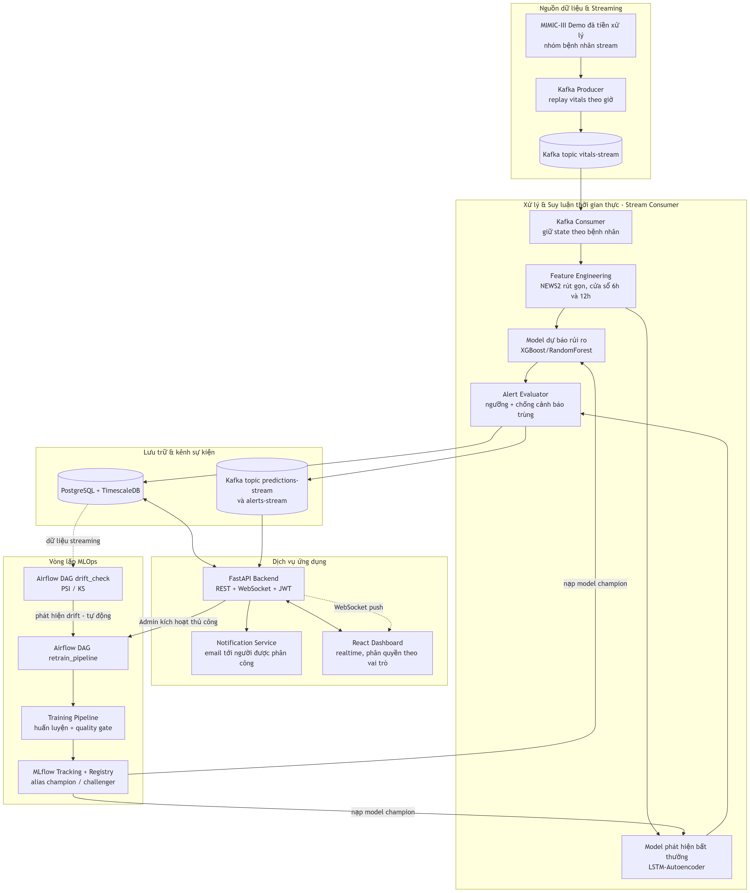{width="15cm"}

**Hình 2.1** Sơ đồ chức năng tổng quát của hệ thống

### 2.1.2. Các trường hợp sử dụng

Hệ thống có ba tác nhân là người dùng (quản trị viên, bác sĩ, điều dưỡng) và hai tác nhân phụ không phải người dùng: hệ thống truyền luồng đẩy dữ liệu sinh hiệu vào, và bộ lập lịch kích hoạt các công việc định kỳ. Tổng cộng 14 trường hợp sử dụng.

**Bảng 2.1** Danh sách trường hợp sử dụng theo tác nhân

| Mã | Trường hợp sử dụng | Tác nhân chính |
|---|---|---|
| UC01 | Đăng nhập | Quản trị viên, Bác sĩ, Điều dưỡng |
| UC02 | Đăng xuất | Quản trị viên, Bác sĩ, Điều dưỡng |
| UC03 | Quản lý tài khoản người dùng | Quản trị viên |
| UC04 | Xem danh sách bệnh nhân được phân công và mức rủi ro | Bác sĩ, Điều dưỡng |
| UC05 | Xem chi tiết sinh hiệu theo thời gian thực | Bác sĩ, Điều dưỡng |
| UC06 | Xem lịch sử cảnh báo | Bác sĩ, Điều dưỡng |
| UC07 | Xác nhận và xử lý cảnh báo | Bác sĩ |
| UC08 | Cấu hình ngưỡng cảnh báo | Quản trị viên |
| UC09 | Theo dõi tình trạng mô hình và báo cáo drift | Quản trị viên |
| UC10 | Kích hoạt huấn luyện lại mô hình (thủ công) | Quản trị viên |
| UC11 | Nhận cảnh báo qua email | Bác sĩ, Điều dưỡng |
| UC12 | Nạp dữ liệu sinh hiệu vào hệ thống | Hệ thống truyền luồng |
| UC13 | Phân công bệnh nhân cho bác sĩ và điều dưỡng | Quản trị viên |
| UC14 | Tự động kiểm tra drift và huấn luyện lại | Bộ lập lịch Airflow |

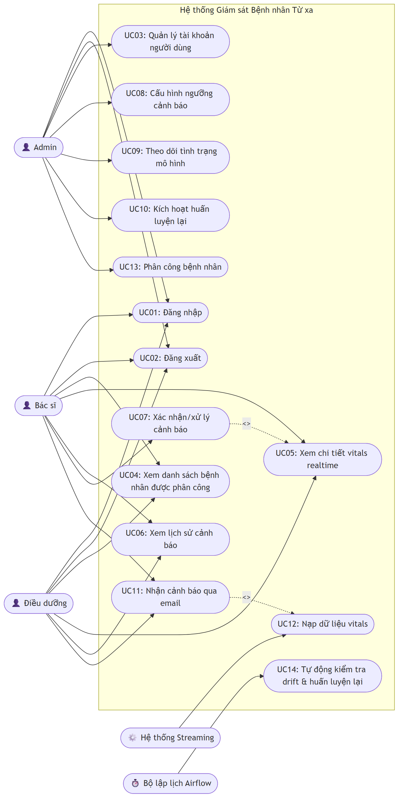{width="12cm"}

**Hình 2.2** Biểu đồ Use Case của hệ thống

Ba quan hệ đáng lưu ý trong biểu đồ:

- **Đăng nhập (UC01) là tiền điều kiện** của mọi trường hợp sử dụng còn lại của người dùng. Nó được ghi ở phần tiền điều kiện của từng trường hợp chứ không vẽ bằng quan hệ `<<include>>`: đăng nhập không phải một bước con của từng chức năng, và vẽ lặp lại cho mọi trường hợp sẽ làm biểu đồ mất khả năng đọc.
- `UC07 <<include>> UC05`: xử lý cảnh báo bắt buộc phải xem chi tiết sinh hiệu trước khi xác nhận.
- `UC11 <<extend>> UC12`: gửi email cảnh báo là nhánh mở rộng, chỉ phát sinh khi bản ghi vừa nạp vào vượt ngưỡng rủi ro **và** không trùng cảnh báo đang mở — không xảy ra ở mọi lần nạp dữ liệu.

Quản trị viên **không** theo dõi bệnh nhân; vai trò này chỉ quản lý người dùng, phân công, ngưỡng cảnh báo và mô hình. Đây là lựa chọn có chủ ý nhằm giới hạn phạm vi truy cập dữ liệu lâm sàng theo đúng nhu cầu công việc.

### 2.1.3. Yêu cầu phi chức năng

| Tiêu chí | Yêu cầu | Cách kiểm chứng |
|---|---|---|
| Độ trễ đầu–cuối | Từ lúc dữ liệu được phát tới lúc giao diện nhận được dự đoán, phân vị 95 dưới 2 giây với 20 bệnh nhân đồng thời | Đo tự động, mục 4.5.5 |
| Không mất dữ liệu | Dừng đột ngột thành phần xử lý luồng rồi khởi động lại: không mất bản ghi, không ghi trùng | Kiểm thử tự động, mục 4.5.5 |
| Không mất cảnh báo | Dừng backend giữa lúc đang có dữ liệu: cảnh báo sinh ra trong lúc đó vẫn được xử lý sau khi khởi động lại | Kiểm thử tự động, mục 4.5.5 |
| Chống bão cảnh báo | Một đợt nguy kịch kéo dài nhiều giờ chỉ sinh ra một cảnh báo cho mỗi loại | Kiểm thử tự động và đo trên lần chạy thật |
| Phân quyền | Bác sĩ và điều dưỡng truy cập bệnh nhân không được phân công phải bị từ chối, ở cả giao diện REST và kênh thời gian thực | Kiểm thử tự động |
| Bảo mật | Xác thực bằng token với ba vai trò; token không được xuất hiện trong log của máy chủ | Kiểm thử tự động |
| Khả năng thay mô hình | Thay mô hình đang dùng mà không phải triển khai lại hay khởi động lại thành phần suy luận | Kiểm thử tự động, mục 4.5.4 |

## 2.2 Các phương pháp giải quyết bài toán

Bài toán đặt ra ở mục 2.1 nằm ở giao của bốn hướng nghiên cứu. Mục này trình bày tóm lược từng hướng cùng nhận xét về điểm mà hướng đó chưa giải quyết cho bài toán này.

### 2.2.1. Thang điểm cảnh báo sớm dựa trên luật

Hướng lâu đời và được triển khai rộng nhất trên thực tế là các thang điểm cảnh báo sớm tổng hợp. Thang **NEWS2** do Royal College of Physicians công bố (bản cập nhật tháng 12/2017) [4] cho điểm bảy thông số sinh tồn theo mức độ lệch khỏi khoảng bình thường, rồi dùng tổng điểm cùng quy tắc "một thông số đạt 3 điểm" để xác định mức độ theo dõi cần thiết. NEWS2 hiện là chuẩn được khuyến nghị áp dụng toàn hệ thống y tế công của Anh.

Ưu điểm của hướng này rất rõ và không nên xem nhẹ: thang điểm minh bạch hoàn toàn, tính được bằng tay tại giường bệnh, không cần huấn luyện trên dữ liệu, và đã được kiểm chứng trên quy mô lớn.

Hạn chế nằm ở bản chất của nó. Thứ nhất, NEWS2 là **hàm của trạng thái hiện tại**: nó không dùng diễn biến trong nhiều giờ trước đó, nên hai bệnh nhân cùng điểm nhưng một người đang xấu đi nhanh và một người đang hồi phục được đối xử như nhau. Thứ hai, trọng số của các thông số là giá trị cố định do hội đồng chuyên gia đặt ra, không học từ dữ liệu, nên không tận dụng được tương tác giữa các thông số. Thứ ba — và đây là điểm quan trọng nhất với đồ án này — NEWS2 **không phải một mô hình dự báo**: nó mô tả mức độ nặng hiện tại chứ không trả lời câu hỏi bệnh nhân nào sẽ chuyển nặng trong vài giờ tới.

Nhận xét này dẫn tới một hệ quả về phương pháp mà đồ án phải xử lý: vì NEWS2 là một hàm tất định của các thông số sinh tồn, nếu lấy chính mức NEWS2 tại thời điểm hiện tại làm nhãn thì mọi mô hình học trên các thông số đó sẽ chỉ học lại bảng tính điểm. Đây là lý do đồ án chuyển sang bài toán dự báo (mục 2.3.1).

### 2.2.2. Dự báo suy giảm lâm sàng bằng học máy

Hướng thứ hai dùng học máy thay cho thang điểm cố định. Bộ dữ liệu **MIMIC-III** [1], công bố năm 2016 với dữ liệu hồi sức tích cực phi định danh của hơn bốn mươi nghìn bệnh nhân, là nền tảng của phần lớn công trình trong hướng này; bản trích xuất công khai thu nhỏ **MIMIC-III Clinical Database Demo** [2] lưu trữ trên PhysioNet [3] là dữ liệu được dùng trong đồ án.

Tổng quan hệ thống của Muralitharan và cộng sự [5] rà soát các hệ thống cảnh báo sớm dựa trên học máy sử dụng thông số sinh tồn và kết luận rằng chúng **có thể đạt độ chính xác cao hơn** các thang điểm tổng hợp theo trọng số cố định. Cùng lúc, tổng quan này nêu ba vấn đề còn tồn tại mà đồ án đã tiếp nhận trực tiếp: thiếu chuẩn hoá về chỉ số đầu ra khiến không so sánh được giữa các mô hình, khả năng diễn giải kết quả cho bác sĩ còn hạn chế, và hiệu quả lâm sàng thực tế của các hệ thống này chưa được chứng minh đầy đủ.

Điểm thiếu trong nhiều công trình thuộc hướng này, và là lý do đồ án đặt ra ràng buộc riêng, là **thiếu một mốc so sánh đủ mạnh**. Nếu một mô hình dự báo tình trạng trong một giờ tới mà không so với phương án đơn giản "một giờ nữa vẫn như bây giờ", thì con số nó đạt được không nói lên điều gì. Thực nghiệm ở mục 4.5.1 cho thấy điều này là một nguy cơ thật chứ không phải lo xa: ở tầm một giờ, mô hình học máy của đồ án **thua** phương án đơn giản đó.

### 2.2.3. Phát hiện bất thường trên chuỗi thời gian

Hướng thứ ba tiếp cận vấn đề theo kiểu không giám sát: thay vì học từ nhãn "nguy kịch", mô hình học "hình dạng bình thường" của tín hiệu rồi coi những gì tái tạo kém là bất thường. Malhotra và cộng sự [6] đề xuất dùng kiến trúc mã hoá–giải mã dựa trên LSTM [9] cho dữ liệu nhiều cảm biến, trong đó sai số tái tạo được dùng trực tiếp làm điểm bất thường. Cách này có hai ưu điểm quan trọng với bài toán y tế: nó không cần nhãn bất thường (thứ mà bộ dữ liệu này không có), và nó so sánh bệnh nhân với **chính họ** thay vì với một ngưỡng chung cho mọi người.

Hai khó khăn thực tế của hướng này cũng được ghi nhận rõ trong y văn và đã tái xuất hiện trong đồ án. Thứ nhất là **chọn ngưỡng**: sai số tái tạo là một số không có ý nghĩa trực tiếp, nên phải chuyển sang một thang đọc được và phải chọn ngưỡng cắt. Thứ hai là **tính ổn định của ngưỡng giữa các đối tượng**: một ngưỡng tốt trên tập huấn luyện có thể cho tỷ lệ báo nhầm rất khác trên bệnh nhân mới. Cả hai vấn đề này dẫn tới hai giải pháp cụ thể của đồ án — chuẩn hoá điểm bằng hàm phân phối tích lũy thực nghiệm, và căn giữa cửa sổ theo từng kênh (mục 3.2.3b).

### 2.2.4. Phát hiện drift và thực hành MLOps

Hướng thứ tư không thuộc về y tế mà thuộc về vận hành hệ thống học máy. Gama và cộng sự [7] tổng quan các phương pháp phát hiện và thích ứng với hiện tượng phân phối dữ liệu thay đổi theo thời gian, phân biệt giữa drift ở phân phối đầu vào và drift ở quan hệ giữa đầu vào và nhãn. Sculley và cộng sự [8] chỉ ra rằng phần mã học máy chỉ là một phần nhỏ trong một hệ thống học máy thực tế, và phần lớn chi phí bảo trì nằm ở những vấn đề quanh nó — trong đó có hai vấn đề mà đồ án phải xử lý trực tiếp: **lệch giữa huấn luyện và vận hành** (khi đặc trưng lúc suy luận không trùng đặc trưng lúc huấn luyện) và **vòng phản hồi ẩn** (khi hệ thống tự tác động lên chính dữ liệu nó học).

Chỉ số **PSI** (Population Stability Index), vốn xuất phát từ thực hành mô hình rủi ro tín dụng, được dùng rộng rãi để đo mức lệch phân phối, cùng thang phân loại thường được trích dẫn: dưới 0,1 không đáng kể, 0,1–0,25 trung bình, từ 0,25 trở lên là đáng kể. Một trong các phát hiện thực nghiệm của đồ án (mục 3.2.4b và 4.5.4) là **thang ngưỡng này không dùng được** ở quy mô cửa sổ khoảng 20 bệnh nhân, vì nó giả định các quan sát độc lập trong khi các giờ của cùng một bệnh nhân tương quan rất mạnh.

### 2.2.5. Khoảng trống mà đồ án nhắm tới

Ba nhận xét tổng hợp từ bốn hướng trên định hình phạm vi của đồ án.

**Thứ nhất, phần lớn công trình về dự báo suy giảm lâm sàng dừng ở mô hình ngoại tuyến.** Mô hình được huấn luyện, đánh giá trên một tập dữ liệu giữ lại, rồi báo cáo chỉ số. Ít công trình đặt mô hình vào một hệ thống thực sự chạy, nơi xuất hiện những vấn đề mà đánh giá ngoại tuyến không thấy: đặc trưng phải tính được từ dữ liệu đến từng bản ghi một, cảnh báo phải chống trùng lặp, dữ liệu không được mất khi có sự cố, và mô hình phải thay được mà không dừng hệ thống.

**Thứ hai, các chỉ tiêu phi chức năng gần như không được báo cáo.** Một hệ thống cảnh báo sớm mà kết quả tới người trực sau năm phút thì không còn là cảnh báo sớm, nhưng độ trễ đầu–cuối rất ít khi xuất hiện trong các công bố về mô hình y tế. Đồ án đo và công bố chỉ tiêu này cùng với khả năng chịu lỗi.

**Thứ ba, vòng vận hành thường được mô tả mà không được kiểm chứng.** Kiến trúc "phát hiện drift → huấn luyện lại → kiểm định → thay mô hình" xuất hiện trong nhiều tài liệu về MLOps ở dạng sơ đồ. Đồ án hiện thực vòng này và chạy thật, kể cả những phần kết quả không thuận lợi: cả bốn phiên bản mô hình sinh ra từ việc huấn luyện lại đều bị cửa kiểm định từ chối (mục 4.5.4).

## 2.3 Phương pháp đề xuất giải quyết bài toán

### 2.3.1. Hướng tiếp cận

Từ các yêu cầu ở mục 2.1 và nhận xét ở mục 2.2, đồ án chọn hướng tiếp cận gồm bốn quyết định chính; chi tiết kỹ thuật được trình bày ở Chương 3.

**Thứ nhất, đặt bài toán rủi ro ở dạng dự báo.** Nhãn của giờ *t* là mức rủi ro cao nhất trong khoảng bốn giờ tiếp theo, không phải mức rủi ro tại chính giờ *t*. Lý do: NEWS2 là một hàm tất định của các thông số sinh tồn, nên nếu lấy nhãn tại thời điểm hiện tại thì mô hình sẽ đạt độ chính xác gần như hoàn hảo mà thực chất chỉ học lại bảng tính điểm — một dạng rò rỉ nhãn. Kèm theo quyết định này là một ràng buộc tự đặt ra: mô hình phải thắng **baseline persistence** (dự báo rằng bốn giờ nữa trạng thái vẫn như hiện tại), nếu không thì nó không đóng góp gì so với việc chỉ hiển thị NEWS2 hiện tại.

**Thứ hai, dùng hai mô hình bổ sung nhau thay vì một mô hình.** Mô hình dự báo rủi ro trả lời câu hỏi "bệnh nhân này có nguy cơ chuyển nặng không", dựa trên các ngưỡng lâm sàng chung cho mọi người. Mô hình phát hiện bất thường trả lời một câu hỏi khác: "diễn biến của bệnh nhân này có lệch khỏi chính nền tảng của họ không". Hai câu hỏi này không thay thế được nhau: một bệnh nhân có thể có sinh hiệu trong ngưỡng bình thường nhưng đang biến động theo kiểu bất thường so với 12 giờ trước đó, và ngược lại.

**Thứ ba, một nguồn tính đặc trưng duy nhất.** Toàn bộ phép biến đổi từ giá trị đo thô thành đặc trưng đầu vào của mô hình được đặt trong một thư viện dùng chung, được cả quy trình huấn luyện và thành phần suy luận trực tuyến sử dụng. Đây là biện pháp trực tiếp chống lệch giữa huấn luyện và vận hành — loại lỗi rất khó phát hiện vì nó không gây ngoại lệ, chỉ làm chất lượng dự đoán âm thầm giảm.

**Thứ tư, vòng vận hành khép kín với một cửa kiểm soát.** Hệ thống tự theo dõi phân phối dữ liệu và tự huấn luyện lại, nhưng mô hình mới không được tự động thay thế mô hình đang dùng. Nó phải qua một bộ tiêu chí kiểm định (quality gate) trên tập dữ liệu kiểm tra cố định. Cơ chế này bảo vệ hệ thống khỏi kịch bản nguy hiểm nhất của MLOps tự động: huấn luyện lại trên dữ liệu nhiễu rồi tự hạ cấp chính mình.

### 2.3.2. Luồng dữ liệu

Ở mức ngữ cảnh, hệ thống nhận dữ liệu từ hai nguồn (dòng sinh hiệu theo thời gian thực và bộ dữ liệu đã tiền xử lý dùng để huấn luyện), phục vụ ba nhóm người dùng, và gửi thông báo ra ngoài qua máy chủ thư điện tử.

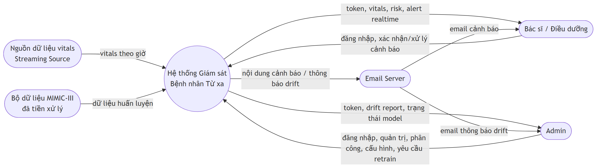{width="15cm"}

**Hình 2.3** Sơ đồ luồng dữ liệu mức ngữ cảnh (Level 0)

Ở mức 1, hệ thống được phân rã thành các tiến trình xử lý chính cùng các kho dữ liệu tương ứng: tiến trình suy luận thời gian thực, tiến trình phân phối sự kiện và thông báo, tiến trình quản trị, và tiến trình theo dõi mô hình.

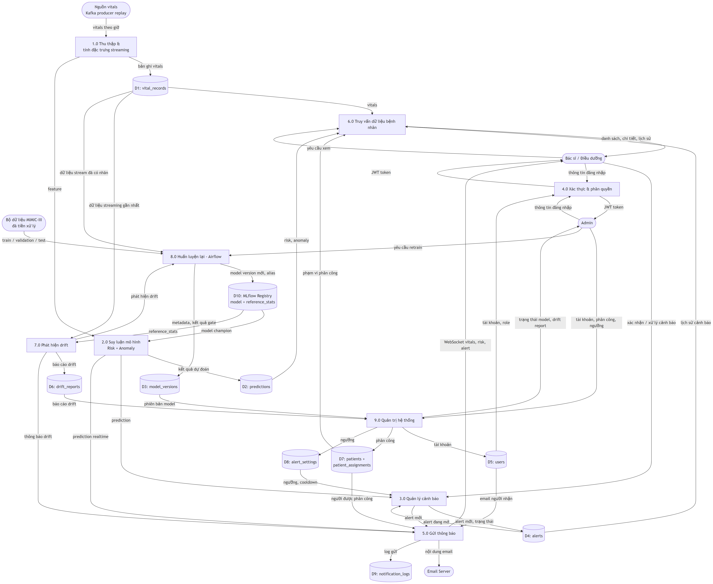{width="15cm"}

**Hình 2.4** Sơ đồ luồng dữ liệu mức 1

### 2.3.3. Mô hình dữ liệu

Cơ sở dữ liệu gồm mười bảng, chia thành ba nhóm theo chức năng:

- **Nhóm lâm sàng**: `patients` (bệnh nhân), `vital_records` (giá trị đo theo giờ), `predictions` (kết quả của hai mô hình theo từng giờ), `alerts` (cảnh báo cùng vòng trạng thái xử lý).
- **Nhóm người dùng và phân quyền**: `users` (tài khoản, ba vai trò), `patient_assignments` (bảng quan hệ nhiều–nhiều giữa nhân viên y tế và bệnh nhân — chính bảng này quyết định phạm vi dữ liệu mà mỗi người được xem), `notification_logs` (log gửi email, dùng để không gửi trùng).
- **Nhóm vận hành mô hình**: `model_versions` (bản sao thông tin phiên bản mô hình từ sổ đăng ký, kèm kết luận của quality gate và lý do bị từ chối), `drift_reports` (kết quả từng lần kiểm tra drift), `alert_settings` (ngưỡng cảnh báo do quản trị viên đặt, lưu theo lịch sử thay đổi).

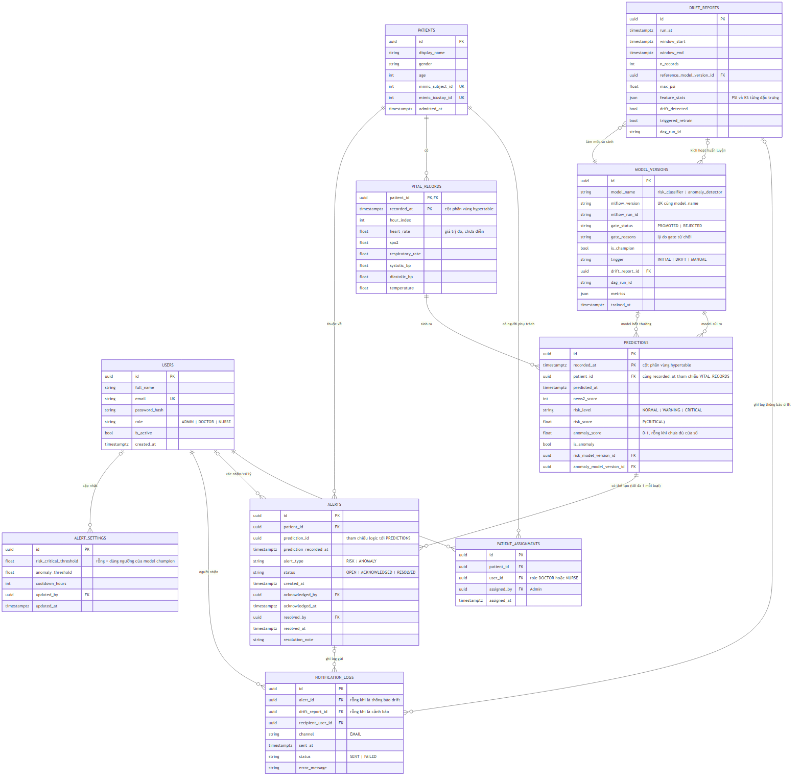{width="15cm"}

**Hình 2.5** Biểu đồ quan hệ dữ liệu (ERD)

Ba điểm thiết kế cần nói rõ vì chúng khác với một lược đồ quan hệ thông thường:

1. **`vital_records` và `predictions` là bảng chuỗi thời gian** (hypertable của TimescaleDB), được phân vùng tự động theo thời gian. Hệ quả bắt buộc: khoá chính của hai bảng này phải chứa cột thời gian `recorded_at`.
2. **Tham chiếu tới hai bảng trên là tham chiếu logic.** Không thể đặt ràng buộc khoá ngoại trỏ vào một bảng đã được phân vùng, nên `alerts` giữ cặp `(prediction_id, prediction_recorded_at)` và tính đúng đắn được bảo đảm bằng việc ghi cả ba bản ghi (giá trị đo, dự đoán, cảnh báo) trong **cùng một giao dịch**.
3. **`vital_records` lưu giá trị đo chưa điền.** Giá trị sau khi điền theo chiều thời gian không được lưu lại mà được tính lại mỗi khi cần. Điều này bảo đảm dữ liệu gốc không bị bóp méo, và quan trọng hơn: khi huấn luyện lại, bảng này dựng lại được đúng bộ đặc trưng như lúc huấn luyện lần đầu.

\newpage

# CHƯƠNG 3 PHƯƠNG PHÁP ĐỀ XUẤT

## 3.1. Mô hình tổng quát

{width="15cm"}

**Hình 3.1** Kiến trúc tổng quát của hệ thống

Hệ thống gồm sáu tầng, mỗi tầng là một tiến trình độc lập và giao tiếp với nhau qua hàng đợi thông điệp hoặc cơ sở dữ liệu, không gọi trực tiếp lẫn nhau.

**Tầng nguồn dữ liệu và tiền xử lý.** Bộ dữ liệu MIMIC-III Demo được làm sạch, gộp mã chỉ số, đưa về lưới thời gian một giờ rồi chia thành bốn nhóm bệnh nhân cố định. Nhóm dành riêng cho việc phát lại được lưu thành một tệp riêng và không bao giờ tham gia huấn luyện ban đầu.

**Tầng truyền luồng.** Thành phần phát (producer) đọc tệp phát lại và gửi từng giờ dữ liệu lên hàng đợi như thể đó là dòng dữ liệu đến từ thiết bị theo dõi. Khoá của mỗi thông điệp là mã bệnh nhân, nhờ đó mọi bản ghi của cùng một bệnh nhân luôn vào cùng một phân vùng và giữ đúng thứ tự thời gian. Đây không phải chi tiết phụ: nếu thứ tự bị đảo, các đặc trưng cửa sổ và điểm bất thường đều sai.

**Tầng xử lý thời gian thực.** Thành phần tiêu thụ (consumer) giữ trạng thái của từng bệnh nhân trong bộ nhớ, và với mỗi thông điệp thì thực hiện đúng một trình tự: cập nhật trạng thái → tính đặc trưng → chạy hai mô hình → quyết định cảnh báo → ghi cơ sở dữ liệu trong một giao dịch → phát sự kiện → xác nhận đã tiêu thụ thông điệp. **Thứ tự hai bước cuối không được đảo.** Nếu xác nhận tiêu thụ trước khi ghi cơ sở dữ liệu, một sự cố xảy ra đúng giữa hai bước sẽ làm mất bản ghi vĩnh viễn. Với thứ tự như trên, sự cố chỉ dẫn tới việc thông điệp được xử lý lại, và bản ghi trùng bị phát hiện rồi bỏ qua.

**Tầng lưu trữ.** Cơ sở dữ liệu quan hệ có mở rộng chuỗi thời gian lưu giá trị đo, dự đoán và cảnh báo. Đồng thời hai chủ đề hàng đợi khác mang kết quả dự đoán và cảnh báo ra ngoài, để tầng ứng dụng tiêu thụ độc lập với tầng xử lý.

**Tầng ứng dụng.** Máy chủ ứng dụng vừa phục vụ giao diện REST, vừa duy trì kết nối thời gian thực tới trình duyệt, vừa nghe hàng đợi để đẩy sự kiện và gửi email. Điểm cần nhấn: **máy chủ ứng dụng không chạy mô hình và không chạy công việc định kỳ** — suy luận thuộc tầng xử lý, còn công việc định kỳ thuộc tầng vận hành. Nhờ tách như vậy, việc khởi động lại máy chủ ứng dụng không làm gián đoạn dòng dữ liệu.

**Tầng vận hành MLOps.** Bộ lập lịch chạy hai luồng công việc: kiểm tra drift định kỳ, và huấn luyện lại. Sổ đăng ký mô hình giữ các phiên bản cùng một nhãn trỏ tới phiên bản đang dùng.

Hai quyết định kiến trúc xuyên suốt toàn hệ thống, đáng được nêu riêng vì chúng quyết định tính đúng đắn của mọi thứ còn lại:

**(a) Một nguồn tính đặc trưng duy nhất.** Mọi phép tính đặc trưng — gộp mã chỉ số, làm sạch, dựng lưới giờ, điền giá trị, NEWS2, đặc trưng cửa sổ, nền tảng cá nhân, điểm z, cắt cửa sổ — nằm trong một thư viện dùng chung, được cả quy trình huấn luyện và thành phần xử lý luồng nhập vào. Không có bản sao thứ hai của bất kỳ công thức nào. Để bảo đảm điều này không bị vi phạm về sau, hệ thống có một kiểm thử tự động so từng giờ của dữ liệu thật: đặc trưng mà thành phần xử lý luồng tính trực tuyến phải trùng khít đặc trưng đã dùng khi huấn luyện.

**(b) Thay mô hình bằng cách đổi nhãn, không triển khai lại.** Thành phần xử lý luồng nạp mô hình theo nhãn `champion` của sổ đăng ký và kiểm tra lại nhãn này theo chu kỳ. Khi quality gate cho phép một phiên bản mới lên làm `champion`, thành phần xử lý tự phát hiện và nạp phiên bản mới trong vòng một chu kỳ kiểm tra, không cần dừng tiến trình, không cần xây lại ảnh chứa, không cần can thiệp tay. Mỗi bản ghi dự đoán đều lưu lại mã phiên bản mô hình đã dùng, nên luôn truy vết được kết quả nào do mô hình nào sinh ra.

## 3.2 Đặc trưng của mô hình đề xuất

### 3.2.1. Thu thập và xử lý dữ liệu

**Gộp mã chỉ số.** MIMIC-III trải qua hai hệ thống hồ sơ điện tử khác nhau theo thời gian (CareVue cho bệnh nhân cũ, MetaVision cho bệnh nhân mới hơn), nên cùng một loại thông số sinh tồn mang nhiều mã `itemid` khác nhau và bắt buộc phải gộp lại. Danh sách gộp bám theo các định nghĩa chuẩn của cộng đồng MIMIC, với hai bổ sung lấy từ dữ liệu thật: mã huyết áp động mạch xâm lấn (`220050`/`220051`, có ở 24 đợt ICU) và mã nhiệt độ đo bằng °C (`676`, có ở 14 đợt ICU). Hai mã nhiệt độ `677` và `679` bị **loại bỏ** vì chúng là giá trị tính lại từ hai mã kia, gộp vào sẽ đếm trùng.

**Làm sạch.** Nhiệt độ °F được đổi về °C theo công thức `(F − 32) / 1,8`. Các dòng bị loại: có cờ lỗi của MetaVision (36 dòng), có cờ hủy của CareVue (64 dòng), thiếu giá trị số (2.765 dòng), thiếu mã đợt ICU (81 dòng), và giá trị nằm ngoài khoảng sinh lý hợp lệ. Bước cuối là cần thiết chứ không hình thức: dữ liệu thật có nhịp tim bằng 0, SpO₂ bằng 0 và huyết áp tâm thu bằng 11.647.

**Dựng lưới thời gian một giờ.** Dữ liệu trong MIMIC là giá trị do điều dưỡng ghi nhận, không phải tín hiệu monitor liên tục: khoảng cách trung vị giữa hai lần đo là 60 phút với nhịp tim, SpO₂, nhịp thở và huyết áp, còn nhiệt độ là 240 phút. Vì vậy mỗi đợt ICU được đưa về lưới một giờ, nhiều lần đo trong cùng một giờ lấy trung vị. Hệ quả quan trọng: **mọi cửa sổ thời gian trong toàn bộ thiết kế được tính bằng số giờ dữ liệu, không phải bằng giờ đồng hồ**, nên kết quả không phụ thuộc tốc độ phát lại.

**Điền giá trị thiếu: chỉ theo chiều thời gian.** Giá trị thiếu được điền bằng giá trị gần nhất trước đó (forward-fill), tối đa hai giờ với nhịp tim, SpO₂, nhịp thở, huyết áp và sáu giờ với nhiệt độ. Sau khi điền, 92,9% số giờ có đủ năm thông số cần cho NEWS2. **Không dùng nội suy**, và đây là một quyết định có tính nguyên tắc: nội suy dùng giá trị ở thời điểm tương lai, thứ mà dòng dữ liệu thời gian thực không thể có. Nếu dùng nội suy khi huấn luyện, mô hình sẽ học trên thông tin mà lúc vận hành nó không bao giờ nhìn thấy — vừa là rò rỉ thông tin tương lai, vừa gây lệch giữa huấn luyện và vận hành.

**Chia dữ liệu theo bệnh nhân.** Có 19 bệnh nhân trong bộ dữ liệu nằm ICU nhiều hơn một lần, nên đơn vị chia phải là bệnh nhân chứ không phải đợt ICU. 98 bệnh nhân có dữ liệu sinh hiệu được chia ngẫu nhiên (hạt giống cố định, phân tầng theo việc có tử vong tại viện hay không) thành bốn nhóm; danh sách được lưu thành tệp cố định trong mã nguồn và dùng chung cho mọi lần huấn luyện lại. Vì chia theo bệnh nhân, số giờ mỗi nhóm không tỷ lệ với số bệnh nhân — độ dài đợt ICU chênh nhau từ vài giờ tới hơn 300 giờ, nên nhóm huấn luyện chỉ chiếm khoảng 44% số giờ. Đây là cái giá phải trả để không có bệnh nhân nào xuất hiện ở hai nhóm, và hạt giống không được chọn lại để số liệu "đẹp hơn".

### 3.2.2. Kỹ thuật đặc trưng

**Điểm NEWS2 rút gọn.** NEWS2 nguyên bản có bảy thông số. Đồ án dùng năm thông số đo được liên tục trong dữ liệu; hai thông số còn lại — có thở oxy bổ sung hay không, và mức ý thức — không có trong bộ dữ liệu. Vì vậy tổng điểm nằm trong khoảng 0–15 thay vì 0–20. Huyết áp tâm trương không có điểm trong NEWS2 nhưng vẫn được giữ làm đặc trưng cho mô hình.

**Bảng 3.2** Thang điểm NEWS2 rút gọn (năm thông số)

| Thông số | 3 | 2 | 1 | 0 | 1 | 2 | 3 |
|---|---|---|---|---|---|---|---|
| Nhịp thở (nhịp/phút) | ≤ 8 | | 9–11 | 12–20 | | 21–24 | ≥ 25 |
| SpO₂ (%) | ≤ 91 | 92–93 | 94–95 | ≥ 96 | | | |
| Huyết áp tâm thu (mmHg) | ≤ 90 | 91–100 | 101–110 | 111–219 | | | ≥ 220 |
| Nhịp tim (bpm) | ≤ 40 | | 41–50 | 51–90 | 91–110 | 111–130 | ≥ 131 |
| Nhiệt độ (°C) | ≤ 35,0 | | 35,1–36,0 | 36,1–38,0 | 38,1–39,0 | ≥ 39,1 | |

Dữ liệu thật có giá trị thập phân, nên mỗi mức được hiện thực thành một khoảng nửa mở theo cận trên của bảng: nhịp tim 90,5 được tính là lớn hơn 90 và nhận 1 điểm.

Từ tổng điểm, mức rủi ro được phân thành ba loại theo đúng hướng dẫn của NEWS2, **bao gồm cả quy tắc "một thông số đạt 3 điểm"**:

| Mức | Điều kiện |
|---|---|
| NORMAL | Tổng 0–4 **và** không thông số nào đạt 3 điểm |
| WARNING | Tổng 5–6, **hoặc** có ít nhất một thông số đạt 3 điểm |
| CRITICAL | Tổng ≥ 7 |

Quy tắc "một thông số đạt 3 điểm" không phải chi tiết nhỏ: nếu bỏ nó, 13,9% số giờ dữ liệu sẽ bị gán NORMAL trong khi về mặt lâm sàng bệnh nhân có một thông số ở mức nguy hiểm. Phân bố mức trên dữ liệu thật: NORMAL 61,6%, WARNING 31,8%, CRITICAL 6,7%.

**Đặc trưng cửa sổ trượt.** Với cửa sổ sáu giờ gần nhất (yêu cầu tối thiểu ba giá trị đo thật, nếu không thì để trống), hệ thống tính trung bình, độ lệch chuẩn và độ dốc tuyến tính của từng thông số. Các đại lượng này được tính **trên giá trị đo thật, không tính trên giá trị đã điền** — nếu tính trên giá trị đã điền, độ lệch chuẩn và độ dốc sẽ bị làm phẳng giả tạo vì chuỗi giá trị điền là một hằng số. Ngoài ra còn có chênh lệch so với giờ trước của từng thông số và của tổng NEWS2, cùng NEWS2 cao nhất trong sáu giờ qua.

**Bảng 3.1** Tập đặc trưng đầu vào của mô hình dự báo rủi ro

| Nhóm đặc trưng | Nội dung |
|---|---|
| Giá trị hiện tại | Sáu thông số sinh tồn tại giờ *t* (sau khi điền có giới hạn) |
| Điểm lâm sàng | Điểm từng thành phần NEWS2, tổng NEWS2, cờ "có thông số đạt 3 điểm" |
| Cửa sổ sáu giờ | Trung bình, độ lệch chuẩn, độ dốc của từng thông số; NEWS2 cao nhất trong sáu giờ |
| Biến động ngắn hạn | Chênh lệch so với giờ trước của từng thông số và của tổng NEWS2 |
| Ngữ cảnh | Tuổi, giới tính, số giờ kể từ khi vào ICU |

**Nền tảng cá nhân của từng bệnh nhân.** Phục vụ mô hình phát hiện bất thường, hệ thống tính trung bình và độ lệch chuẩn của từng thông số theo kiểu lũy tiến trên tối đa 24 giờ đầu của đợt ICU, bắt đầu dùng được khi đã có ít nhất sáu giờ dữ liệu. Lý do không đợi đủ 24 giờ: 22 trong số 136 đợt ICU ngắn hơn 24 giờ, nếu bắt buộc đủ thì những đợt này sẽ không bao giờ được chấm điểm bất thường. Độ lệch chuẩn có sàn tối thiểu theo từng thông số để điểm z không bùng nổ — dữ liệu thật có 9 trong 132 đợt ICU với độ lệch chuẩn SpO₂ trong 24 giờ đầu nhỏ hơn 0,5. Điểm z được tính là `z = (giá trị − trung bình nền) / max(độ lệch chuẩn nền, sàn)`.

**Nhãn dự báo.** Nhãn của giờ *t* là `y_t = max(mức rủi ro tại t+1, …, mức rủi ro tại t+h)` với *h* = 4. Chỉ những giờ có đủ *h* giờ phía sau **trong cùng một đợt ICU** và cả *h* giờ đó đều tính được NEWS2 mới được gán nhãn — nhãn không bao giờ được lấy vắt sang đợt ICU khác. Với dữ liệu thời gian thực, nhãn của giờ *t* chỉ "chín" sau bốn giờ; chính đặc điểm này là nguồn nhãn cho việc huấn luyện lại.

**Tính nhân quả.** Mọi đặc trưng tại giờ *t* chỉ được dùng dữ liệu tại thời điểm *t* hoặc trước đó. Đây là tính chất được kiểm chứng bằng kiểm thử tự động, không chỉ bằng rà soát mã nguồn: kiểm thử sửa đổi dữ liệu ở các giờ **sau** *t* rồi khẳng định không một đặc trưng nào tại *t* thay đổi.

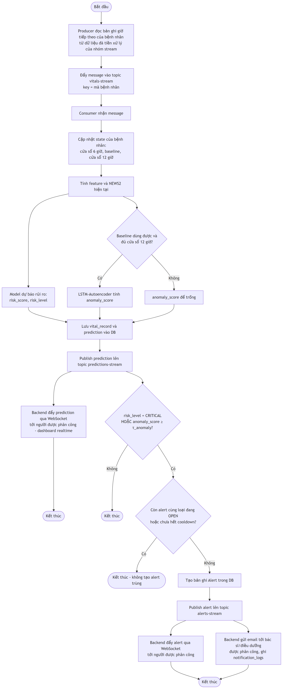{width="10cm"}

**Hình 3.2** Luồng xử lý dữ liệu streaming đến cảnh báo

{width="15cm"}

**Hình 3.3** Tuần tự dự đoán realtime và phát cảnh báo

### 3.2.3. Kiến trúc hai mô hình

#### a) Mô hình dự báo rủi ro

**Bài toán.** Phân loại ba lớp: tại mỗi giờ *t*, dự báo mức rủi ro cao nhất trong bốn giờ tới. Đầu ra là xác suất của ba lớp; `risk_score` được lấy là xác suất của lớp CRITICAL.

**Các ứng viên được so sánh.** Bốn phương án được đánh giá trên cùng một quy trình kiểm định chéo GroupKFold năm phần (nhóm theo bệnh nhân, để không bệnh nhân nào vừa ở phần huấn luyện vừa ở phần kiểm định): baseline persistence, hồi quy logistic đa lớp với chính quy hoá L2, rừng ngẫu nhiên [10], và XGBoost đa lớp [11]. Mất cân bằng lớp được xử lý bằng **trọng số mẫu** chứ không sinh mẫu giả — sinh mẫu giả trên dữ liệu chuỗi thời gian y tế sẽ tạo ra những trạng thái sinh lý không tồn tại.

**Chọn ngưỡng quyết định.** Mức CRITICAL được gán khi `risk_score` vượt một ngưỡng τ. Ngưỡng này không lấy mặc định 0,5 mà được chọn sao cho Recall của lớp CRITICAL đạt mục tiêu 0,80, vì trong bối cảnh lâm sàng thì bỏ sót một ca nguy kịch nghiêm trọng hơn một lần báo động giả.

Điểm cần nhấn mạnh là **ngưỡng được chọn ở đâu**. Lần thực hiện đầu tiên chọn ngưỡng trên riêng tập validation và cho kết quả kém trên tập kiểm tra (Recall CRITICAL chỉ 0,730) — nguyên nhân là tập validation chỉ có 15 bệnh nhân, nên ngưỡng bị chi phối bởi một vài bệnh nhân cụ thể. Phương án cuối cùng chọn ngưỡng trên **dự đoán out-of-fold** của kiểm định chéo trên toàn bộ tập phát triển (63 bệnh nhân): mỗi bệnh nhân được dự đoán bởi một mô hình không hề thấy bệnh nhân đó khi huấn luyện, và mỗi mô hình trong kiểm định chéo được huấn luyện trên số bệnh nhân xấp xỉ mô hình cuối, nên phân phối xác suất gần giống nhau. Mô hình cuối vẫn chỉ huấn luyện trên nhóm huấn luyện; ngưỡng được lưu kèm mô hình và quản trị viên có thể ghi đè.

**Bắt buộc so với baseline persistence.** Mọi báo cáo kết quả đều kèm baseline này trên cùng tập dữ liệu. Đây không phải hình thức: như sẽ thấy ở mục 4.5.1, ở tầm dự báo một giờ thì baseline persistence **thắng** mô hình học máy, vì sinh hiệu tự tương quan rất mạnh trong khoảng thời gian ngắn. Chỉ ở tầm bốn giờ mô hình mới thực sự có giá trị.

#### b) Mô hình phát hiện bất thường

**Kiến trúc.** Bộ tự mã hoá dùng mạng LSTM: bộ mã hoá gồm hai lớp LSTM (64 rồi 32 nơ-ron) nén chuỗi thành một vector ẩn; bộ giải mã nhân bản vector đó rồi dùng hai lớp LSTM (32 rồi 64) và một lớp Dense phân phối theo thời gian để tái tạo lại chuỗi sáu kênh. Hàm mất mát là sai số bình phương trung bình giữa chuỗi vào và chuỗi tái tạo, tối ưu bằng Adam với dừng sớm theo tập validation.

**Đầu vào.** Cửa sổ 12 giờ liên tiếp × 6 kênh, mỗi kênh đã chuẩn hoá thành điểm z so với nền tảng cá nhân của chính bệnh nhân. Do nền tảng cần sáu giờ đầu và cửa sổ cần 12 giờ liên tiếp, **điểm bất thường sớm nhất chỉ xuất hiện ở giờ thứ 17** của đợt ICU; trước đó bệnh nhân chỉ có dự báo rủi ro. Đây là giới hạn nội tại của phương pháp, không phải lỗi hiện thực, và giao diện phải nói rõ điều này cho người dùng.

**Chỉ huấn luyện trên cửa sổ bình thường.** Mô hình chỉ học từ những cửa sổ mà cả 12 giờ đều ở mức NORMAL, để nó học đúng "hình dạng bình thường" của tín hiệu. Bất thường sau đó được suy ra từ việc mô hình tái tạo kém.

**Căn giữa cửa sổ theo từng kênh — quyết định kỹ thuật quan trọng nhất của mô hình này.** Trước khi đưa vào bộ tự mã hoá, mỗi kênh được trừ đi trung bình của chính nó trong cửa sổ. Nhờ vậy mô hình học **hình dạng** diễn biến 12 giờ (dao động, bước nhảy, xu hướng) chứ không học mức lệch tuyệt đối so với nền tảng — phần mức lệch tuyệt đối đã được NEWS2 và mô hình dự báo rủi ro xử lý.

Lý do của bước này được xác định bằng thực nghiệm, và thực nghiệm đó **chỉ chạy trên tập phát triển**, không dùng tập kiểm tra. Khi không căn giữa, sai số tái tạo của cửa sổ bình thường có đuôi rất dày: phân vị 99 gấp tám lần trung vị, do một vài bệnh nhân lệch xa nền tảng dù NEWS2 vẫn NORMAL. Hệ quả là ngưỡng ở phân vị 99 không dùng lại được cho bệnh nhân mới — tỷ lệ gắn cờ nhầm dao động từ 0% đến 24% giữa các phần của kiểm định chéo. Sau khi căn giữa, con số này về khoảng 0–6% và độ chính xác tại cùng ngưỡng tăng từ 0,19 lên 0,50.

**Chuẩn hoá điểm bất thường về khoảng [0, 1].** Sai số tái tạo thô không có ý nghĩa trực tiếp với người dùng, nên nó được chuyển thành điểm thông qua hàm phân phối tích lũy thực nghiệm của sai số trên các cửa sổ bình thường của tập validation (lưu kèm mô hình). Cách này cho điểm một ý nghĩa đọc được ngay: điểm 0,99 nghĩa là sai số tái tạo lớn hơn 99% cửa sổ bình thường.

**Đánh giá khi không có nhãn thật.** Bộ dữ liệu không có nhãn "bất thường" theo từng thời điểm. Đồ án dùng phương pháp **tiêm bất thường tổng hợp** vào các cửa sổ bình thường của tập kiểm tra: 10% số cửa sổ, hạt giống cố định, chia đều ba loại — đột biến nhọn (một đến hai bước lệch ±4σ ở một kênh), dịch mức (từ giữa cửa sổ, một kênh dịch +3σ), và trôi dần (một kênh tăng tuyến tính tới +3σ ở cuối cửa sổ). Giá trị σ của mỗi kênh được lấy từ độ lệch chuẩn điểm z trên các cửa sổ bình thường của **nhóm huấn luyện cố định** (đo được 1,26–1,91), nên tập kiểm tra đã tiêm không đổi giữa các lần huấn luyện lại và mọi phiên bản mô hình đều được chấm trên cùng một thước đo. Không dùng loại bất thường "mất tín hiệu" vì giá trị thiếu đã được xử lý ở bước tiền xử lý — cửa sổ thiếu dữ liệu không được chấm điểm.

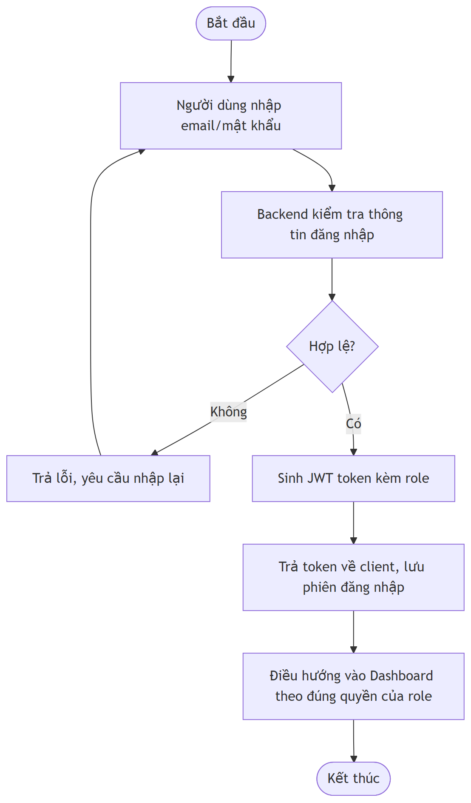{width="8cm"}

**Hình 3.4** Luồng đăng nhập và mở kết nối realtime

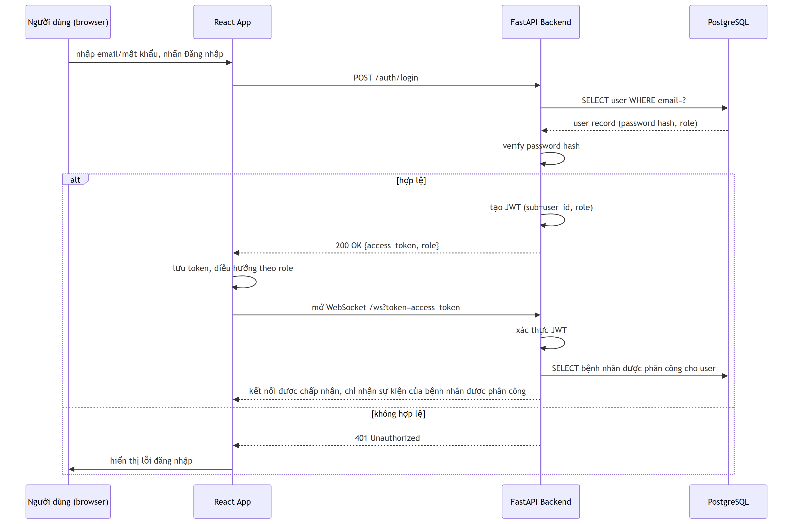{width="14cm"}

**Hình 3.5** Tuần tự đăng nhập và mở kết nối WebSocket

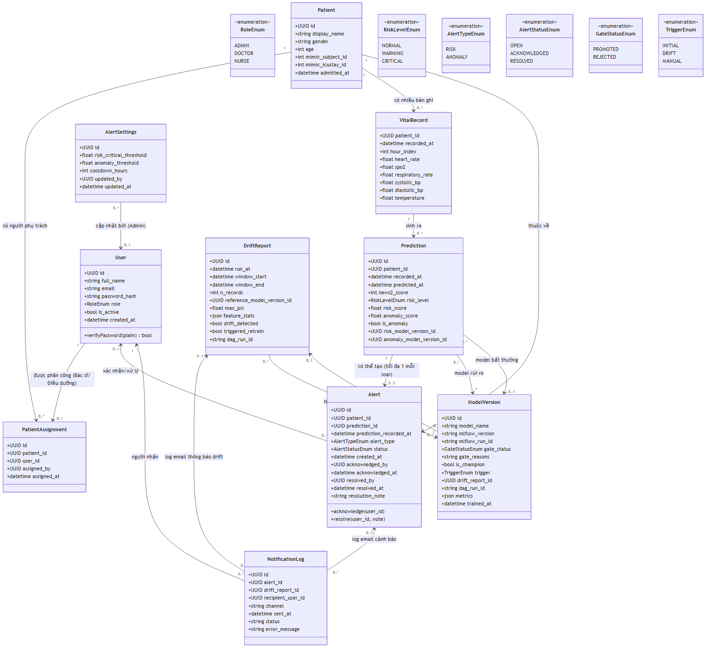{width="15cm"}

**Hình 3.6** Biểu đồ lớp của hệ thống

#### c) Cơ chế sinh cảnh báo

Có hai loại cảnh báo: loại `RISK` khi mức rủi ro dự báo là CRITICAL, và loại `ANOMALY` khi điểm bất thường vượt ngưỡng. Mức WARNING chỉ đổi màu nhãn trên giao diện, không sinh cảnh báo — nếu WARNING cũng sinh cảnh báo thì với 31,8% số giờ ở mức này, hệ thống sẽ trở nên vô dụng vì bị bỏ qua.

**Chống bão cảnh báo.** Đây là yêu cầu bắt buộc để hệ thống dùng được trên thực tế. Với mỗi cặp (bệnh nhân, loại cảnh báo), cảnh báo mới chỉ được tạo khi **không còn cảnh báo cùng loại đang ở trạng thái mở**, *và* cảnh báo cùng loại gần nhất đã cách ít nhất một khoảng nguội (mặc định bốn giờ dữ liệu). Trong lúc một cảnh báo đang mở, các dự đoán mới vẫn được lưu và vẫn hiển thị lên giao diện theo thời gian thực, nhưng không sinh thêm cảnh báo và không gửi thêm email.

Con số minh chứng cho sự cần thiết của cơ chế này: dữ liệu thật có 874 giờ ở mức CRITICAL. Nếu mỗi giờ sinh một cảnh báo, một bác sĩ sẽ nhận hàng trăm email lặp lại cho cùng một đợt nguy kịch, và hệ quả thực tế là toàn bộ hệ thống cảnh báo bị vô hiệu hoá bởi chính người dùng.

**Khoảng nguội tính bằng giờ dữ liệu, không phải giờ đồng hồ.** Nhờ vậy hành vi của hệ thống không phụ thuộc tốc độ phát lại và có thể kiểm thử lặp lại được.

**Người nhận.** Khi một cảnh báo được tạo, email được gửi tới **mọi bác sĩ và điều dưỡng được phân công** cho bệnh nhân đó. Một bảng log riêng ghi lại từng cặp (cảnh báo, người nhận) đã gửi, nên nếu máy chủ ứng dụng khởi động lại và đọc lại sự kiện cũ thì email không bị gửi trùng.

#### d) Thiết kế giao diện

Giao diện gồm tám màn hình, chia phạm vi theo vai trò: bác sĩ và điều dưỡng dùng ba màn hình lâm sàng (danh sách bệnh nhân, chi tiết bệnh nhân, danh sách cảnh báo), quản trị viên dùng bốn màn hình quản trị (người dùng, phân công, ngưỡng cảnh báo, giám sát mô hình), cùng màn hình đăng nhập chung.

Ba nguyên tắc thiết kế được áp dụng xuyên suốt:

1. **Phân biệt rõ luật lâm sàng và dự đoán của mô hình.** Điểm NEWS2 là kết quả của một luật tính toán xác định, còn mức rủi ro là dự đoán có tính xác suất. Hai thứ này được hiển thị bằng hai kiểu thành phần khác nhau và không dùng chung màu, để người dùng không nhầm một suy đoán của mô hình thành một chỉ số lâm sàng đã được kiểm chứng.
2. **Nói rõ khi hệ thống chưa biết.** Khi chưa đủ dữ liệu để chấm điểm bất thường, giao diện phải nói rõ lý do (chưa đủ 16 giờ, hay cửa sổ 12 giờ gần nhất thiếu giá trị đo) thay vì để trống hoặc hiển thị một giá trị mặc định.
3. **Cập nhật theo thời gian thực nhưng không mất ngữ cảnh.** Dữ liệu mới đến qua kết nối thời gian thực được ghép vào trạng thái hiện có bằng các hàm thuần, không tải lại trang, nên người dùng đang xem một bệnh nhân không bị mất vị trí khi có bản ghi mới.

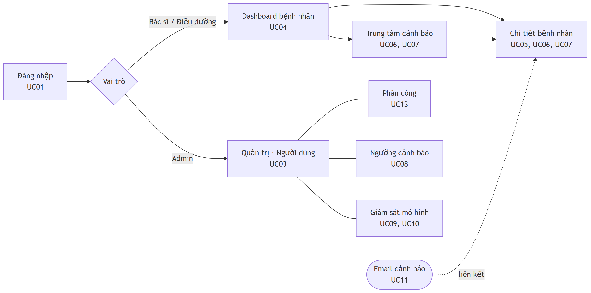{width="15cm"}

**Hình 3.10** Kiến trúc thông tin và điều hướng giao diện

### 3.2.4. Đánh giá mô hình và vòng vận hành MLOps

#### a) Chỉ số đánh giá và lý do chọn

Dữ liệu mất cân bằng mạnh: lớp CRITICAL chỉ chiếm 6,7% số giờ ở mức tức thời, và 14,5% khi tính theo nhãn dự báo bốn giờ. Với phân bố như vậy, **Accuracy là chỉ số gây nhầm lẫn** — một mô hình luôn dự báo NORMAL đã đạt hơn 60% độ chính xác mà không có giá trị lâm sàng nào. Vì vậy hệ thống dùng:

- **Macro F1** làm chỉ số tổng thể, vì nó tính trung bình không theo trọng số trên ba lớp, nên lớp CRITICAL ít mẫu vẫn có trọng lượng bằng hai lớp kia;
- **Recall của lớp CRITICAL** làm chỉ số ưu tiên lâm sàng, vì bỏ sót một ca nguy kịch có hậu quả nặng hơn một lần báo động giả;
- AUROC một-với-phần-còn-lại và AUPRC lớp CRITICAL để đánh giá năng lực xếp hạng độc lập với ngưỡng;
- ma trận nhầm lẫn để thấy mô hình nhầm theo hướng nào;
- mức đóng góp đặc trưng theo phương pháp SHAP [12] để kiểm tra mô hình dựa vào những đặc trưng có ý nghĩa lâm sàng, không phải vào các tương quan giả;
- và **luôn kèm baseline persistence** trên cùng tập dữ liệu.

Với mô hình bất thường, chỉ số dùng để kiểm định là **AUROC** trên tập kiểm tra đã tiêm bất thường. Lý do chọn AUROC: nó không phụ thuộc ngưỡng, nên phản ánh năng lực xếp hạng bất thường mà không gắn với một ngưỡng cảnh báo cụ thể. Precision, Recall và F1 tại ngưỡng vận hành vẫn được báo cáo nhưng không dùng để quyết định.

#### b) Phát hiện drift

**Đặc trưng theo dõi.** Sáu thông số sinh tồn và tổng NEWS2, tức bảy đặc trưng, được dựng lại từ cơ sở dữ liệu bằng đúng thư viện đã dùng khi huấn luyện.

**Phân phối tham chiếu.** Là phân phối trên tập huấn luyện của mô hình rủi ro đang làm `champion`, được lưu thành tệp đi kèm mô hình khi mô hình được đăng ký. Nhờ vậy, khi mô hình đang dùng thay đổi thì mốc so sánh cũng tự thay đổi theo.

**Cửa sổ hiện tại.** 24 giờ dữ liệu gần nhất của tất cả bệnh nhân đang được theo dõi. Lần kiểm tra bị **bỏ qua** (không ghi báo cáo) trong bốn trường hợp: chưa có mô hình `champion`; cửa sổ chưa đủ 24 nhịp; cửa sổ có dưới 200 bản ghi; hoặc không có dữ liệu mới so với lần kiểm tra trước. Điều kiện "đủ 24 nhịp" được thêm vào sau lần chạy thật đầu tiên, khi drift bị kết luận ở nhịp thứ 16 và việc huấn luyện lại chỉ có 316 giờ dữ liệu mới — quá ít để cải thiện được gì.

**Chỉ số.** Chỉ số ổn định phân phối (PSI) được tính cho từng đặc trưng theo công thức

`PSI = Σ (tỷ_lệ_thực_tế_i − tỷ_lệ_tham_chiếu_i) × ln(tỷ_lệ_thực_tế_i / tỷ_lệ_tham_chiếu_i)`

với 10 khoảng chia theo các thập phân vị của phân phối tham chiếu, hai khoảng đầu và cuối mở rộng ra vô cực. Khoảng có tỷ lệ bằng 0 được thay bằng một hằng số rất nhỏ để tránh chia cho 0 và logarit của 0. Thống kê Kolmogorov–Smirnov cũng được tính để kiểm chứng chéo và hiển thị trong báo cáo, nhưng **p-value không được dùng để ra quyết định**: với số mẫu lớn, một chênh lệch nhỏ đến mức không có ý nghĩa thực tế vẫn "có ý nghĩa thống kê".

**Ngưỡng quyết định — và lý do không dùng ngưỡng 0,25 thông dụng.** Thang PSI thường được trích dẫn là: dưới 0,1 không đáng kể, 0,1–0,25 trung bình, từ 0,25 trở lên là đáng kể. Thang này giả định mẫu lớn và các quan sát độc lập. Trong hệ thống này, một cửa sổ chỉ gồm khoảng 20 bệnh nhân × 24 giờ, và các giờ của cùng một bệnh nhân tương quan rất mạnh, nên chỉ riêng sự khác biệt giữa các bệnh nhân đã đẩy PSI lên cao. Đo trên những cửa sổ **không** có drift nhưng cùng hình dạng với lúc vận hành, quy tắc "PSI lớn nhất ≥ 0,25" gắn cờ **93%** số cửa sổ. Nếu giữ quy tắc này, hệ thống sẽ huấn luyện lại liên tục mà không có drift nào.

Đồ án thay bằng **ngưỡng hiệu chỉnh riêng cho từng đặc trưng**, tính theo quy trình sau và **chỉ dùng dữ liệu phát triển, không bao giờ dùng tập kiểm tra**:

1. Kiểm định chéo GroupKFold năm phần theo bệnh nhân; mỗi phần dựng phân phối tham chiếu từ bốn phần còn lại.
2. Lấy ngẫu nhiên tối đa 20 đợt ICU của phần bị giữ lại, lặp 150 lần, với cửa sổ có đúng hình dạng như lúc vận hành, để thu được phân bố PSI trong điều kiện **không có drift**.
3. Ngưỡng của mỗi đặc trưng là giá trị lớn hơn giữa 0,25 và một phân vị *q* của phân bố PSI không drift của chính đặc trưng đó. Cùng một *q* cho mọi đặc trưng, chọn bằng tìm kiếm nhị phân sao cho tỷ lệ cửa sổ không drift bị gắn cờ xấp xỉ **5% mỗi lần kiểm tra**.

Ngưỡng được tính lại tự động mỗi lần huấn luyện và lưu thành tệp đi kèm mô hình. Kết luận có drift khi **ít nhất một** đặc trưng vượt ngưỡng của nó.

**Chống thông báo lặp.** Khi phát hiện drift, quản trị viên được thông báo qua giao diện và email. Nhưng email chỉ gửi khi **bắt đầu một đợt drift mới** (lần kiểm tra trước không có drift) hoặc khi lần này đã kích hoạt huấn luyện lại. Một đợt drift kéo dài nhiều lần kiểm tra không sinh email mỗi lần — cùng tinh thần chống bão cảnh báo đã áp dụng cho cảnh báo lâm sàng.

#### c) Chiến lược Champion–Challenger và quality gate

**Kích hoạt huấn luyện lại** có hai đường: tự động khi phát hiện drift, và thủ công khi quản trị viên yêu cầu. Cơ chế chống vòng lặp: không kích hoạt tự động nếu đang có một lần huấn luyện lại đang chạy, hoặc lần gần nhất (kể cả lần thủ công hoặc lần thất bại) mới kết thúc trong vòng một giờ.

**Dữ liệu huấn luyện lại** là nhóm huấn luyện cố định cộng với dữ liệu đã tích luỹ từ dòng thời gian thực. Ba điểm bất biến: tập validation và tập kiểm tra **không bao giờ đổi**; chỉ phần dữ liệu đã thực sự được phát mới được dùng (phần chưa phát của cùng đợt ICU, dù có sẵn trong tệp gốc, không bao giờ vào huấn luyện); và dữ liệu mới được dựng lại từ giá trị đo chưa điền trong cơ sở dữ liệu bằng đúng đường tính của lúc huấn luyện lần đầu, có kiểm thử so khớp.

**Quality gate.** Mô hình rủi ro chỉ được lên làm `champion` khi đạt **đồng thời** ba điều kiện: (1) vượt các ngưỡng tuyệt đối; (2) Macro F1 cao hơn baseline persistence trên cùng tập kiểm tra; (3) Macro F1 **và** Recall CRITICAL đều không kém mô hình đang dùng — điều kiện thứ ba chặn việc đánh đổi khả năng phát hiện ca nguy kịch để lấy độ chính xác tổng thể. Lần huấn luyện đầu tiên chưa có `champion` thì bỏ qua điều kiện (3). Mô hình bất thường được kiểm định độc lập bằng AUROC, và hai mô hình có thể được thay riêng rẽ.

Một chi tiết quan trọng về cách so sánh: ở mỗi lần huấn luyện lại, **cả mô hình mới và mô hình đang dùng đều được chấm lại trên cùng tập kiểm tra ngay tại thời điểm đó**, chứ không lấy chỉ số đã lưu từ lần trước. Chỉ số cũ có thể đã được đo trong điều kiện khác, và so sánh hai con số không cùng điều kiện là một lỗi phương pháp dễ mắc.

**Cách thay mô hình.** Hệ thống dùng **nhãn** của sổ đăng ký mô hình, không dùng khái niệm "giai đoạn Production" (khái niệm này đã bị chính MLflow đánh dấu lỗi thời). Mô hình đạt kiểm định thì nhãn `champion` được chuyển sang phiên bản mới; mô hình bị từ chối vẫn được đăng ký nhưng gắn thẻ ghi rõ lý do, và mô hình đang dùng giữ nguyên. Mọi phiên bản, kể cả phiên bản bị từ chối, đều được ghi vào cơ sở dữ liệu kèm lý do để quản trị viên xem được trên giao diện — điều này biến quality gate từ một cơ chế ẩn thành một thứ có thể kiểm tra được.

{width="9cm"}

**Hình 3.7** Luồng phát hiện drift và huấn luyện lại mô hình

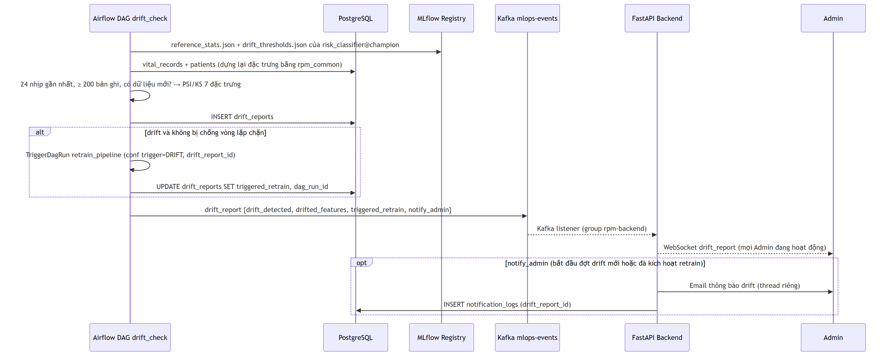{width="15cm"}

**Hình 3.8** Tuần tự phát hiện drift và thông báo người quản trị

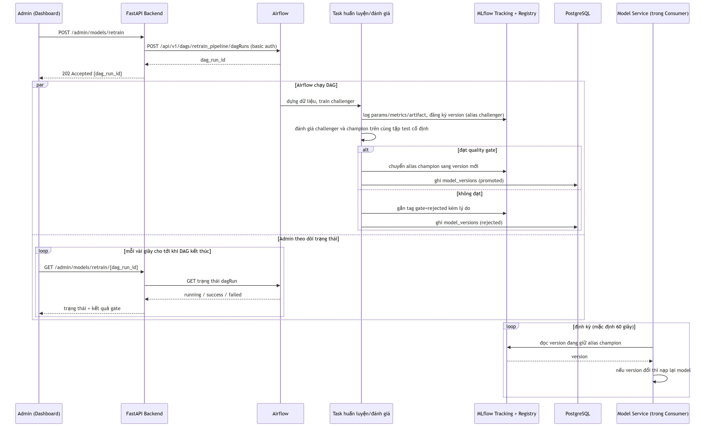{width="15cm"}

**Hình 3.9** Tuần tự kích hoạt huấn luyện lại mô hình thủ công

\newpage

# CHƯƠNG 4 THỰC NGHIỆM

## 4.1 Dữ liệu

**Nguồn.** MIMIC-III Clinical Database Demo v1.4 — bản trích xuất công khai, thu nhỏ còn 100 bệnh nhân, từ cơ sở dữ liệu lâm sàng MIMIC-III do MIT Laboratory for Computational Physiology công bố trên PhysioNet. Dữ liệu là dữ liệu thật, đã phi định danh, thu thập từ khoa hồi sức tích cực của Beth Israel Deaconess Medical Center (Boston, Hoa Kỳ) giai đoạn 2001–2012. Giấy phép Open Data Commons ODbL v1.0 chỉ yêu cầu tài khoản PhysioNet miễn phí và chấp nhận điều khoản, không cần chứng chỉ đào tạo và thoả thuận sử dụng dữ liệu có kiểm duyệt như bản đầy đủ.

Quy mô: 100 bệnh nhân, 129 lượt nhập viện, 136 đợt nằm ICU (77 đợt ghi bằng MetaVision, 59 đợt ghi bằng CareVue), bảng dữ liệu chính có 758.355 dòng giá trị đo.

**Lý do chọn bộ dữ liệu này.** Bốn phương án được cân nhắc: MIMIC-III Demo, MIMIC-III/eICU bản đầy đủ, tự mô phỏng bằng bộ sinh dữ liệu, và các bộ dữ liệu sinh hiệu trên Kaggle. Ba tiêu chí quyết định:

- **Tính xác thực lâm sàng**: chỉ hai phương án đầu là dữ liệu ICU thật. Dữ liệu tự mô phỏng phản ánh đúng công thức do người viết đặt ra chứ không phản ánh biến động sinh lý thật; các bộ trên Kaggle phần lớn là dữ liệu tổng hợp và thường là bảng tĩnh, không có chuỗi thời gian theo từng bệnh nhân — trong khi cả việc phát lại dòng dữ liệu lẫn mô hình LSTM đều đòi hỏi chuỗi thời gian.
- **Khả năng tiếp cận**: bản đầy đủ của MIMIC-III và eICU cần hoàn thành khoá đào tạo về nghiên cứu trên người và chờ duyệt thoả thuận sử dụng dữ liệu, mất từ vài ngày tới vài tuần.
- **Có kết cục thật để đối chiếu**: bộ dữ liệu có cờ tử vong tại viện, cho phép kiểm tra chéo rằng nhãn proxy dựa trên NEWS2 có liên hệ với kết cục lâm sàng thật hay không.

MIMIC-III Demo là điểm cân bằng của ba tiêu chí trên, và vì có cùng cấu trúc bảng với bản đầy đủ nên toàn bộ quy trình có thể chạy lại nguyên vẹn trên bản đầy đủ khi có quyền truy cập.

**Đặc điểm cần biết trước khi đọc kết quả.** PhysioNet chọn 100 bệnh nhân này **từ nhóm bệnh nhân về sau đã tử vong** — đã kiểm chứng trên dữ liệu: cả 100 bệnh nhân đều có cờ tử vong và có ngày tử vong. Không phải ai cũng tử vong ngay trong lượt nằm viện được ghi nhận: 40 trong 129 lượt nhập viện có tử vong tại viện, tức 31%. Đây là thiên lệch chọn mẫu và nó ảnh hưởng tới mọi phép đối chiếu với kết cục thật (xem mục 5.1.2).

**Bảng 4.1** Quy mô dữ liệu sau tiền xử lý

| Chỉ tiêu | Giá trị |
|---|---|
| Bộ dữ liệu | MIMIC-III Clinical Database Demo v1.4 (ODbL v1.0) |
| Số bệnh nhân trong bộ dữ liệu | 100 |
| Số bệnh nhân có dữ liệu sinh hiệu dùng được | 98 |
| Số đợt ICU sau tiền xử lý | 132 |
| Số giờ dữ liệu trên lưới 1 giờ | 14.138 |
| Nhóm phát lại (stream) | 20 bệnh nhân, 1.834 giờ |

**Bảng 4.2** Chia dữ liệu theo bệnh nhân (`ml/splits/subject_split.json`, seed 42)

| Nhóm | Số bệnh nhân | Mục đích |
|---|---|---|
| train | 48 | Huấn luyện mô hình |
| validation | 15 | Chọn siêu tham số, theo dõi quá khớp |
| test | 15 | **Chỉ** dùng cho quality gate |
| stream | 20 | Phát lại mô phỏng bệnh nhân đang nằm viện |

Danh sách bệnh nhân của từng nhóm được lưu thành một tệp cố định trong mã nguồn và **không được tạo lại**. Đây là điều kiện để mọi lần huấn luyện lại đều so sánh được với nhau: nếu tập kiểm tra thay đổi giữa các lần, việc so sánh mô hình mới với mô hình đang dùng trở nên vô nghĩa.

Số giờ dữ liệu chi tiết theo nhóm:

| Nhóm | Bệnh nhân | Đợt ICU | Giờ dữ liệu | Tỷ lệ số giờ |
|---|---|---|---|---|
| train | 48 | 69 | 6.286 | 44,5% |
| validation | 15 | 17 | 2.251 | 15,9% |
| test | 15 | 21 | 3.476 | 24,6% |
| stream | 20 | 25 | 2.125 | 15,0% |

Nhóm huấn luyện chỉ chiếm 44,5% số giờ dù có 49% số bệnh nhân, vì độ dài đợt ICU chênh nhau rất lớn (từ 12 giờ tới 365 giờ). Đây là hệ quả trực tiếp của việc chia theo bệnh nhân và được chấp nhận để không có bệnh nhân nào xuất hiện ở hai nhóm.

## 4.2 Xử lý dữ liệu

Quy trình tiền xử lý (mô tả ở mục 3.2.1) được hiện thực thành một bước chạy được độc lập, sinh ra ba tệp: bảng dữ liệu theo giờ dùng để huấn luyện, bảng dữ liệu phát lại cho nhóm `stream`, và một tệp tóm tắt thống kê để kiểm tra lại.

**Kết quả trên dữ liệu thật.** 132 trong 136 đợt ICU có dữ liệu sinh hiệu (4 đợt còn lại không có), cho 14.138 giờ trên lưới một giờ. Nhóm phát lại gồm 20 bệnh nhân với 1.834 giờ.

**Mức độ thiếu dữ liệu.** Đây là đặc điểm quan trọng nhất của bộ dữ liệu và nó định hình nhiều quyết định thiết kế. Nhiệt độ chỉ có mặt ở khoảng 32% số giờ trước khi điền, vì khoảng cách đo trung vị của nhiệt độ là 240 phút so với 60 phút của bốn thông số còn lại. Sau khi điền theo chiều thời gian với giới hạn hai giờ (sáu giờ với nhiệt độ), 92,9% số giờ có đủ năm thông số cần cho NEWS2.

Giới hạn điền được đặt khác nhau cho nhiệt độ chính vì tần suất đo khác nhau: nếu dùng chung giới hạn hai giờ, phần lớn số giờ sẽ không tính được NEWS2; nếu nới giới hạn của bốn thông số kia lên sáu giờ, hệ thống sẽ dùng một giá trị nhịp tim cũ sáu giờ như thể nó là giá trị hiện tại — điều không chấp nhận được về mặt lâm sàng.

**Phân bố nhãn và mức mất cân bằng.** Ở mức tức thời, phân bố là NORMAL 61,6%, WARNING 31,8%, CRITICAL 6,7%; tổng điểm NEWS2 cao nhất quan sát được là 13 trên thang 15. Với nhãn dự báo bốn giờ, tỷ lệ lớp CRITICAL tăng lên 14,5% — vì nhãn lấy mức cao nhất trong bốn giờ nên một giờ CRITICAL sẽ "nhuộm" nhãn cho tối đa bốn giờ trước đó.

Một con số đáng chú ý cho thấy bài toán dự báo là bài toán thật: trong 874 giờ ở mức CRITICAL, có **434 giờ là khởi phát mới** — tức giờ liền trước chưa ở mức CRITICAL. Nếu tất cả các giờ CRITICAL đều nối tiếp một giờ CRITICAL khác, bài toán dự báo sẽ tầm thường và baseline persistence sẽ không thể bị đánh bại.

**Cửa sổ cho mô hình bất thường.** Số cửa sổ 12 giờ mà cả 12 giờ đều ở mức NORMAL và không còn giá trị trống: 1.146 cửa sổ ở nhóm huấn luyện, 334 ở validation, 485 ở tập kiểm tra.

## 4.3 Công nghệ sử dụng

**Bảng 4.3** Công nghệ và phiên bản sử dụng

| Lớp | Công nghệ (phiên bản) |
|---|---|
| Streaming | Apache Kafka (Confluent `cp-kafka` 7.6.1, Zookeeper 7.6.1), client `confluent-kafka` 2.15.1 |
| Cơ sở dữ liệu | PostgreSQL 16 + TimescaleDB 2.30.0, SQLAlchemy 2.0.49, Alembic 1.15.1 |
| Học máy | scikit-learn 1.3.2, XGBoost 3.0.0, TensorFlow 2.21.0 / Keras 3.13.1, SHAP 0.51.0, SciPy 1.16.2 |
| MLOps | MLflow 3.11.1 (tracking + registry, alias `champion`), Apache Airflow 2.9.3 (LocalExecutor) |
| Backend | FastAPI 0.135.3, Uvicorn 0.34.0, Pydantic 2.12.5, PyJWT 2.12.1, bcrypt 4.2.1 |
| Frontend | React 19.2, TypeScript 7.0, Vite 8.2, Tailwind CSS 4.3, Base UI 1.8, React Router 7.18 |
| Hạ tầng | Docker Compose, Prometheus, Grafana |

**Lý do chọn từng công nghệ.**

- **Apache Kafka** cho tầng truyền luồng: khoá thông điệp bảo đảm mọi bản ghi của cùng một bệnh nhân vào cùng một phân vùng và giữ đúng thứ tự — điều kiện bắt buộc cho các đặc trưng cửa sổ. Việc cho phép nhiều thành phần tiêu thụ độc lập cùng một dòng dữ liệu cũng là lý do máy chủ ứng dụng có thể khởi động lại mà không làm mất dữ liệu. Cơ chế xác nhận tiêu thụ tách khỏi việc đọc cho phép hiện thực bảo đảm "xử lý ít nhất một lần".
- **PostgreSQL với mở rộng TimescaleDB**: hai bảng lớn nhất là dữ liệu chuỗi thời gian chỉ ghi thêm, và được phân vùng tự động theo thời gian. Chọn một cơ sở dữ liệu quan hệ thay vì một cơ sở dữ liệu chuỗi thời gian chuyên dụng để có thể dùng chung một hệ quản trị cho cả dữ liệu quan hệ (người dùng, phân công, phiên bản mô hình) và dữ liệu chuỗi thời gian, giữ được tính toàn vẹn trong một giao dịch.
- **MLflow** cho theo dõi và sổ đăng ký mô hình: dùng cơ chế **nhãn** để chỉ định mô hình đang dùng, thay cho khái niệm "giai đoạn Production" đã bị chính MLflow đánh dấu lỗi thời. Nhờ nhãn, việc thay mô hình là một thao tác dữ liệu, không phải một lần triển khai lại.
- **Apache Airflow** cho các công việc định kỳ: kiểm tra drift theo lịch và luồng huấn luyện lại nhiều bước có phụ thuộc lẫn nhau, trong đó hai bước huấn luyện chạy song song.
- **FastAPI** cho máy chủ ứng dụng: cần cả REST và kết nối thời gian thực trong cùng một tiến trình, cùng khả năng chạy một luồng nền nghe hàng đợi.

Một lưu ý về phiên bản: MLflow phải **cùng một phiên bản** ở máy chủ và ở mọi thành phần gọi tới nó (quy trình huấn luyện, thành phần xử lý luồng, bộ lập lịch). Khác phiên bản dẫn tới lỗi khi nạp mô hình mà thông báo lỗi không chỉ ra nguyên nhân.

## 4.4 Cách đánh giá

Hệ thống được kiểm thử ở bốn tầng, mỗi tầng trả lời một câu hỏi khác nhau.

**Tầng 1 — Kiểm thử đơn vị.** Kiểm tra tính đúng đắn của từng phép tính: gộp mã chỉ số, làm sạch, dựng lưới giờ, từng ngưỡng của NEWS2 tại các giá trị biên (nhịp thở 8 và 9, 11 và 12, 20 và 21, 24 và 25; SpO₂ 91 và 92, 93 và 94, 95 và 96) và với giá trị thập phân, quy tắc "một thông số đạt 3 điểm", công thức nhãn dự báo, nền tảng cá nhân, PSI so với giá trị tính tay, và các tổ hợp của quality gate. Trong nhóm này có hai kiểm thử đóng vai trò rào chắn kiến trúc:

- **Kiểm thử tính nhân quả**: thay đổi dữ liệu ở các giờ sau *t* không được làm đổi bất kỳ đặc trưng nào tại *t*.
- **Kiểm thử đồng nhất huấn luyện–vận hành**: với dữ liệu thật, đặc trưng mà thành phần xử lý luồng tính trực tuyến ở từng giờ phải trùng khít dòng tương ứng trong bảng dữ liệu đã dùng khi huấn luyện.

**Tầng 2 — Kiểm thử tích hợp.** Chạy trên hệ thống thật, không mock: hàng đợi, cơ sở dữ liệu và sổ đăng ký mô hình đều là bản thật chạy trong container, còn thành phần xử lý luồng và máy chủ ứng dụng do chính bộ kiểm thử khởi động để có thể dừng và bật lại. Các luồng được kiểm tra: dữ liệu vào tới khi có bản ghi, dự đoán và sự kiện; nhiều giờ CRITICAL liên tiếp chỉ sinh một cảnh báo; sự kiện tới đúng người được phân công và không tới người khác; đăng nhập và kết nối thời gian thực; thay nhãn mô hình trên sổ đăng ký.

**Tầng 3 — Kiểm định mô hình (quality gate).** Chạy tự động trong luồng huấn luyện lại, trước khi cho phép một phiên bản mới thay thế phiên bản đang dùng. Mọi chỉ số đo trên tập kiểm tra cố định.

**Bảng 4.4** Tiêu chí quality gate

| Mô hình | Tiêu chí đạt |
|---|---|
| Dự báo rủi ro (h = 4) | Macro F1 ≥ 0,60 **và** cao hơn baseline persistence trên cùng tập kiểm tra; Recall CRITICAL ≥ 0,75 tại ngưỡng τ; không kém mô hình đang dùng ở **cả hai** chỉ số |
| Phát hiện bất thường | AUROC ≥ 0,75 trên tập kiểm tra có 10% cửa sổ bị tiêm bất thường; AUROC không kém mô hình đang dùng |

**Hai ngưỡng trong bảng trên đã được hiệu chỉnh sau khi xem kết quả trên tập kiểm tra. Đây là một hạn chế về phương pháp và phải được nêu rõ.**

- **Ngưỡng Recall CRITICAL hạ từ 0,80 xuống 0,75.** Ngưỡng ban đầu là 0,80, trùng đúng với mục tiêu dùng khi chọn ngưỡng τ — nghĩa là không có biên an toàn nào. Lần huấn luyện thứ hai đạt Recall CRITICAL 0,807 trên dự đoán out-of-fold và 0,849 trên validation, nhưng chỉ 0,790 trên tập kiểm tra: thiếu đúng ba giờ CRITICAL (249 trên 315, cần 252). Vì tập kiểm tra chỉ có 15 bệnh nhân và các giờ trong cùng một bệnh nhân tương quan mạnh, mỗi lần huấn luyện lại có khoảng 50% khả năng trượt ngưỡng chỉ do nhiễu. Ngưỡng gate được hạ xuống 0,75 trong khi mục tiêu chọn τ vẫn giữ 0,80, để có biên. Ngưỡng mới được áp lại trên chỉ số **đã được ghi lại** của phiên bản đó, không dự đoán lại trên tập kiểm tra.
- **Tiêu chí của mô hình bất thường đổi từ Precision/Recall sang AUROC.** Tiêu chí ban đầu là Precision ≥ 0,7 và Recall ≥ 0,7 tại ngưỡng vận hành. Lần huấn luyện đầu cho Precision 0,23 và Recall 0,15. Việc chẩn đoán nguyên nhân **chỉ thực hiện trên tập phát triển** (kiểm định chéo theo bệnh nhân, thử ba cách tính điểm × ba cách tiền xử lý) và cho thấy không phương án nào đạt Recall vượt khoảng 0,15 tại ngưỡng phân vị 99 với bộ dữ liệu này: bất thường tiêm ở mức ±3–4σ trên một kênh phần lớn nằm trong độ biến thiên tự nhiên của sinh hiệu theo giờ. Tiêu chí được đổi sang AUROC vì AUROC không phụ thuộc ngưỡng.

**Hệ quả cần nói thẳng: tập kiểm tra của cả hai mô hình đã được sử dụng hai lần** — một lần để đo, một lần sau khi ngưỡng đã được điều chỉnh dựa trên kết quả lần đo đó. Chỉ số báo cáo ở mục 4.5 vì vậy là ước lượng lạc quan hơn thực tế. Cách làm đúng về phương pháp là tách thêm một tập giữ lại thứ hai, nhưng với 98 bệnh nhân thì tập đó sẽ quá nhỏ để có ý nghĩa. Đồ án chọn công khai hạn chế thay vì che đi.

**Tầng 4 — Kiểm thử phi chức năng.** Đo độ trễ đầu–cuối từ lúc dữ liệu được phát tới lúc giao diện nhận được dự đoán, và kiểm tra khả năng chịu lỗi bằng cách dừng đột ngột từng thành phần giữa lúc đang có dữ liệu chảy qua. Kết quả ở mục 4.5.5.

## 4.5 Kết quả đạt được

### 4.5.1. Mô hình dự báo rủi ro

**Bảng 4.5** So sánh các thuật toán (cross-validation trên train ∪ validation)

| Thuật toán | Macro F1 (CV) |
|---|---|
| Random Forest (được chọn) | 0,622 |
| Logistic Regression | 0,618 |
| XGBoost | 0,608 |
| Baseline persistence | 0,565 |

**Bảng 4.6** Kết quả `risk_classifier` v2 (Random Forest, τ_critical = 0,22)

| Tập dữ liệu | Macro F1 | Recall CRITICAL | Precision CRITICAL |
|---|---|---|---|
| Out-of-fold (63 bệnh nhân) | 0,591 | 0,807 | 0,395 |
| Validation | 0,623 | 0,849 | 0,498 |
| **Test** | **0,623** | **0,790** (249/315) | 0,391 |
| Baseline persistence (test) | 0,547 | 0,308 | — |

Ngoài các chỉ số trong bảng, trên tập kiểm tra mô hình đạt AUROC 0,836, AUPRC lớp CRITICAL 0,615 và Accuracy 0,647.

**Nhận xét 1 — mô hình thắng baseline ở đúng chỗ quan trọng nhất.** Chênh lệch Macro F1 so với baseline persistence là 0,623 so với 0,547, tức khoảng 14% tương đối. Nhưng chênh lệch có ý nghĩa lâm sàng nằm ở Recall của lớp CRITICAL: **0,790 so với 0,308**, tức mô hình phát hiện được hơn hai lần rưỡi số giờ nguy kịch so với việc chỉ giả định trạng thái giữ nguyên. Với một hệ thống cảnh báo sớm, đây chính là chỉ số quyết định nó có dùng được hay không.

**Nhận xét 2 — Accuracy thấp hơn baseline, và điều đó là chủ ý.** Accuracy của mô hình (0,647) không cao hơn baseline nhiều, vì ngưỡng τ đã được hạ để đổi lấy Recall của lớp CRITICAL. Precision của lớp CRITICAL chỉ 0,391, nghĩa là khoảng 6 trong 10 lần báo CRITICAL là báo động giả. Đây là một đánh đổi được chọn có ý thức: trong bối cảnh hồi sức, một lần kiểm tra không cần thiết ít tốn kém hơn một ca chuyển nặng bị bỏ sót. Cơ chế chống bão cảnh báo (mục 3.2.3c) là thứ giữ cho tỷ lệ báo động giả này không biến thành gánh nặng thực tế cho nhân viên y tế.

**Nhận xét 3 — tầm dự báo quyết định việc mô hình có giá trị hay không.** Một thực nghiệm bổ sung với *h* = 1 (dự báo một giờ) cho kết quả ngược: mô hình đạt Macro F1 0,578 trong khi baseline persistence đạt 0,621 — **mô hình thua baseline**. Nguyên nhân là sinh hiệu tự tương quan rất mạnh trong khoảng một giờ, nên "một giờ nữa vẫn như bây giờ" là một dự báo rất khó đánh bại. Kết quả này biện minh cho việc chọn *h* = 4, và quan trọng hơn, nó cho thấy nếu không bắt buộc so với baseline persistence thì một mô hình ở tầm một giờ vẫn có thể được báo cáo là "đạt Macro F1 0,578" và trông như một thành công.

**Nhận xét 4 — nhãn proxy có liên hệ với kết cục thật.** Vì nhãn rủi ro chỉ là proxy suy ra từ NEWS2, cần kiểm tra chéo nó với một kết cục lâm sàng thật. Tỷ lệ giờ ở mức CRITICAL trung bình mỗi đợt ICU là **19,1% ở nhóm tử vong tại viện** so với **3,6% ở nhóm sống sót**, và AUROC ở mức đợt ICU đạt 0,718. Nhãn proxy vì vậy không phải một đại lượng tuỳ ý, dù phép đối chiếu này mang thiên lệch chọn mẫu của bộ dữ liệu (mục 5.1.2).

{width="12cm"}

**Hình 4.1** Ma trận nhầm lẫn của mô hình dự báo rủi ro trên tập kiểm tra

{width="14cm"}

**Hình 4.2** Mức đóng góp đặc trưng (SHAP) cho lớp CRITICAL

Bốn đặc trưng có đóng góp lớn nhất cho lớp CRITICAL, theo thứ tự: **NEWS2 cao nhất trong sáu giờ qua**, **NEWS2 hiện tại**, **nhịp thở trung bình sáu giờ**, và **nhịp tim**. Kết quả này đáng chú ý ở hai điểm.

Thứ nhất, đặc trưng quan trọng nhất là một đặc trưng **lịch sử**, không phải trạng thái hiện tại. Nếu mô hình chỉ dựa vào NEWS2 hiện tại thì nó không khác gì baseline persistence; việc NEWS2 cao nhất trong sáu giờ qua xếp trên NEWS2 hiện tại cho thấy mô hình thực sự dùng diễn biến để dự báo, và đây là lời giải thích cơ học cho việc nó thắng được baseline.

Thứ hai, nhịp thở nổi lên như thông số sinh tồn có giá trị dự báo cao nhất — phù hợp với y văn về cảnh báo sớm, nơi nhịp thở từ lâu được xem là dấu hiệu thay đổi sớm nhất và cũng là thông số bị ghi nhận thiếu nhất trên thực tế. Hướng tác động của các đặc trưng cũng hợp lý về mặt lâm sàng: SpO₂ thấp và huyết áp thấp đẩy xác suất nguy kịch lên.

### 4.5.2. Mô hình phát hiện bất thường

**Bảng 4.7** Kết quả `anomaly_detector` trên tập kiểm tra (10% cửa sổ bị tiêm bất thường)

| Chỉ số | Giá trị |
|---|---|
| AUROC | 0,864 |
| Precision tại τ = 0,99 | 0,727 |
| Recall tại τ = 0,99 | 0,167 |
| F1 tại τ = 0,99 | 0,271 |
| Tỷ lệ gắn cờ nhầm | 0,7% |
| Recall theo loại: spike / level shift / drift | 0,25 / 0,19 / 0,06 |

{width="14cm"}

**Hình 4.3** Phân bố điểm bất thường trên cửa sổ bình thường và cửa sổ bị tiêm bất thường

**Nhận xét 1 — AUROC cao nhưng Recall thấp, và hai điều đó không mâu thuẫn.** AUROC 0,864 nghĩa là mô hình xếp hạng cửa sổ bất thường cao hơn cửa sổ bình thường một cách khá tin cậy. Recall 0,167 là kết quả *tại một ngưỡng rất cao* (phân vị 99), nơi mô hình chỉ gắn cờ những trường hợp rõ rệt nhất. Đổi lại, Precision đạt 0,727 và tỷ lệ gắn cờ nhầm chỉ 0,7%. Đây là đánh đổi có chủ ý: một hệ thống gắn cờ 5% số cửa sổ bình thường sẽ tạo ra hàng chục cảnh báo giả mỗi giờ trên 20 bệnh nhân và bị người dùng bỏ qua ngay trong ngày đầu.

**Nhận xét 2 — loại bất thường trôi dần gần như không phát hiện được.** Recall theo loại cho thấy rõ giới hạn của phương pháp: đột biến nhọn 0,25, dịch mức 0,19, nhưng trôi dần chỉ 0,06. Nguyên nhân có thể giải thích được: một kênh tăng tuyến tính tới +3σ trong 12 giờ có hình dạng gần như không phân biệt được với một xu hướng sinh lý bình thường, và chính bước căn giữa cửa sổ (giúp ổn định ngưỡng giữa các bệnh nhân) cũng làm mô hình bớt nhạy với dạng lệch chậm này. Nói cách khác, đây là hệ quả trực tiếp của một quyết định thiết kế, không phải một lỗi hiện thực.

**Nhận xét 3 — bằng chứng bổ sung trên dữ liệu thật, không tiêm.** Vì việc đánh giá bằng bất thường tổng hợp chỉ là bán thực nghiệm, mô hình được kiểm tra thêm trên dữ liệu thật bằng cách xem tỷ lệ gắn cờ có tăng theo mức độ nặng lâm sàng hay không. Kết quả: tỷ lệ gắn cờ là **0,6% với cửa sổ toàn NORMAL, 17,4% với cửa sổ có WARNING, và 34,8% với cửa sổ có CRITICAL**; AUROC phân biệt cửa sổ CRITICAL với cửa sổ NORMAL đạt 0,837. Đây là bằng chứng độc lập với phần tiêm tổng hợp, và nó cho thấy mô hình bắt được thứ có liên hệ với diễn biến lâm sàng thật chứ không chỉ bắt được các nhiễu do chính người viết tiêm vào.

### 4.5.3. Kết quả chạy end-to-end tầng streaming

**Bảng 4.8** Kết quả chạy end-to-end (20 bệnh nhân, 1.834 giờ dữ liệu)

| Chỉ tiêu | Kết quả |
|---|---|
| Bản ghi sinh hiệu ghi vào cơ sở dữ liệu | 1.834 / 1.834 |
| Bản ghi dự đoán | 1.834 |
| Message trên `predictions-stream` | 1.834 |
| Số giờ được dự báo CRITICAL | 507 |
| Số cảnh báo sinh ra | 28 (19 RISK, 9 ANOMALY) |
| Cảnh báo OPEN trùng | 0 |
| Thời gian xử lý mỗi message | 130–190 ms (đặc trưng ~45 ms, Random Forest ~12 ms, LSTM-AE ~64 ms) |

**Nhận xét — tỷ lệ nén cảnh báo là 18 lần.** 507 giờ được dự báo ở mức CRITICAL chỉ sinh ra 19 cảnh báo loại RISK. Nếu không có cơ chế chống trùng, bác sĩ phụ trách sẽ nhận 507 email cho 20 bệnh nhân trong một lần phát lại. Con số 0 cảnh báo mở trùng lặp cho thấy cơ chế hoạt động đúng chứ không chỉ đơn giản là chặn bớt.

Về hiệu năng, thời gian xử lý mỗi bản ghi được phân tích theo thành phần cho thấy phần lớn chi phí nằm ở tính đặc trưng (~45 ms) và mô hình bất thường (~64 ms), trong khi mô hình rủi ro chỉ ~12 ms. Riêng mô hình rủi ro, con số 12 ms chỉ đạt được sau khi buộc thư viện chạy đơn luồng: với cấu hình đa luồng mặc định, chi phí tạo và điều phối nhóm luồng cho **một** dòng dữ liệu lên tới khoảng 40 ms, tức chậm hơn ba lần với cùng kết quả. Đây là một ví dụ cho thấy tối ưu mặc định cho suy luận theo lô không phù hợp với suy luận từng bản ghi.

### 4.5.4. Kết quả vòng vận hành MLOps

Toàn bộ vòng vận hành được kiểm chứng bằng cách chạy thật trên Docker Compose với đầy đủ bộ lập lịch, hàng đợi, cơ sở dữ liệu và sổ đăng ký mô hình.

**Ngưỡng drift sau hiệu chỉnh.** Ngưỡng thu được cho bảy đặc trưng trải từ 0,53 (huyết áp tâm trương) tới 1,78 (nhịp tim), riêng SpO₂ là 0,745 — tất cả đều cao hơn nhiều so với ngưỡng 0,25 thông dụng. Khoảng cách này chính là thước đo mức độ không phù hợp của ngưỡng chung với quy mô cửa sổ ở đây. Ngưỡng của nhịp tim cao nhất vì nhịp tim khác nhau rất nhiều giữa các bệnh nhân, nên chỉ riêng việc đổi nhóm bệnh nhân đã đẩy PSI của nó lên cao.

**Bảng 4.9** Kết quả kiểm chứng vòng vận hành MLOps

| Kịch bản | Kết quả |
|---|---|
| Phát lại dữ liệu sạch | Hai lần kiểm tra (432 và 250 bản ghi), PSI lớn nhất 0,235 và 0,340 → **không drift**. Với quy tắc 0,25 thông dụng, lần thứ hai sẽ bị kết luận drift sai |
| Phát lại có tiêm drift | Phát hiện drift ở SpO₂ (PSI 0,76 so với ngưỡng 0,745) → tự kích hoạt huấn luyện lại, gửi một email cho quản trị viên, ghi log gửi |
| Kiểm tra lại trong lúc đang huấn luyện | Vẫn kết luận drift (PSI lớn nhất 1,147) nhưng **không kích hoạt lần hai**, không gửi email lặp |
| Kiểm tra lại sau khi huấn luyện xong | Bị chặn bởi khoảng nguội một giờ; không gửi email vì đợt drift đang tiếp diễn |
| Huấn luyện lại thủ công qua giao diện | Trả về ngay trạng thái đã nhận, hoàn tất sau 1 phút 30 giây, trả kèm kết luận quality gate |

**Kết quả quality gate của bốn phiên bản mới.** Đây là phần đáng chú ý nhất của thực nghiệm: **không phiên bản nào trong bốn lần huấn luyện lại vượt được mô hình đang dùng.**

| Mô hình mới | Nguồn kích hoạt | Chỉ số trên tập kiểm tra | Kết luận |
|---|---|---|---|
| risk_classifier v3 | Tự động do drift | Macro F1 0,612, Recall CRITICAL 0,803 | **Từ chối** — Macro F1 thấp hơn 0,623 của mô hình đang dùng |
| anomaly_detector v4 | Tự động do drift | AUROC 0,86418 | Chấp nhận — nhưng chỉ hơn 0,86415 ở chữ số thứ tư |
| risk_classifier v4 | Thủ công | Macro F1 0,631, Recall CRITICAL 0,759 | **Từ chối** — Macro F1 cao hơn nhưng Recall CRITICAL thấp hơn 0,790 |
| anomaly_detector v5 | Thủ công | AUROC 0,853 | **Từ chối** — thấp hơn 0,864 |

Trường hợp risk_classifier v4 minh hoạ đúng ý định của điều kiện thứ ba trong quality gate: phiên bản này **có** Macro F1 tốt hơn (0,631 so với 0,623), nếu chỉ dùng một chỉ số tổng thể thì nó đã được chấp nhận. Nhưng Recall của lớp CRITICAL giảm từ 0,790 xuống 0,759, tức nó đánh đổi khả năng phát hiện ca nguy kịch để lấy độ chính xác chung. Quality gate chặn lại đúng như thiết kế.

Trường hợp anomaly_detector v4 lại bộc lộ một điểm yếu: nó được chấp nhận chỉ vì **bằng điểm** mô hình đang dùng. Nguyên nhân là ở lần chạy đó, drift bị kết luận khi cửa sổ mới có 16 nhịp, nên dữ liệu huấn luyện lại chỉ có 316 giờ và **không có cửa sổ bình thường mới nào** — mô hình mới thực chất học trên đúng dữ liệu cũ. Đây là lý do điều kiện "cửa sổ phải đủ 24 nhịp" được thêm vào sau lần chạy này; quy tắc quality gate thì giữ nguyên theo thiết kế.

*Lưu ý về múi giờ: các mốc thời gian trong bản ghi hệ thống là giờ UTC, còn giao diện trong các hình ở mục 4.5.6 hiển thị giờ địa phương (UTC+7).*

### 4.5.5. Kết quả kiểm thử phi chức năng

**Bảng 4.10** Độ trễ đầu–cuối từ lúc producer phát tới lúc dashboard nhận qua WebSocket

| Nhóm mẫu | n | p50 (s) | p95 (s) | p99 (s) | max (s) |
|---|---|---|---|---|---|
| 20 bệnh nhân phát đồng thời, tốc độ mặc định | 220 | 0,71 | **1,30** | 1,51 | 1,63 |
| Toàn bộ mẫu | 388 | 0,74 | 1,52 | 1,87 | 2,33 |
| Cửa sổ đã đủ 12 giờ (có chạy LSTM-AE) | 80 | 0,95 | 1,75 | 2,16 | 2,25 |

**Đạt ngưỡng thiết kế.** Ba lần chạy độc lập cho phân vị 95 của kịch bản 20 bệnh nhân là 1,30 / 1,48 / 1,62 giây, đều dưới ngưỡng 2 giây. Việc báo cáo cả ba lần chứ không chỉ lần tốt nhất là có lý do: khoảng dao động 0,3 giây giữa các lần cho thấy phép đo phụ thuộc tải của máy, nên một con số duy nhất sẽ tạo cảm giác chính xác hơn thực tế.

**Độ trễ đến từ đâu.** Phân tích cho thấy phần lớn độ trễ không phải chi phí tính toán mà là **thời gian chờ trong hàng đợi của một nhịp phát**. Thành phần xử lý luồng xử lý tuần tự khoảng 70 ms cho mỗi bản ghi, nên trong một nhịp có 20 bản ghi được phát gần như đồng thời, bản ghi cuối phải chờ khoảng 1,4 giây trước khi được xử lý. Điều này giải thích tại sao phân vị 95 (khoảng 1,3–1,6 giây) gần với thời gian xử lý hết một nhịp, còn phân vị 50 chỉ khoảng 0,7 giây.

**Hệ quả về khả năng mở rộng.** Vì độ trễ tăng gần như tuyến tính theo số bệnh nhân trong một nhịp, có thể ngoại suy rằng khoảng **28 bệnh nhân mỗi nhịp là chạm ngưỡng 2 giây** với một thành phần xử lý duy nhất. Cách mở rộng đã có sẵn trong thiết kế — tăng số phân vùng của hàng đợi và chạy nhiều thành phần xử lý trong cùng một nhóm, với khoá là mã bệnh nhân nên thứ tự trong từng bệnh nhân vẫn được bảo đảm — nhưng **chưa được đo thử** trong phạm vi đồ án.

**Ảnh hưởng của mô hình bất thường.** Nhóm mẫu đã đủ 12 giờ dữ liệu (tức có chạy cả mô hình LSTM) có phân vị 95 cao hơn khoảng 0,2–0,45 giây so với nhóm chung, phù hợp với chi phí ~64 ms mỗi lần suy luận của mô hình này khi nhân với hiệu ứng hàng đợi.

**Chịu lỗi thành phần xử lý luồng.** Tiến trình bị kết thúc cưỡng bức giữa lúc đang xử lý dữ liệu của hai bệnh nhân, rồi được bật lại. Kết quả: trạng thái của từng bệnh nhân được dựng lại từ cơ sở dữ liệu (xác nhận qua bản ghi log), số bản ghi đầy đủ, không có giờ nào bị trùng, mỗi bản ghi có đúng một dự đoán, và **mỗi bệnh nhân vẫn chỉ có đúng một cảnh báo** — tức việc xử lý lại các thông điệp chưa được xác nhận không sinh cảnh báo trùng.

**Chịu lỗi máy chủ ứng dụng.** Máy chủ bị tắt giữa lúc dữ liệu đang chảy. Trong thời gian đó, thành phần xử lý luồng vẫn ghi cơ sở dữ liệu và vẫn tạo cảnh báo bình thường, nhưng chưa có log gửi email nào — đúng như mong đợi, vì gửi email là việc của máy chủ ứng dụng. Sau khi bật lại, máy chủ đọc tiếp từ vị trí đã xác nhận trước đó, xử lý cảnh báo đã bị bỏ lại và ghi log gửi tới đúng bác sĩ được phân công. **Không có cảnh báo nào bị mất.**

Hai kết quả này xác nhận rằng thứ tự "ghi cơ sở dữ liệu trước, xác nhận tiêu thụ sau" (mục 3.1) hoạt động đúng như dự định, và việc tách máy chủ ứng dụng khỏi tầng xử lý cho phép khởi động lại từng phần mà không gián đoạn dòng dữ liệu.

**Bảng 4.11** Số lượng kiểm thử tự động

| Thành phần | Số test |
|---|---|
| `packages/common` (đặc trưng dùng chung) | 99 |
| `ml` (dữ liệu, mô hình, gate, drift) | 61 |
| `services/streaming` | 27 |
| `services/backend` (cơ sở dữ liệu thật) | 34 |
| `services/frontend` (Vitest) | 23 |
| `tests/e2e` (hệ thống thật) | 10 |
| **Tổng** | **254** |

### 4.5.6. Giao diện hệ thống

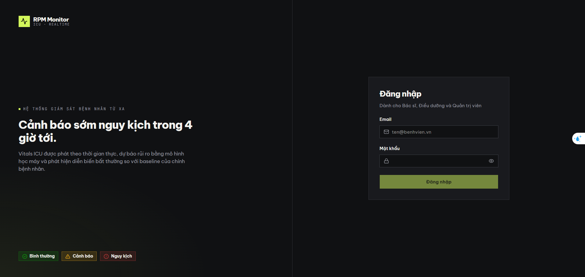{width="15cm"}

**Hình 4.4** Màn hình đăng nhập

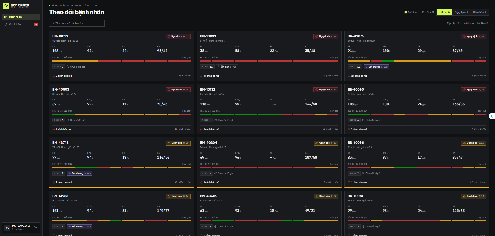{width="15cm"}

**Hình 4.5** Danh sách bệnh nhân được phân công, sắp theo mức rủi ro dự báo

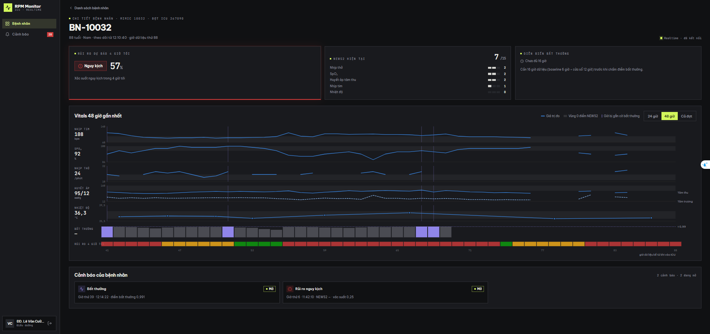{width="15cm"}

**Hình 4.6** Chi tiết bệnh nhân: dự báo rủi ro 4 giờ tới, NEWS2 và biểu đồ sinh hiệu

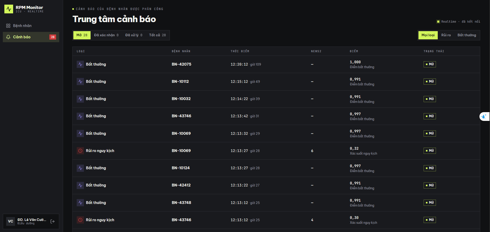{width="15cm"}

**Hình 4.7** Danh sách cảnh báo và trạng thái xử lý

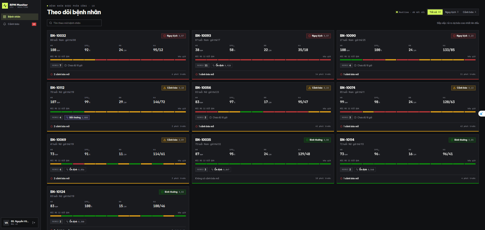{width="15cm"}

**Hình 4.8** Phạm vi xem theo phân công: bác sĩ chỉ thấy bệnh nhân mình phụ trách

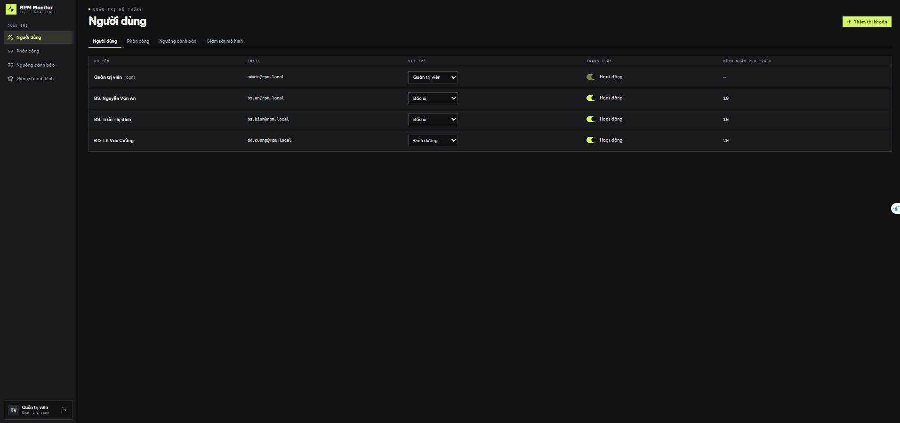{width="15cm"}

**Hình 4.9** Quản lý tài khoản người dùng

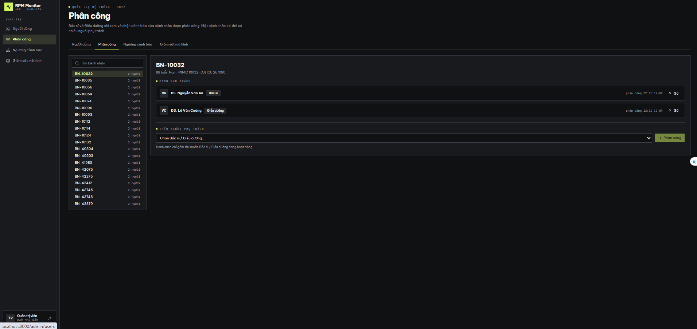{width="15cm"}

**Hình 4.10** Phân công bệnh nhân cho bác sĩ và điều dưỡng

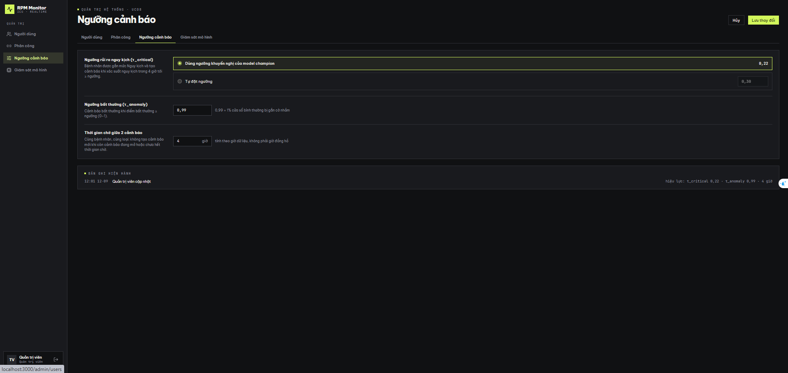{width="15cm"}

**Hình 4.11** Cấu hình ngưỡng cảnh báo

{width="15cm"}

**Hình 4.12** Giám sát mô hình: kết luận quality gate của từng phiên bản và biểu đồ drift

\newpage

# CHƯƠNG 5 KẾT LUẬN

## 5.1 Kết luận

### 5.1.1. Kết quả đạt được

- Xây dựng được pipeline hoàn chỉnh từ dữ liệu ICU thật tới dashboard realtime, chạy thật trên Docker Compose.
- Hai mô hình đều qua quality gate và thắng baseline persistence trên tập kiểm tra cố định.
- Vòng vận hành MLOps khép kín: phát hiện drift tự động kích hoạt huấn luyện lại, quality gate chặn mô hình kém, đổi mô hình đang dùng chỉ bằng cách đổi alias.
- Phân quyền theo phân công xuyên suốt REST, WebSocket và email.
- Đạt ngưỡng phi chức năng p95 < 2 giây và chịu được sự cố dừng đột ngột của consumer lẫn backend.

### 5.1.2. Hạn chế

Phần này nêu các hạn chế theo mức độ ảnh hưởng tới việc diễn giải kết quả. Mục đích không phải để giảm nhẹ kết quả mà để người đọc biết chính xác những con số ở Chương 4 có thể và không thể được dùng để kết luận điều gì.

#### a) Hạn chế về phương pháp đánh giá

**1. Tập kiểm tra đã được sử dụng hai lần, và ngưỡng quality gate được hiệu chỉnh sau khi xem kết quả kiểm tra.** Đây là hạn chế nghiêm trọng nhất về mặt phương pháp và đã được trình bày chi tiết ở mục 4.4. Cụ thể: ngưỡng Recall CRITICAL hạ từ 0,80 xuống 0,75 sau khi phiên bản v2 thiếu đúng ba giờ CRITICAL, và tiêu chí của mô hình bất thường đổi từ Precision/Recall sang AUROC sau khi kết quả lần đầu không đạt. Hệ quả: các chỉ số ở mục 4.5 là **ước lượng lạc quan hơn thực tế**, và không nên dùng chúng để so sánh trực tiếp với các nghiên cứu có quy trình giữ tập kiểm tra nghiêm ngặt hơn.

**2. Tập kiểm tra quá nhỏ để có khoảng tin cậy hẹp.** 15 bệnh nhân, 3.476 giờ dữ liệu, 315 giờ ở lớp CRITICAL. Vì các giờ trong cùng một bệnh nhân tương quan mạnh, số lượng quan sát độc lập hiệu dụng gần với 15 hơn là 3.476. Chênh lệch ba giờ CRITICAL đã đủ làm một phiên bản trượt hay đạt ngưỡng — chính vì vậy kết quả được báo cáo kèm dạng trung bình ± độ lệch qua kiểm định chéo, và mọi kết luận cần được diễn giải thận trọng.

**3. Bất thường dùng để đánh giá là bất thường tổng hợp.** Bộ dữ liệu không có nhãn bất thường theo thời điểm, nên mô hình được đánh giá bằng các bất thường do chính đồ án tiêm vào. Đây là đánh giá bán thực nghiệm: nó đo được năng lực phát hiện ba dạng lệch cụ thể, nhưng không chứng minh được mô hình phát hiện được bất thường lâm sàng thật. Phần bằng chứng bổ sung trên dữ liệu thật (tỷ lệ gắn cờ tăng theo mức NEWS2) làm giảm bớt nhưng không loại bỏ hạn chế này.

#### b) Hạn chế về dữ liệu

**4. Thiên lệch chọn mẫu.** Cả 100 bệnh nhân trong bộ dữ liệu đều là người về sau đã tử vong, và 31% lượt nhập viện có tử vong tại viện. Nhóm bệnh nhân này nặng hơn quần thể hồi sức chung, nên mọi tỷ lệ tuyệt đối (tỷ lệ giờ CRITICAL, tỷ lệ gắn cờ bất thường) đều không suy rộng được. Phép đối chiếu nhãn proxy với tử vong tại viện ở mục 4.5.1 cũng mang thiên lệch này vì không có nhóm đối chứng thực sự "khoẻ".

**5. Nhãn rủi ro là nhãn proxy, không phải chẩn đoán lâm sàng.** Nhãn được suy ra từ NEWS2 rút gọn năm thông số, thang 0–15 thay vì 0–20 vì thiếu thông tin về thở oxy bổ sung và mức ý thức. Mô hình vì vậy dự báo "điểm cảnh báo sớm sẽ cao trong bốn giờ tới", không phải "bệnh nhân sẽ chuyển nặng". Hai điều này có liên hệ nhưng không đồng nhất.

**6. Nền tảng cá nhân có thể đã bất thường ngay từ đầu.** Nền tảng của mỗi bệnh nhân được tính trên tối đa 24 giờ đầu của đợt ICU — nhưng giai đoạn đầu nằm hồi sức thường là lúc bệnh nặng nhất. Mô hình bất thường vì vậy so sánh với một mốc có thể đã lệch, và điều này có xu hướng làm nó bớt nhạy hơn là nhạy quá.

**7. Dữ liệu đo thưa và không đều.** Khoảng cách đo trung vị 60 phút, riêng nhiệt độ 240 phút. Chỉ điền theo chiều thời gian với giới hạn nên 7,1% số giờ vẫn không tính được NEWS2. Dữ liệu từ giai đoạn 2001–2012 của một bệnh viện Hoa Kỳ với hai hệ thống hồ sơ điện tử cũ, có thể không phản ánh đúng đặc điểm dân số và thiết bị y tế tại Việt Nam.

#### c) Hạn chế về hệ thống và kết quả vận hành

**8. Dòng dữ liệu là phát lại dữ liệu lịch sử, không phải thiết bị thật.** Một giờ dữ liệu được nén thành vài giây đồng hồ. Mọi cửa sổ trong hệ thống được tính bằng giờ dữ liệu nên logic không bị ảnh hưởng, nhưng hệ thống chưa từng đối mặt với các vấn đề của thiết bị thật: mất kết nối, dữ liệu đến muộn, dữ liệu đến sai thứ tự, nhiễu do cảm biến lỏng.

**9. Drift trong thực nghiệm là drift mô phỏng.** Nhóm dữ liệu phát lại có cùng phân phối với nhóm huấn luyện, nên không có drift tự nhiên. Drift được tạo bằng cách cộng một độ lệch có kiểm soát (nhịp tim +15, SpO₂ −3) lên một nửa số bệnh nhân. Hệ thống phát hiện được lệch ở SpO₂ nhưng **không** phát hiện được lệch ở nhịp tim, vì ngưỡng hiệu chỉnh của nhịp tim rất cao (1,78) do thông số này khác nhau nhiều giữa các bệnh nhân.

**10. Ngưỡng drift hiệu chỉnh chỉ đúng cho quy mô này.** Ngưỡng được hiệu chỉnh cho đúng hình dạng cửa sổ của bộ dữ liệu Demo (khoảng 20 bệnh nhân). Với số bệnh nhân lớn hơn, cửa sổ ổn định hơn và ngưỡng hiệu chỉnh sẽ tự giảm về gần 0,25. Tỷ lệ báo nhầm 5% được đo trên các cửa sổ không drift của **dữ liệu phát triển**, chưa phải trên dữ liệu vận hành thật. Ngoài ra, do các đợt ICU ngắn kết thúc sớm, cửa sổ chỉ đủ 200 bản ghi trong khoảng nhịp 24–55 của mỗi lần phát lại, nên thực tế chỉ kiểm tra được drift trong một khoảng thời gian hẹp.

**11. Huấn luyện lại trên drift mô phỏng không cải thiện được mô hình.** Cả bốn phiên bản mới đều không vượt được mô hình đang dùng. Đây là hành vi đúng của quality gate (nó bảo vệ hệ thống khỏi việc tự hạ cấp), nhưng cần nói rõ: thực nghiệm này **không chứng minh** được rằng việc huấn luyện lại "sửa" được drift. Nguyên nhân là dữ liệu mới quá ít (tối đa 858 giờ so với 6.286 giờ của nhóm huấn luyện) và tập kiểm tra cố định không chứa drift, nên một mô hình học được cách xử lý drift cũng không được thưởng điểm trên tập kiểm tra đó.

**12. Điều kiện "không kém mô hình đang dùng" cho qua khi bằng điểm.** Phiên bản anomaly_detector v4 được chấp nhận dù thực chất trùng với phiên bản trước ở chữ số thứ tư. Khả năng này đã được giảm bằng điều kiện cửa sổ phải đủ 24 nhịp, nhưng quy tắc so sánh vẫn giữ nguyên theo thiết kế.

**13. Độ trễ chỉ đo với một thành phần xử lý trên một máy.** Phân vị 95 khoảng 1,3–1,6 giây là số đo trên một máy chạy đồng thời toàn bộ hệ thống trong container. Khả năng mở rộng bằng nhiều thành phần xử lý song song có trong thiết kế nhưng chưa được kiểm chứng.

**14. Recall của mô hình bất thường thấp ở ngưỡng vận hành** (0,167, riêng dạng trôi dần chỉ 0,06). Hệ thống chọn ít báo nhầm hơn là bắt được nhiều — phù hợp với mục tiêu tránh bão cảnh báo, nhưng nghĩa là phần lớn bất thường dạng nhẹ sẽ không được gắn cờ.

**15. Email mặc định chỉ ghi log.** Trong toàn bộ thực nghiệm, việc gửi email được cấu hình ở chế độ chỉ ghi log để tránh gửi thư ngoài ý muốn. Đường gửi qua giao thức SMTP đã được hiện thực nhưng chưa chạy thật với một máy chủ thư thực tế.

## 5.2. Hướng phát triển

**Về dữ liệu.** Chạy lại toàn bộ quy trình trên MIMIC-III hoặc MIMIC-IV bản đầy đủ, hoặc eICU (cần hoàn thành khoá đào tạo về nghiên cứu trên người và thoả thuận sử dụng dữ liệu). Vì bản Demo có cùng cấu trúc bảng, mã nguồn gần như không phải sửa. Lợi ích trực tiếp: tập kiểm tra đủ lớn để khoảng tin cậy hẹp lại, có bệnh nhân sống sót nên loại bỏ được thiên lệch chọn mẫu, và có thể tách thêm một tập giữ lại thứ hai để khắc phục hạn chế số 1.

**Về nhãn.** Thay nhãn proxy dựa trên NEWS2 bằng nhãn lâm sàng thật — biến cố chuyển nặng, can thiệp cấp cứu, đặt nội khí quản, dùng thuốc vận mạch. Bộ dữ liệu đầy đủ có các bảng thuốc và thủ thuật cho phép làm điều này, và nó sẽ biến bài toán từ "dự báo điểm cảnh báo sớm" thành "dự báo biến cố lâm sàng".

**Về phát hiện drift.** Thay PSI gộp bằng phương pháp có tính đến tương quan trong cùng bệnh nhân, hoặc theo dõi drift theo từng bệnh nhân so với chính nền tảng của họ. Điều này giải quyết trực tiếp nguyên nhân khiến ngưỡng 0,25 không dùng được: PSI gộp coi các giờ của cùng một bệnh nhân là quan sát độc lập, trong khi thực tế không phải. Một hướng bổ sung là theo dõi trực tiếp chất lượng dự đoán theo thời gian (khi nhãn đã "chín" sau bốn giờ) thay vì chỉ theo dõi phân phối đầu vào — drift đầu vào chỉ là dấu hiệu gián tiếp, còn suy giảm chất lượng dự đoán là thứ thực sự đáng lo.

**Về khả năng mở rộng.** Tăng số phân vùng hàng đợi và chạy nhiều thành phần xử lý trong cùng nhóm, rồi đo lại độ trễ để xác nhận ngoại suy ở mục 4.5.5. Một hướng tối ưu khác là gộp các bản ghi cùng nhịp thành một lô suy luận, đổi một chút độ trễ để giảm đáng kể chi phí mỗi bản ghi.

**Về mô hình bất thường.** Thử các kiến trúc khác (bộ tự mã hoá biến phân, mô hình dựa trên Transformer) và đặc biệt là tìm cách phát hiện dạng trôi dần — dạng hiện gần như không phát hiện được nhưng lại chính là dạng có ý nghĩa lâm sàng cao, vì suy giảm chậm là điều khó nhận ra nhất bằng mắt thường.

**Về hệ thống.** Nâng cấp giao diện theo phản hồi người dùng; bổ sung theo dõi hiệu năng mô hình theo thời gian trên dữ liệu vận hành; và thử nghiệm với nguồn dữ liệu đến muộn hoặc sai thứ tự để kiểm chứng hệ thống trong điều kiện gần với thiết bị thật hơn.

\newpage

# TÀI LIỆU THAM KHẢO

\[1\] Johnson, A. E. W., Pollard, T. J., Shen, L., Lehman, L. H., Feng, M., Ghassemi, M., Moody, B., Szolovits, P., Celi, L. A., & Mark, R. G. (2016). MIMIC-III, a freely accessible critical care database. *Scientific Data*, 3, 160035. https://doi.org/10.1038/sdata.2016.35

\[2\] Johnson, A., Pollard, T., & Mark, R. (2016). *MIMIC-III Clinical Database Demo* (version 1.4). PhysioNet. https://doi.org/10.13026/C2HM2Q

\[3\] Goldberger, A. L., Amaral, L. A. N., Glass, L., Hausdorff, J. M., Ivanov, P. C., Mark, R. G., Mietus, J. E., Moody, G. B., Peng, C.-K., & Stanley, H. E. (2000). PhysioBank, PhysioToolkit, and PhysioNet: Components of a new research resource for complex physiologic signals. *Circulation*, 101(23), e215–e220.

\[4\] Royal College of Physicians. (2017). *National Early Warning Score (NEWS) 2: Standardising the assessment of acute-illness severity in the NHS. Updated report of a working party*. London: RCP.

\[5\] Muralitharan, S., Nelson, W., Di, S., McGillion, M., Devereaux, P. J., Barr, N. G., & Petch, J. (2021). Machine learning–based early warning systems for clinical deterioration: Systematic scoping review. *Journal of Medical Internet Research*, 23(2), e25187. https://doi.org/10.2196/25187

\[6\] Malhotra, P., Ramakrishnan, A., Anand, G., Vig, L., Agarwal, P., & Shroff, G. (2016). LSTM-based encoder-decoder for multi-sensor anomaly detection. *arXiv preprint arXiv:1607.00148*.

\[7\] Gama, J., Žliobaitė, I., Bifet, A., Pechenizkiy, M., & Bouchachia, A. (2014). A survey on concept drift adaptation. *ACM Computing Surveys*, 46(4), 44:1–44:37. https://doi.org/10.1145/2523813

\[8\] Sculley, D., Holt, G., Golovin, D., Davydov, E., Phillips, T., Ebner, D., Chaudhary, V., Young, M., Crespo, J.-F., & Dennison, D. (2015). Hidden technical debt in machine learning systems. *Advances in Neural Information Processing Systems 28 (NIPS 2015)*, 2503–2511.

\[9\] Hochreiter, S., & Schmidhuber, J. (1997). Long short-term memory. *Neural Computation*, 9(8), 1735–1780.

\[10\] Breiman, L. (2001). Random forests. *Machine Learning*, 45(1), 5–32.

\[11\] Chen, T., & Guestrin, C. (2016). XGBoost: A scalable tree boosting system. *Proceedings of the 22nd ACM SIGKDD International Conference on Knowledge Discovery and Data Mining*, 785–794.

\[12\] Lundberg, S. M., & Lee, S.-I. (2017). A unified approach to interpreting model predictions. *Advances in Neural Information Processing Systems 30 (NIPS 2017)*, 4765–4774.
