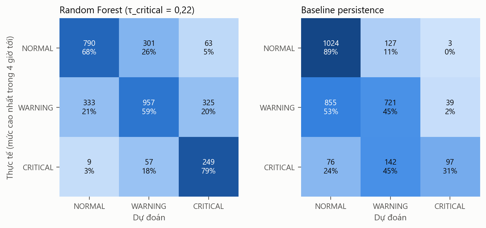
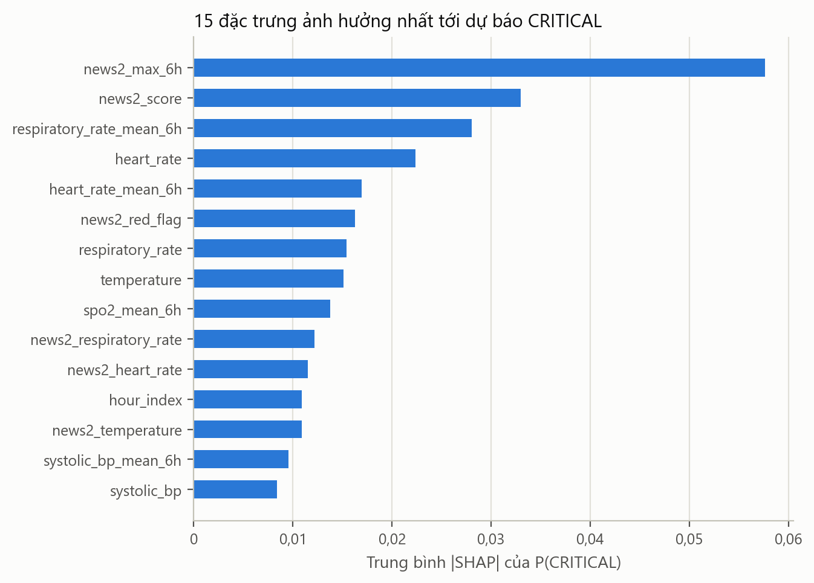
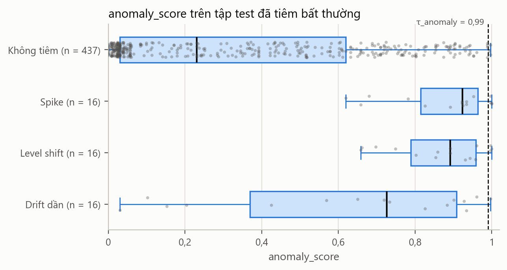

# Kết quả đánh giá mô hình (sinh tự động bởi `python -m rpm_ml.evaluation.report`)

Mọi chỉ số đo trên nhóm `test` cố định (15 bệnh nhân), trừ khi ghi khác. Không chọn lại ngưỡng hay mô hình nào trên tập test.

## 1. Dự báo rủi ro (h = 4) — `risk_classifier` v2, τ_critical = 0,22

3084 mẫu giờ. 

| Chỉ số | Random Forest | Persistence |
|---|---|---|
| Accuracy | 0,647 | 0,597 |
| Macro F1 | 0,623 | 0,547 |
| Recall CRITICAL | 0,790 | 0,308 |
| Precision CRITICAL | 0,391 | 0,698 |
| AUROC (OvR, macro) | 0,836 | — |
| AUPRC CRITICAL | 0,615 | — |

Theo từng lớp:

| Lớp | Số mẫu | Precision (model / persistence) | Recall (model / persistence) | F1 (model / persistence) |
|---|---|---|---|---|
| NORMAL | 1154 | 0,698 / 0,524 | 0,685 / 0,887 | 0,691 / 0,659 |
| WARNING | 1615 | 0,728 / 0,728 | 0,593 / 0,446 | 0,653 / 0,554 |
| CRITICAL | 315 | 0,391 / 0,698 | 0,790 / 0,308 | 0,523 / 0,427 |

### So sánh horizon

| Horizon | τ_critical | Macro F1 model | Macro F1 persistence | Recall CRITICAL model | Recall CRITICAL persistence | Precision CRITICAL model |
|---|---|---|---|---|---|---|
| h = 1 | 0,18 | 0,578 | 0,621 | 0,784 | 0,486 | 0,270 |
| h = 4 | 0,22 | 0,623 | 0,547 | 0,790 | 0,308 | 0,391 |

### Giải thích mô hình (SHAP, lớp CRITICAL, 400 mẫu test)

| Đặc trưng | Mean \|SHAP\| | Hướng (tương quan giá trị–SHAP) |
|---|---|---|
| `news2_max_6h` | 0,0576 | 0,89 |
| `news2_score` | 0,0329 | 0,84 |
| `respiratory_rate_mean_6h` | 0,0281 | 0,92 |
| `heart_rate` | 0,0223 | 0,83 |
| `heart_rate_mean_6h` | 0,0169 | 0,84 |
| `news2_red_flag` | 0,0162 | 0,94 |
| `respiratory_rate` | 0,0154 | 0,87 |
| `temperature` | 0,0151 | -0,68 |
| `spo2_mean_6h` | 0,0138 | -0,87 |
| `news2_respiratory_rate` | 0,0122 | 0,93 |
| `news2_heart_rate` | 0,0115 | 0,94 |
| `hour_index` | 0,0109 | 0,57 |
| `news2_temperature` | 0,0109 | 0,85 |
| `systolic_bp_mean_6h` | 0,0095 | -0,86 |
| `systolic_bp` | 0,0084 | -0,91 |

### Lịch sử version

| Version | τ_critical | Cách chọn τ | Macro F1 test | Recall CRITICAL test | Gate | Champion |
|---|---|---|---|---|---|---|
| v1 | 0,25 | validation | 0,639 | 0,730 | rejected |  |
| v2 | 0,22 | oof_groupkfold_train_validation | 0,623 | 0,790 | passed | ✓ |
| v3 | 0,21 | oof_groupkfold_train_validation | 0,612 | 0,803 | rejected |  |
| v4 | 0,24 | oof_groupkfold_train_validation | 0,631 | 0,759 | rejected |  |

## 2. Nhãn proxy (NEWS2) so với tử vong tại viện

Toàn bộ dữ liệu, mức đợt ICU. Cả 100 bệnh nhân của bản Demo về sau đều tử vong (thiên lệch chọn mẫu, mục 3.5).

| Kết cục lượt nhập viện | Số đợt ICU | Số bệnh nhân | Tỷ lệ giờ CRITICAL (trung bình) | (trung vị) |
|---|---|---|---|---|
| Tử vong tại viện | 44 | 38 | 19,1% | 7,3% |
| Sống sót ra viện | 88 | 67 | 3,6% | 0,0% |

AUROC mức đợt ICU của tỷ lệ giờ CRITICAL khi phân biệt tử vong/sống sót: 0,718.

## 3. Phát hiện bất thường — `anomaly_detector` v4, τ_anomaly = 0,99

Tập test tiêm bất thường (10% cửa sổ NORMAL, seed 42):

| Chỉ số | Giá trị |
|---|---|
| AUROC (tiêu chí gate) | 0,864 |
| Precision | 0,727 |
| Recall | 0,167 |
| F1 | 0,271 |
| Tỷ lệ gắn cờ nhầm | 0,007 |
| Recall spike | 0,250 |
| Recall level shift | 0,188 |
| Recall drift dần | 0,062 |

Số cửa sổ: 485, trong đó 48 bị tiêm.

Đối chiếu với diễn biến thật (mọi cửa sổ của tập test, không tiêm), nhóm theo mức NEWS2 cao nhất trong 12 giờ:

| Mức cao nhất trong cửa sổ | Số cửa sổ | Trung vị anomaly_score | Tỷ lệ bị gắn cờ |
|---|---|---|---|
| NORMAL | 485 | 0,222 | 0,6% |
| WARNING | 1751 | 0,746 | 17,4% |
| CRITICAL | 469 | 0,904 | 34,8% |

AUROC của anomaly_score khi phân biệt cửa sổ có giờ CRITICAL với cửa sổ toàn NORMAL: 0,837.
